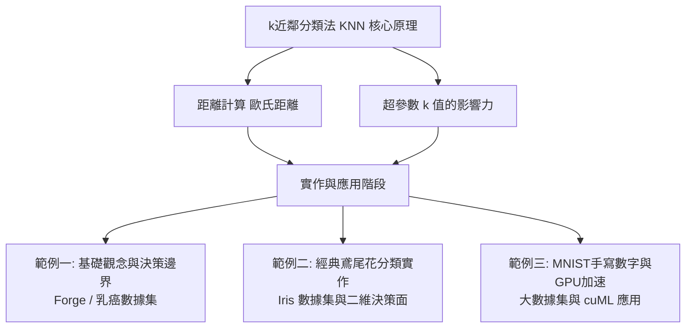

# k 近鄰分類法 (k-Nearest Neighbors Classification, KNN)

k 近鄰分類法 (KNN) 是一種簡單、直觀且效果卓越的**監督式學習演算法**。它是一種基於實例的學習 (Instance-based learning) 或懶惰學習 (Lazy learning)，在訓練階段只會儲存數據，直到有新樣本需要預測時，才計算其與周圍鄰居的距離，並透過多數決投票來決定新樣本的類別。

---

## 🗺️ 學習地圖 (Learning Map)

---

## 📚 實作範例對照表 (Jupyter Notebooks Overview)

本章節設計了三個由淺入深的實作範例，幫助您逐步掌握 KNN 在不同尺度數據集上的應用：

| 實作檔案 (Jupyter Notebook) | 使用數據集 (Dataset) | 學習重點 (Learning Focus) | 核心特色 (Core Feature) |
| :--- | :--- | :--- | :--- |
| 🔗 [README.ipynb (基礎觀念與決策邊界)](./README.ipynb) | Forge 模擬資料集 Breast Cancer 乳癌數據集 | - 理解 KNN 的投票與預測機制。 - 視覺化呈現不同 $k$ 值下的決策邊界。 - 繪製訓練/測試準確率隨 $k$ 值變化的曲線。 | 基礎概念與參數量測（過擬合與欠擬合分析） |
| 🔗 [sklearn實作1.ipynb (鳶尾花分類)](./sklearn實作1.ipynb) | Iris 鳶尾花數據集 | - 使用 Scikit-Learn 快速建立 KNN 分類器。 - 計算測試集分類準確率 (Accuracy Score)。 - 使用網格預測方法繪製彩色二維決策邊界區域。 | 標準套件應用與決策邊界視覺化 |
| 🔗 [sklearn實作2.ipynb (MNIST與GPU加速)](./sklearn實作2.ipynb) | MNIST 手寫數字數據集 | - 處理 70,000 筆高維特徵 (28x28 像素) 的大數據分類。 - 繪製 $k=1$ 到 $10$ 的準確率學習曲線。 - 介紹並使用 NVIDIA RAPIDS `cuML` 進行 **GPU 加速運算**。 | 大數據集與 GPU 計算加速 (cuml & cupy) |

---

## 📐 KNN 核心數學與概念說明

### 1. 遊戲故事比喻（找朋友）
當新同學（新資料點）加入班級時，我們想要判斷他應該加入「運動組」還是「美術組」：
- **觀察**：看看班上已經分好組的同學們。
- **計算距離**：計算新同學與所有同學之間的相似度（距離）。
- **找出鄰居**：找出距離新同學最近的 $k$ 個同學。
- **多數決投票**：在這 $k$ 個鄰居中，如果運動組的人數最多，新同學就被分到「運動組」。

### 2. 距離計算公式（歐氏距離）
在二維或多維特徵空間中，我們最常用**歐氏距離 (Euclidean Distance)** 來衡量資料點之間的相似度。若有兩個點 $x$ 與 $y$，其特徵維度為 $n$，則距離公式為：

$$d(x, y) = \sqrt{(x_1 - y_1)^2 + (x_2 - y_2)^2 + \dots + (x_n - y_n)^2} = \sqrt{\sum_{i=1}^{n} (x_i - y_i)^2}$$

> [!TIP]
> **特徵標準化的重要性**：由於 KNN 極度依賴距離計算，若某個特徵的數值範圍非常大（如年收入幾十萬），而另一個特徵非常小（如年資 1~10），距離的計算會完全被大數值特徵主導。因此，在使用 KNN 前，對特徵進行**標準化 (Feature Scaling / StandardScaler)** 是確保模型表現的關鍵步驟！

### 3. 超參數 $k$ 值的偏誤與變異權衡 (Bias-Variance Trade-off)
$k$ 值的選取決定了模型的複雜度，它是 KNN 中最核心的超參數：

- **當 $k$ 值過小（例如 $k=1$）**：
  - 模型過於複雜，決策邊界會極力迎合每一個訓練資料點，呈現崎嶇、破碎的形狀。
  - 對資料中的雜訊（Noise）和異常值極度敏感，容易導致**過擬合 (Overfitting)**。
  - 訓練集準確率極高 (甚至達 100%)，但測試集表現較差。
- **當 $k$ 值過大（例如 $k=50$ 或更大）**：
  - 模型過於簡單，決策邊界會過度平滑。
  - 模型會考慮到很多距離遙遠、關係較弱的點，忽略了局部的關鍵特徵，容易導致**欠擬合 (Underfitting)**。
  - 訓練集與測試集準確率都會偏低。
- **如何選擇最佳 $k$ 值？**
  - **奇數原則**：$k$ 通常選擇奇數（例如 3, 5, 7），以避免多數決投票時出現平手（票數相同）無法決定類別的窘境。
  - **實務做法**：透過**交叉驗證 (Cross-Validation)** 或繪製**驗證曲線**，比較不同 $k$ 值在測試集上的表現，選擇準確度最高且沒有過擬合跡象的 $k$ 值。

---

## 💼 常見應用場景 (Application Scenarios)

1. **圖像與模式識別**：手寫數字辨識 (MNIST)、人臉特徵匹配。
2. **推薦系統**：協同過濾 (Collaborative Filtering)，尋找與目標使用者行為或偏好最接近的 $k$ 個鄰居，並推薦他們感興趣的內容。
3. **醫學輔助診斷**：根據病患的生理特徵（如腫瘤大小、細胞形狀）預測其屬於良性或惡性。
4. **信用評估**：分析借款人的財務數據，找出相似信用品質的群體以評估貸款違約風險。
5. **文本分類與垃圾郵件過濾**：通過計算詞頻向量的餘弦相似度進行文件歸類。
