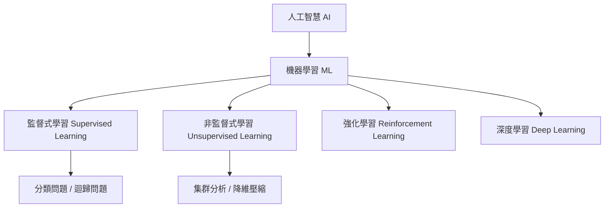
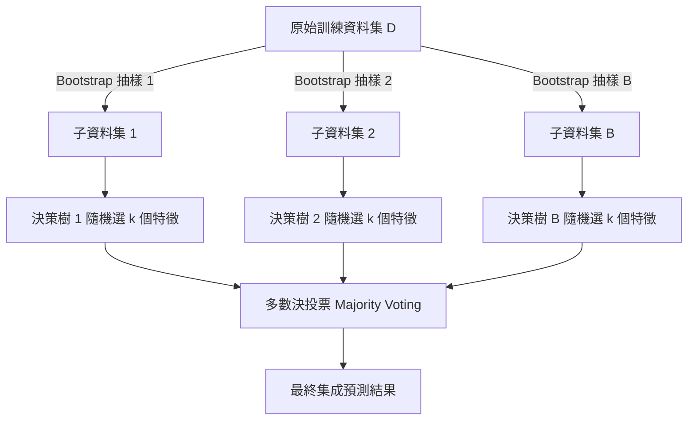
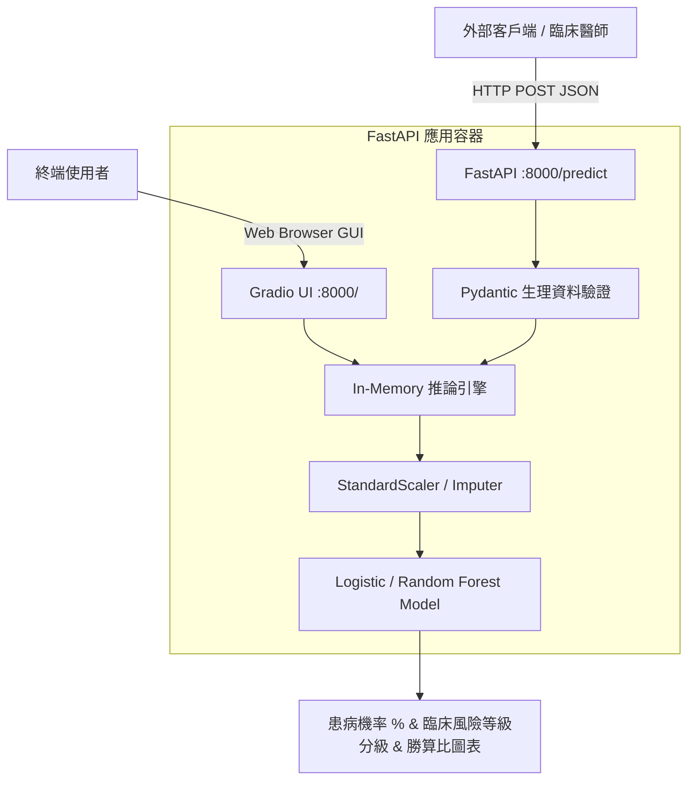

# 聯合醫院｜⼈⼯智慧(AI)開發基礎課程

<style>
@media print {
  .page-break { page-break-after: always; break-after: page; }
  body { font-size: 11pt; line-height: 1.5; color: #1a1a1a; font-family: "PingFang TC", "Microsoft JhengHei", "Noto Sans TC", sans-serif; }
  h1 { font-size: 20pt; color: #0d47a1; border-bottom: 2px solid #0d47a1; padding-bottom: 6px; margin-top: 0; }
  h2 { font-size: 15pt; color: #1565c0; border-bottom: 1px solid #90caf9; padding-bottom: 4px; margin-top: 14px; }
  h3 { font-size: 12pt; color: #283593; margin-top: 10px; margin-bottom: 4px; }
  pre { font-size: 9pt; background-color: #f5f5f5 !important; border: 1px solid #e0e0e0; padding: 8px; border-radius: 4px; }
  table { font-size: 9.5pt; width: 100%; border-collapse: collapse; margin: 10px 0; }
  th, td { border: 1px solid #bdbdbd; padding: 5px 8px; text-align: left; }
  th { background-color: #e3f2fd !important; }
  blockquote { border-left: 4px solid #1976d2; margin: 8px 0; padding: 6px 12px; background-color: #f8fafc; font-size: 9.5pt; }
}
.page-header { display: flex; justify-content: space-between; align-items: center; border-bottom: 1px solid #ccc; padding-bottom: 4px; margin-bottom: 12px; font-size: 9pt; color: #666; }
.page-footer { display: flex; justify-content: space-between; align-items: center; border-top: 1px solid #eee; padding-top: 4px; margin-top: 16px; font-size: 8.5pt; color: #888; }
.badge { display: inline-block; padding: 2px 8px; border-radius: 4px; font-size: 8.5pt; font-weight: bold; background: #e0f2fe; color: #0369a1; }
</style>

<!-- PAGE 1 START -->
<div class="page-header">
  <span>聯合醫院｜人工智慧(AI)開發基礎課程講義</span>
  <span>第 1 頁 / 共 10 頁</span>
</div>

# 課程總覽與機器學習專案生命週期

本手冊專為 **聯合醫院 人工智慧(AI)開發基礎課程** 設計，旨在引導臨床醫療與資訊專業人員從實務角度掌握「資料管線構建」、「核心分類與集成演算法臨床應用與調校」，並最終以「FastAPI + Gradio 混合架構」將機器學習模型服務化落地。

---

## 🎯 課程模組學習地圖與核心產出

| 模組編號 | 學習階段 | 核心焦點與產出 | 銜接專題與知識點 |
| :--- | :--- | :--- | :--- |
| **模組一** | 基礎準備與探索 | Python 數據科學基石、EDA 統計視覺化、異常檢測 | NumPy, Pandas, Seaborn, 統計假設 |
| **模組二** | 資料管線與評估 | 缺失值插補、編碼、特徵縮放、防止洩漏、分類指標 | Scikit-Learn Pipeline, ROC-AUC, PR |
| **模組三** | 核心與集成演算法 | 邏輯迴歸、SVM、隨機森林、梯度提升決策樹 (GBDT) | Log-Loss, Kernel Trick, Bagging, Boosting |
| **模組四** | 服務化與專案落地 | 模型持久化、FastAPI 非同步後端、Gradio 互動前端 | Pydantic 資料驗證, Docker 容器化思維 |

---

## 🔄 機器學習端到端生命週期（ML Pipeline）

現代企業級機器學習並非僅止於呼叫 `model.fit()`，而是涵蓋從商業理解到維運監控的完整閉環：


### 1. 商業與問題定義 (Problem Formulation)
- **確認預測目標型態**：二元分類（如：患病與否）、多元分類（如：疾病分型）、數值迴歸（如：生存月數）。
- **確認指標代價矩陣**：判斷誤報（False Positive）與漏報（False Negative）的商業或臨床損失成本。

### 2. 資料探索性分析 (Exploratory Data Analysis, EDA)
- 檢查樣本數與特徵維度、資料型態（數值型、名目型、順序型）。
- 檢驗標籤分佈是否極度不平衡（Class Imbalance）、辨識遺漏值分佈機制。

### 3. 資料管線建置 (Data Preprocessing & Pipeline)
- 嚴格隔離訓練集（Train Set）與測試集（Test Set），防止 **資料洩漏（Data Leakage）**。
- 將標準化、編碼與特徵衍生封裝為單一可重複運作的 Pipeline 物件。

### 4. 演算法選型、訓練與驗證 (Model Training & Validation)
- 從基礎可解釋模型（邏輯迴歸）出發，建立基準線（Baseline）。
- 推進至非線性邊界（SVM）與樹狀集成模型（Random Forest, GBDT），進行 K-Fold 交叉驗證。

### 5. 服務化落地與監控 (Deployment & Monitoring)
- 使用 `joblib` 將前處理器與最佳模型共同打包。
- 以 FastAPI 封裝微服務端點，整合 Pydantic 實現進端型別校驗與例外防護。

<div class="page-footer">
  <span>© 聯合醫院 人工智慧(AI)開發基礎課程講義</span>
  <span>課程總覽與生命週期</span>
</div>

<div class="page-break"></div>
<!-- PAGE 1 END -->

<!-- PAGE 2 START -->
<div class="page-header">
  <span>單元一：基礎準備與開發環境</span>
  <span>第 2 頁 / 共 10 頁</span>
</div>

# 單元一・機器學習基礎與開發環境

## 🧠 AI、機器學習與深度學習之定位範疇

- **人工智慧 (Artificial Intelligence, AI)**：使機器展現如人類智慧的廣義科學。
- **機器學習 (Machine Learning, ML)**：AI 的關鍵子領域，透過大量歷史資料尋找統計規律與映射函數 $y = f(x)$，具備對未知資料的「泛化能力 (Generalization)」。
- **深度學習 (Deep Learning, DL)**：ML 的分支，以多層人工神經網路 (ANN) 自動抽取高維抽象特徵，擅長影像、語音與大型語言模型。



---

## 📚 機器學習三大範式與核心專有名詞

1. **監督式學習 (Supervised Learning)**：訓練資料具備輸入特徵 $X$ 與真實標籤 $y$。
   - **分類 (Classification)**：輸出為離散類別（如：信貸違約 0/1、腫瘤良惡性）。
   - **迴歸 (Regression)**：輸出為連續實數值（如：房價、血壓數值）。
2. **非監督式學習 (Unsupervised Learning)**：訓練資料無標籤，目標為探索資料內在結構（如：K-Means 客群分群、PCA 特徵降維）。
3. **強化學習 (Reinforcement Learning)**：代理人（Agent）在環境中執行動作，透過回饋獎懲（Reward）最大化長期回報。

### 關鍵術語精要速查
- **特徵矩陣 (Feature Matrix, $X$)**：大小為 $n \times m$ 的矩陣，代表 $n$ 筆樣本、$m$ 個維度屬性。
- **標籤向量 (Target Vector, $y$)**：長度為 $n$ 的目標數值。
- **過擬合 (Overfitting)**：模型過度記憶訓練資料中的雜訊，訓練集表現極高但測試集嚴重下滑（高方差 High Variance）。
- **欠擬合 (Underfitting)**：模型複雜度過低，連訓練集的基本趨勢都無法捕捉（高偏差 High Bias）。
- **偏差-方差權衡 (Bias-Variance Tradeoff)**：調參過程本質上即是在降低欠擬合（減小 Bias）與防止過擬合（減小 Variance）之間尋找最低泛化誤差點。

---

## 🛠️ Python 數據科學基石工具鏈

```python
import numpy as np
import pandas as pd
from sklearn.model_selection import train_test_split

# 1. 建立示範結構化資料
raw_data = {
    'age': [25, 48, 32, np.nan, 56, 41],
    'bmi': [22.4, 28.1, 24.5, 31.2, 29.8, np.nan],
    'glucose': [85, 142, 98, 120, 165, 105],
    'diabetes': [0, 1, 0, 1, 1, 0]
}
df = pd.DataFrame(raw_data)

# 2. 檢視資料基本資訊與統計摘要
print("資料維度與欄位資訊:")
df.info()

# 3. 切分特徵矩陣 X 與目標向量 y，並保留 20% 作為獨立測試集
X = df[['age', 'bmi', 'glucose']]
y = df['diabetes']
X_train, X_test, y_train, y_test = train_test_split(
    X, y, test_size=0.2, random_state=42, stratify=y
)
print(f"訓練集形狀: {X_train.shape}, 測試集形狀: {X_test.shape}")
```

> **實務小技巧**：在分類問題中，務必設定 `stratify=y`，確保訓練集與測試集保有相同比例的類別分佈，避免因抽樣偏差影響模型評估真實度。

<div class="page-footer">
  <span>© 聯合醫院 人工智慧(AI)開發基礎課程講義</span>
  <span>機器學習基礎與開發環境</span>
</div>

<div class="page-break"></div>
<!-- PAGE 2 END -->

<!-- PAGE 3 START -->
<div class="page-header">
  <span>單元一：基礎準備與開發環境</span>
  <span>第 3 頁 / 共 10 頁</span>
</div>

# 單元一・探索性資料分析與統計視覺化 (EDA)

探索性資料分析（Exploratory Data Analysis, EDA）是機器學習專案的第一步。透過統計指標與視覺化圖表，工程師能洞悉特徵分佈、資料偏態、異常極端值與特徵間的多重共線性。

---

## 📊 四大核心視覺化圖表實務手冊

| 圖表類型 | 常用情境 | Seaborn / Matplotlib 關鍵函式 | 觀察重點與工程處置 |
| :--- | :--- | :--- | :--- |
| **直方圖與 KDE** | 單變數連續特徵分佈 | `sns.histplot(kde=True)` | 檢查偏態（Skewness）。若高度右偏，後續需考慮 Log 轉換或 Box-Cox 轉換。 |
| **箱形圖 (Boxplot)** | 類別分組比較、離群值探查 | `sns.boxplot(x='y', y='x')` | 基於四分位距（IQR）識別異常點。確認是否為量測錯誤或真實罕見臨床表徵。 |
| **散佈圖 (Scatter)** | 雙變數線性/非線性關聯 | `sns.scatterplot()` / `sns.pairplot()` | 觀察特徵間群聚趨勢與線性可分性。提早評估是否需要核化（Kernel）特徵轉換。 |
| **熱力圖 (Heatmap)** | 全特徵相關係數矩陣 | `sns.heatmap(annot=True, cmap='coolwarm')` | 檢測特徵間皮爾森相關係數（Pearson $r$）。若 $|r| > 0.85$，需注意多重共線性風險。 |

---

## 📈 離群值（Outliers）統計判定法：IQR 準則

箱形圖內部以五數概括法（Minimum, $Q_1$, Median, $Q_3$, Maximum）呈現數據：
- 四分位距：$\text{IQR} = Q_3 - Q_1$
- 異常值上下界：
  $$\text{Lower Bound} = Q_1 - 1.5 \times \text{IQR}, \quad \text{Upper Bound} = Q_3 + 1.5 \times \text{IQR}$$

```text
       ┌───┐             ┌─────────┬─────────┐             ┌───┐
───────┤ ╷ ├─────────────┤   Q1    │ Median  │   Q3        ├─╷─┤───────  (離群點: ●)
       └───┘             └─────────┴─────────┘             └───┘
  Lower Whisker                                      Upper Whisker       ● (極端值)
 [Q1 - 1.5*IQR]                                     [Q3 + 1.5*IQR]
```

---

## 💻 完整 EDA 樣板程式碼

```python
import matplotlib.pyplot as plt
import seaborn as sns
import pandas as pd

# 設定視覺化美學風格與字體
sns.set_theme(style="whitegrid", font="sans-serif")
plt.rcParams['figure.figsize'] = (10, 4)

def run_comprehensive_eda(df: pd.DataFrame, target_col: str):
    """執行完整 EDA: 繪製特徵分佈、分組箱形圖與相關係數熱力圖"""
    numeric_cols = df.select_dtypes(include=['float64', 'int64']).columns.tolist()
    
    # 1. 相關係數熱力圖 (Correlation Heatmap)
    plt.figure(figsize=(8, 6))
    corr = df[numeric_cols].corr()
    sns.heatmap(corr, annot=True, fmt=".2f", cmap='Blues', vmin=-1, vmax=1)
    plt.title("Feature Pearson Correlation Matrix")
    plt.tight_layout()
    plt.show()
    
    # 2. 針對目標變數繪製箱形圖 (Boxplot by Target)
    feature_to_plot = [c for c in numeric_cols if c != target_col][0]
    plt.figure(figsize=(7, 4))
    sns.boxplot(x=target_col, y=feature_to_plot, data=df, palette='Set2')
    plt.title(f"Distribution of {feature_to_plot} grouped by {target_col}")
    plt.tight_layout()
    plt.show()

# 呼叫示範
# run_comprehensive_eda(diabetes_df, target_col='Outcome')
```

<div class="page-footer">
  <span>© 聯合醫院 人工智慧(AI)開發基礎課程講義</span>
  <span>探索性資料分析與視覺化</span>
</div>

<div class="page-break"></div>
<!-- PAGE 3 END -->

<!-- PAGE 4 START -->
<div class="page-header">
  <span>單元二：資料管線與模型評估</span>
  <span>第 4 頁 / 共 10 頁</span>
</div>

# 單元二・資料管線與特徵工程 (Feature Engineering)

「資料與特徵決定了機器學習的上限，模型與演算法只是逼近這個上限。」
特徵工程包含**缺失值處置**、**類別編碼**、**數值縮放**與**管線串接**。

---

## 🛠️ 特徵工程三部曲

### 1. 缺失值插補策略 (Missing Value Imputation)
- **直接刪除 (Drop)**：若缺失比例極小（$< 3\%$）或某特徵缺失極高（$> 60\%$），可考慮直接剔除列或欄。
- **統計值插補 (SimpleImputer)**：
  - 連續型特徵：中位數（Median，抗極端值）或平均值（Mean）。
  - 類別型特徵：最頻繁值（Mode / Most Frequent）或新增 `'Unknown'` 類別。
- **演算法插補 (KNNImputer)**：利用鄰近樣本的歐氏距離加權估計缺失值，能保留特徵間的相關性。

### 2. 類別特徵編碼 (Categorical Encoding)
- **標籤編碼 (Label Encoding)**：將類別轉換為整數 ($0, 1, 2, \dots$)。僅適用於**有序資料 (Ordinal)**（如：學歷「高中:0, 大學:1, 碩士:2」）。若用於無順序的名目資料，會給予模型錯誤的大小權重假設。
- **獨熱編碼 (One-Hot Encoding)**：為每個無序類別建立獨立二元欄位（0 或 1）。需防範維度爆炸（Curse of Dimensionality）；可搭配 `drop='first'` 避免虛擬變數陷阱（Dummy Variable Trap）。

### 3. 特徵縮放 (Feature Scaling)
演算法若仰賴距離計算（SVM、k-NN）或梯度下降（邏輯迴歸、神經網路），未縮放的特徵將導致大尺度特徵主導目標函數：
- **標準化 (Standardization / Z-score)**：
  $$z = \frac{x - \mu}{\sigma} \quad (\mu=0, \sigma=1)$$
  不限制範圍，能良好保留離群值資訊，適用於多數統計與線性模型。
- **最大最小歸一化 (Min-Max Scaling)**：
  $$x' = \frac{x - x_{\min}}{x_{\max} - x_{\min}} \quad (x' \in [0, 1])$$
  對極端值敏感，適用於特徵邊界明確或神經網路激勵函數輸入層。

---

## 🛡️ 防止資料洩漏（Data Leakage）與 Pipeline 實戰

> **重要原則**：所有前處理參數（例如 $\mu, \sigma$、插補值、編碼規則）**必須僅由訓練集（Train Set）計算 (`fit`)**，再套用至測試集 (`transform`)。絕不能先全域標準化後再進行切分！

```python
from sklearn.pipeline import Pipeline
from sklearn.compose import ColumnTransformer
from sklearn.impute import SimpleImputer
from sklearn.preprocessing import StandardScaler, OneHotEncoder
from sklearn.linear_model import LogisticRegression

# 定義不同類型欄位
numeric_features = ['age', 'bmi', 'glucose']
categorical_features = ['gender', 'smoking_history']

# 建立數值前處理分支: 中位數填補 -> Z-score 標準化
numeric_transformer = Pipeline(steps=[
    ('imputer', SimpleImputer(strategy='median')),
    ('scaler', StandardScaler())
])

# 建立類別前處理分支: 眾數填補 -> 獨熱編碼 (避免未見過類別錯誤)
categorical_transformer = Pipeline(steps=[
    ('imputer', SimpleImputer(strategy='most_frequent')),
    ('onehot', OneHotEncoder(handle_unknown='ignore', drop='first'))
])

# 整合為欄位轉換器 (ColumnTransformer)
preprocessor = ColumnTransformer(transformers=[
    ('num', numeric_transformer, numeric_features),
    ('cat', categorical_transformer, categorical_features)
])

# 打包成包含終端模型的完整端到端管線
full_pipeline = Pipeline(steps=[
    ('preprocessor', preprocessor),
    ('classifier', LogisticRegression(random_state=42))
])

# 一鍵擬合訓練，完美隔離驗證集
# full_pipeline.fit(X_train, y_train)
# test_preds = full_pipeline.predict(X_test)
```

<div class="page-footer">
  <span>© 聯合醫院 人工智慧(AI)開發基礎課程講義</span>
  <span>資料管線與特徵工程</span>
</div>

<div class="page-break"></div>
<!-- PAGE 4 END -->

<!-- PAGE 5 START -->
<div class="page-header">
  <span>單元二：資料管線與模型評估</span>
  <span>第 5 頁 / 共 10 頁</span>
</div>

# 單元二・分類模型評估指標與決策門檻

在真實專案中，「準確率 (Accuracy)」往往具有高度欺騙性。例如在癌症篩檢或罕見信用卡盜刷場景中，若正例僅佔 $1\%$，一個盲目猜測全部為陰性的愚蠢模型亦能取得 $99\%$ 的準確率，但卻造成災難性的業務後果。

---

## 🔲 混淆矩陣 (Confusion Matrix) 四大象限

```text
                  真實正例 (Actual Positive)    真實反例 (Actual Negative)
預測為正 (Pred +)      TP (True Positive)           FP (False Positive - 型 I 錯誤)
預測為負 (Pred -)      FN (False Negative - 型 II 錯誤)  TN (True Negative)
```

- **準確率 (Accuracy)**：$\frac{\text{TP} + \text{TN}}{\text{TP} + \text{TN} + \text{FP} + \text{FN}}$，全體樣本中預測正確之比例。
- **精確率 (Precision)**：$\frac{\text{TP}}{\text{TP} + \text{FP}}$，預測為正例中「真正為陽性」之比例（看重**誤報代價**）。
- **召回率 (Recall / Sensitivity)**：$\frac{\text{TP}}{\text{TP} + \text{FN}}$，所有真正陽性中「成功被抓出」之比例（看重**漏報代價**）。
- **特異度 (Specificity)**：$\frac{\text{TN}}{\text{TN} + \text{FP}}$，真反例中被正確辨識為反例之比例。
- **F1-Score**：精確率與召回率之調和平均數（Harmonic Mean）：
  $$\text{F1} = 2 \times \frac{\text{Precision} \times \text{Recall}}{\text{Precision} + \text{Recall}} = \frac{2\text{TP}}{2\text{TP} + \text{FP} + \text{FN}}$$

---

## 📉 ROC 曲線 vs PR 曲線解析

| 評估工具 | 定義與座標軸 | 最佳指標數值 | 適用業務場景 |
| :--- | :--- | :--- | :--- |
| **ROC 曲線**<br>(Receiver Operating Characteristic) | **Y 軸**：TPR (召回率)<br>**X 軸**：FPR ($1 - \text{特異度} = \frac{\text{FP}}{\text{FP} + \text{TN}}$) | **AUC = 1.0**<br>(隨機猜測為 0.5) | **類別分佈均勻**。評估模型跨門檻的整體排序鑑別能力。 |
| **PR 曲線**<br>(Precision-Recall Curve) | **Y 軸**：Precision (精確率)<br>**X 軸**：Recall (召回率) | **PR-AUC 越高越好** | **高度不平衡資料集**（正例 $< 5\%$）。專注於少數正例的預測精準度。 |

---

## 💻 Scikit-Learn 評估指標產出範例

```python
from sklearn.metrics import classification_report, confusion_matrix, roc_auc_score, roc_curve
import matplotlib.pyplot as plt

def evaluate_classification_model(y_true, y_pred, y_prob):
    """產出完整分類評估報告與 ROC 曲線"""
    print("=== 分類評估報告 ===")
    print(classification_report(y_true, y_pred, target_names=['未患病 (0)', '患病 (1)']))
    
    auc_score = roc_auc_score(y_true, y_prob)
    print(f"ROC-AUC 分數: {auc_score:.4f}")
    
    # 計算 ROC 曲線點位
    fpr, tpr, thresholds = roc_curve(y_true, y_prob)
    
    plt.figure(figsize=(6, 5))
    plt.plot(fpr, tpr, color='darkorange', lw=2, label=f'ROC curve (AUC = {auc_score:.2f})')
    plt.plot([0, 1], [0, 1], color='navy', lw=1, linestyle='--')
    plt.xlabel('False Positive Rate (1 - Specificity)')
    plt.ylabel('True Positive Rate (Recall)')
    plt.title('Receiver Operating Characteristic (ROC)')
    plt.legend(loc="lower right")
    plt.show()
```

> **決策門檻值調校 (Threshold Tuning)**：`predict()` 預設機率門檻為 $0.5$。若為醫療重症篩檢（寧可錯殺不可放過），應將閾值降至 $0.3$，犧牲 Precision 以換取接近 $100\%$ 的 Recall。

<div class="page-footer">
  <span>© 聯合醫院 人工智慧(AI)開發基礎課程講義</span>
  <span>模型評估指標與決策門檻</span>
</div>

<div class="page-break"></div>
<!-- PAGE 5 END -->

<!-- PAGE 6 START -->
<div class="page-header">
  <span>單元三：核心與集成演算法</span>
  <span>第 6 頁 / 共 10 頁</span>
</div>

# 單元三・核心演算法 (1)：邏輯迴歸 (Logistic Regression)

雖然名為「迴歸」，但邏輯迴歸是業界最廣泛應用的**線性二元分類模型**，以計算效率高、抗過擬合與優越的臨床**可解釋性**著稱。

---

## 📐 數學原理：從線性組合到機率輸出

線性迴歸輸出 $z = w^T x + b$ 的範圍為 $(-\infty, +\infty)$。邏輯迴歸引入 **Sigmoid 函數** $\sigma(z)$ 將數值壓縮至 $(0, 1)$，作為屬於類別 1 的條件機率：

$$P(y=1|x) = \sigma(z) = \frac{1}{1 + e^{-z}} = \frac{1}{1 + e^{-(w^T x + b)}}$$

```text
  機率 P
    1.0 ┤                 ┌────────────────────
        │                /
    0.5 ┤───────────────┼ (決策門檻 z=0, P=0.5)
        │              /
    0.0 └─────────────┴──────────────────────── z = w^T x + b
                     0
```

### 勝算比（Odds Ratio）與對數勝算（Logit）
- **勝算 (Odds)**：事件發生與不發生的機率比值：$\text{Odds} = \frac{p}{1-p}$
- **對數勝算 (Logit)**：$\ln\left(\frac{p}{1-p}\right) = w_1 x_1 + w_2 x_2 + \dots + b$
- **臨床可解釋性**：權重 $w_i$ 代表當特徵 $x_i$ 增加 1 個單位時，對數勝算增加 $w_i$；換言之，勝算比放大為 $e^{w_i}$ 倍。

### 損失函數：二元交叉熵 (Binary Cross-Entropy / Log Loss)
$$\mathcal{L}(w, b) = -\frac{1}{N} \sum_{i=1}^N \left[ y_i \ln(p_i) + (1 - y_i) \ln(1 - p_i) \right]$$
透過凸函數最佳化，保證以梯度下降法（Gradient Descent）必能求得全域最佳解。

---

## ⚖️ 正則化防禦機制 (Regularization)

- **L1 正則化 (Lasso)**：加入 $\lambda \sum |w_i|$ 懲罰項，促使不重要特徵權重收斂至精確的 0，達成自動特徵選取（稀疏矩陣）。
- **L2 正則化 (Ridge)**：加入 $\frac{\lambda}{2} \sum w_i^2$ 懲罰項，縮小權重數值但非零，可穩定處理多重共線性。
- **Scikit-Learn 超參數 $C$**：$C = \frac{1}{\lambda}$，**$C$ 越大代表正則化懲罰越弱**（模型越容易複雜）；**$C$ 越小正則化越強**（模型偏向保守）。

---

## 💻 邏輯迴歸與危險因子勝算比實作

```python
import numpy as np
import pandas as pd
from sklearn.linear_model import LogisticRegression
from sklearn.preprocessing import StandardScaler

# 假設 X_train, y_train 已完成前處理與切分
scaler = StandardScaler()
X_train_scaled = scaler.fit_transform(X_train)

# 訓練邏輯迴歸模型 (預設為 L2 正則化)
lr_model = LogisticRegression(C=1.0, max_iter=1000, random_state=42)
lr_model.fit(X_train_scaled, y_train)

# 臨床關鍵: 萃取各特徵之勝算比 (Odds Ratio)
feature_names = ['age', 'bmi', 'glucose']
odds_ratios = np.exp(lr_model.coef_[0])

interpret_df = pd.DataFrame({
    'Feature': feature_names,
    'Weight (w)': lr_model.coef_[0],
    'Odds Ratio (e^w)': odds_ratios
}).sort_values(by='Odds Ratio (e^w)', ascending=False)

print(interpret_df)
# 解讀: 若 glucose 的 Odds Ratio 為 1.85，表示在其他條件固定下，
# 血糖標準化每上升 1 單位，患病勝算提高 85%
```

<div class="page-footer">
  <span>© 聯合醫院 人工智慧(AI)開發基礎課程講義</span>
  <span>邏輯迴歸演算法實戰</span>
</div>

<div class="page-break"></div>
<!-- PAGE 6 END -->

<!-- PAGE 7 START -->
<div class="page-header">
  <span>單元三：核心與集成演算法</span>
  <span>第 7 頁 / 共 10 頁</span>
</div>

# 單元三・核心演算法 (2)：支援向量機 (SVM)

支援向量機（Support Vector Machine, SVM）是極具幾何優雅性的監督學習演算法。其核心目標在於尋找一個能將相異類別完全分開、且擁有**最大幾何邊界（Margin）**的超平面。

---

## 📐 最大邊界與支援向量之幾何意義

```text
                    類別 +1: ●
             ●      ●    ●
  ───────────┼──────────────────── 超平面: w^T x + b = +1
      ↑      │ 支援向量 ●
    Margin   │     
    (2/||w||)│──────────────────── 最佳分隔超平面: w^T x + b = 0
      ↓      │ 支援向量 ■
  ───────────┼──────────────────── 超平面: w^T x + b = -1
             ■      ■    ■
                    類別 -1: ■
```

- **超平面 (Hyperplane)**：$w^T x + b = 0$
- **邊界寬度 (Margin)**：等於 $\frac{2}{\|w\|}$。最大化邊界等價於最小化 $\frac{1}{2} \|w\|^2$。
- **支援向量 (Support Vectors)**：落在邊界超平面上的關鍵樣本點。**整個模型的決策邊界僅由這些支援向量決定**，其餘樣本增刪對超平面毫無影響。

---

## 🎛️ 軟邊界 (Soft Margin) 與懲罰參數 $C$

真實世界資料極難百分之百線性可分。軟邊界引入鬆弛變數（Slack Variable $\xi_i$），容許少數樣本落在邊界內甚至分類錯誤：
$$\min_{w, b, \xi} \frac{1}{2}\|w\|^2 + C \sum_{i=1}^N \xi_i$$
- **超參數 $C$ 調控**：
  - **$C$ 很大**：對分類錯誤懲罰極嚴格，容忍度低 $\rightarrow$ 邊界窄，容易**過擬合 (Overfitting)**。
  - **$C$ 很小**：容忍較多錯誤點 $\rightarrow$ 邊界寬，平滑度高，但可能**欠擬合 (Underfitting)**。

---

## 🔮 核技巧 (Kernel Trick)：征服非線性維度

當資料在原始低維空間線性不可分時，核技巧利用映射函數 $\phi(x)$ 將資料投影至高維特徵空間，在無需實際計算高維座標的前提下，直接透過核函數計算內積：
$$K(x_i, x_j) = \phi(x_i)^T \phi(x_j)$$

### 常見核函數比較
1. **線性核 (Linear Kernel)**：$K(x_i, x_j) = x_i^T x_j$（特徵維度大於樣本數時首選，速度最快）。
2. **徑向基函數核 (RBF / Gaussian Kernel)**：
   $$K(x_i, x_j) = \exp\left(-\gamma \|x_i - x_j\|^2\right)$$
   - **$\gamma$ 參數影響**：$\gamma = \frac{1}{2\sigma^2}$。$\gamma$ 越大，單一樣本的影響半徑越小，邊界越崎嶇（易過擬合）；$\gamma$ 越小，平滑度越高。

---

## 💻 SVM 實作關鍵提醒

> ⚠️ **致命要點**：SVM 演算法高度仰賴幾何歐氏距離。**訓練 SVM 之前必須對所有特徵進行標準化 (StandardScaler)**，否則大尺度特徵將使距離計算完全失真！

```python
from sklearn.svm import SVC
from sklearn.pipeline import make_pipeline
from sklearn.preprocessing import StandardScaler

# 使用 RBF 核建立非線性 SVM 分類器
# 建議開啟 probability=True 以便後續輸出 ROC-AUC 或 API 患病機率
svm_pipeline = make_pipeline(
    StandardScaler(),
    SVC(kernel='rbf', C=1.0, gamma='scale', probability=True, random_state=42)
)

svm_pipeline.fit(X_train, y_train)
print(f"SVM 測試集準確率: {svm_pipeline.score(X_test, y_test):.4f}")
```

<div class="page-footer">
  <span>© 聯合醫院 人工智慧(AI)開發基礎課程講義</span>
  <span>支援向量機 (SVM) 實戰</span>
</div>

<div class="page-break"></div>
<!-- PAGE 7 END -->

<!-- PAGE 8 START -->
<div class="page-header">
  <span>單元三：核心與集成演算法</span>
  <span>第 8 頁 / 共 10 頁</span>
</div>

# 單元三・核心演算法 (3)：決策樹與隨機森林 (Random Forest)

決策樹遵循人類規則邏輯，而「隨機森林」透過**集成學習 (Ensemble Learning)** 的 Bagging 機制，將多棵決策樹凝聚為極抗過擬合的高準度強分類器。

---

## 🌲 單一決策樹分割準則 (Splitting Criteria)

決策樹透過遞迴分割尋找最佳切分點，最大化類別純度：
- **吉尼不純度 (Gini Impurity)**：
  $$\text{Gini}(D) = 1 - \sum_{k=1}^K p_k^2 \quad (\text{純度最高時為 0})$$
- **資訊熵 (Entropy) 與資訊獲利 (Information Gain)**：
  $$H(D) = -\sum_{k=1}^K p_k \log_2(p_k), \quad \text{Gain}(D, A) = H(D) - \sum_{v} \frac{|D_v|}{|D|} H(D_v)$$
- **單一決策樹缺點**：若不限制樹深（`max_depth`），極易瘋狂生長直至純度為 100%，導致極度嚴重的過擬合。

---

## 🤝 集成思維：Bagging 與隨機森林架構

隨機森林的核心哲學在於「集思廣益」與「多元化」。透過兩大隨機性降低基學習器間的相關係數：



1. **資料隨機性 (Bootstrap Aggregating)**：對原始 $N$ 筆資料進行「有放回抽樣」生成子訓練集。數學上約有 $36.8\%$ 的樣本未被抽中，稱為 **袋外樣本 (Out-of-Bag, OOB)**，可直接充當內部驗證集！
2. **特徵隨機性 (Feature Subspace)**：在節點切分時，不檢查所有 $M$ 個特徵，僅隨機挑選 $\sqrt{M}$ 個特徵候選，大幅降低各樹之間的相關性，進而最小化整體模型的變異數（Variance）。

---

## 💻 隨機森林與特徵重要度 (Feature Importance)

```python
from sklearn.ensemble import RandomForestClassifier
import pandas as pd
import matplotlib.pyplot as plt

# 建立隨機森林分類器
rf_clf = RandomForestClassifier(
    n_estimators=200,      # 樹的棵數
    max_depth=8,           # 單樹最大深度，避免個別樹過深
    max_features='sqrt',   # 節點分割隨機特徵數
    oob_score=True,        # 開啟袋外驗證
    random_state=42,
    n_jobs=-1              # 多核心平行運算
)

rf_clf.fit(X_train, y_train)
print(f"OOB 內部評估分數: {rf_clf.oob_score_:.4f}")

# 提取特徵重要度 (基於 Mean Decrease in Impurity, MDI)
importances = rf_clf.feature_importances_
feat_df = pd.DataFrame({'Feature': X_train.columns, 'Importance': importances})
feat_df = feat_df.sort_values(by='Importance', ascending=True)

# 繪製特徵重要度橫條圖
plt.figure(figsize=(7, 3.5))
plt.barh(feat_df['Feature'], feat_df['Importance'], color='teal')
plt.title("Random Forest Feature Importances")
plt.xlabel("Relative Importance (MDI)")
plt.tight_layout()
plt.show()
```

<div class="page-footer">
  <span>© 聯合醫院 人工智慧(AI)開發基礎課程講義</span>
  <span>決策樹與隨機森林實戰</span>
</div>

<div class="page-break"></div>
<!-- PAGE 8 END -->

<!-- PAGE 9 START -->
<div class="page-header">
  <span>單元三：核心與集成演算法</span>
  <span>第 9 頁 / 共 10 頁</span>
</div>

# 單元三・核心演算法 (4)：梯度提升決策樹 (Gradient Boosting)

如果說 Bagging（隨機森林）是多位專家**獨立平等投票**；那麼 Boosting（提升法）則是讓後續學習器**專門向先前的錯誤學習**的序列迭代架構。

---

## 🚀 Boosting 核心哲學：從錯誤中漸進學習

- **AdaBoost (Adaptive Boosting)**：每一輪提高先前被分錯樣本的權重，讓下一棵樹專注擬合高難度樣本。
- **Gradient Boosting (GBM)**：每一棵新樹不再直接預測目標 $y$，而是**擬合先前所有樹加總預測後的殘差 (Residuals)** 或損失函數的負梯度方向：
  $$\text{Residual}_i = y_i - \hat{y}_i^{(m-1)}$$
  第 $m$ 輪模型累加：
  $$\hat{y}^{(m)}(x) = \hat{y}^{(m-1)}(x) + \eta \cdot h_m(x)$$
  其中 $\eta$ 為**學習率 (Learning Rate / Shrinkage)**，$h_m(x)$ 為當前輪擬合殘差的弱決策樹。

```text
 原始標籤 y ───► [第 1 棵樹] ───► 預測值 ŷ1 (殘差 e1 = y - ŷ1)
                                      │
               ┌──────────────────────┘ (專注擬合殘差 e1)
               ▼
           [第 2 棵樹] ───► 預測殘差 ŷ2 (新殘差 e2 = e1 - η*ŷ2)
                                      │
               ┌──────────────────────┘ (專注擬合殘差 e2)
               ▼
           [第 3 棵樹] ───► 最終預測 = ŷ1 + η*ŷ2 + η*ŷ3 + ...
```

---

## 🏆 當代主流工業級 GBDT 框架對比

| 演算法框架 | 核心技術突破 | 運算速度 | 記憶體消耗 | 適用場景 |
| :--- | :--- | :--- | :--- |
| **Scikit-Learn GBDT** | 經典梯度提升實現 | 較慢（單執行緒為主） | 一般 | 中小型教學數據集 |
| **XGBoost** | 二階泰勒展開、正則化樹結構剪枝、列採樣 | 快（平行化優化） | 中等 | Kaggle 競賽、表格資料基準 |
| **LightGBM** | 基於直方圖 (Histogram)、帶深度限制的 Leaf-wise 生長、GOSS 單邊採樣 | 極快 | 極低 | 百萬級海量資料、線上即時推論 |
| **CatBoost** | 對稱樹結構 (Symmetric Trees)、原生高階類別特徵轉換 | 快 | 中等 | 包含大量文字或高基數類別資料 |

---

## 💻 梯度提升分類器超參數調校關鍵實戰

```python
from sklearn.ensemble import GradientBoostingClassifier

# 建立 Gradient Boosting 分類器
gb_clf = GradientBoostingClassifier(
    n_estimators=150,     # 迭代輪數 (樹的數量)
    learning_rate=0.08,   # 學習率 (Shrinkage): 越小越穩健，但需搭配較大 n_estimators
    max_depth=3,          # 弱學習器樹深，GBDT 建議 3~5 即可 (避免個別樹太複雜)
    subsample=0.8,        # 隨機子取樣比例 (Stochastic Gradient Boosting 防過擬合)
    random_state=42
)

gb_clf.fit(X_train, y_train)
train_score = gb_clf.score(X_train, y_train)
test_score = gb_clf.score(X_test, y_test)
print(f"GBDT 訓練集分數: {train_score:.4f} | 測試集分數: {test_score:.4f}")
```

> **調參黃金法則**：先將 `learning_rate` 固定在 $0.05 \sim 0.1$，透過交叉驗證尋找最佳的 `n_estimators`；接著調整 `max_depth` (3~6) 與 `subsample` (0.7~0.9)；最後調低 `learning_rate` 至 $0.01$ 並成比例放大 `n_estimators` 以追求極限精度。

<div class="page-footer">
  <span>© 聯合醫院 人工智慧(AI)開發基礎課程講義</span>
  <span>梯度提升決策樹 (GBDT) 實戰</span>
</div>

<div class="page-break"></div>
<!-- PAGE 9 END -->

<!-- PAGE 10 START -->
<div class="page-header">
  <span>單元四：專案落地與服務化部署</span>
  <span>第 10 頁 / 共 10 頁</span>
</div>

# 單元四・專案落地與 MLOps：FastAPI + Gradio 服務部署

本專案將機器學習模型從 Jupyter Notebook 帶入現代微服務架構，整合 **FastAPI 高效非同步後端** 與 **Gradio 互動式前端**。

---

## 🏗️ 服務化雙軌架構設計 (Dual-Engine Serving)



---

## 💾 1. 模型與前處理器聯合持久化 (`train_save.py`)

```python
import joblib
from sklearn.pipeline import Pipeline
from sklearn.preprocessing import StandardScaler
from sklearn.linear_model import LogisticRegression

# 封裝包含標準化與邏輯迴歸之管線
pipeline = Pipeline([
    ('scaler', StandardScaler()),
    ('model', LogisticRegression(C=1.0, random_state=42))
])
pipeline.fit(X_train, y_train)

# 打包模型二進位檔與相關元數據
payload = {
    'pipeline': pipeline,
    'features': ['age', 'bmi', 'glucose'],
    'classes': ['Low Risk (Healthy)', 'High Risk (Diabetes)']
}
joblib.dump(payload, 'diabetes_model.joblib')
print("✅ 模型與前處理管線成功序列化為 diabetes_model.joblib")
```

---

## 🌐 2. 混合服務部署主程式 (`app.py`)

```python
from fastapi import FastAPI, HTTPException
from pydantic import BaseModel, Field
import gradio as gr
import joblib
import pandas as pd
import uvicorn

# 載入持久化模型
bundle = joblib.load('diabetes_model.joblib')
pipeline = bundle['pipeline']

# 定義 Pydantic 嚴格型別校驗
class PatientInput(BaseModel):
    age: float = Field(..., ge=1, le=120, description="年齡 (歲)")
    bmi: float = Field(..., ge=10, le=60, description="身體質量指數")
    glucose: float = Field(..., ge=40, le=400, description="空腹血糖 (mg/dL)")

app = FastAPI(title="智慧醫療風險評估 API", version="1.0.0")

@app.post("/predict")
def api_predict(data: PatientInput):
    df = pd.DataFrame([data.dict()])
    prob = float(pipeline.predict_proba(df)[0][1])
    risk_level = "極高風險" if prob > 0.7 else ("中度風險" if prob > 0.4 else "低風險")
    return {"diabetes_probability": round(prob, 4), "risk_level": risk_level}

# 定義 Gradio 前端介面邏輯
def ui_predict(age, bmi, glucose):
    df = pd.DataFrame([[age, bmi, glucose]], columns=['age', 'bmi', 'glucose'])
    prob = pipeline.predict_proba(df)[0][1]
    return f"{prob * 100:.1f} %", ("⚠️ 高度警訊" if prob > 0.5 else "✅ 生理指標正常")

demo = gr.Interface(
    fn=ui_predict,
    inputs=[
        gr.Slider(18, 90, value=45, label="年齡"),
        gr.Slider(15.0, 45.0, value=24.5, label="BMI"),
        gr.Slider(60, 250, value=110, label="空腹血糖")
    ],
    outputs=[gr.Label(label="患病機率"), gr.Textbox(label="臨床建議")],
    title="🩺 糖尿病患病風險評估系統",
    description="結合機器學習邏輯迴歸模型之臨床決策輔助工具。"
)

# 掛載 Gradio 至 FastAPI 根目錄
app = gr.mount_gradio_app(app, demo, path="/")

if __name__ == "__main__":
    uvicorn.run(app, host="0.0.0.0", port=8000)
```

---

## 📋 生產環境上線檢核清單 (Checklist)

- [ ] **資料輸入防禦**：使用 Pydantic 限制合理生理數值，防止非法輸入造成模型崩潰。
- [ ] **管線尺度一致性**：確保推論輸入經過與訓練期完全相同的 `StandardScaler` 轉換。
- [ ] **容器化環境隔離**：封裝 `Dockerfile`，固定 `requirements.txt` 之相依套件版本。
- [ ] **API 監控與記錄**：配置推論日誌（Logging），定期監控真實世界資料之概念漂移（Concept Drift）。

<div class="page-footer">
  <span>© 聯合醫院 人工智慧(AI)開發基礎課程講義</span>
  <span>服務化部署與 MLOps 實戰</span>
</div>
<!-- PAGE 10 END -->
