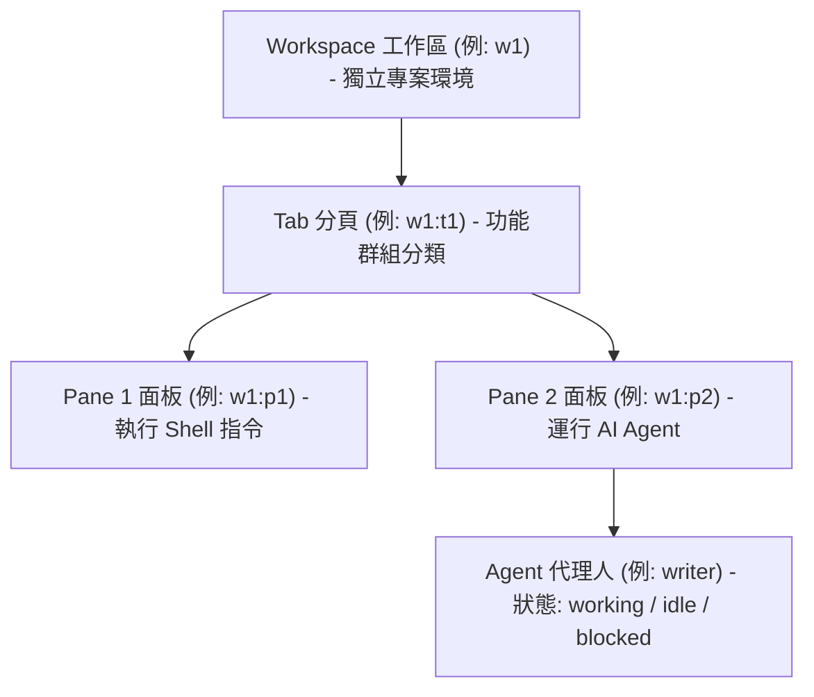

# Herdr 使用手冊：AI Agent 終端工作區管理器

> **適用版本**：herdr 0.8.0+  
> **課程單元**：聯合醫院 人工智慧 (AI) 開發基礎課程

---

## 目錄
- [第 1 章：認識 Herdr 與多 Agent 協同架構](#第-1-章認識-herdr-與多-agent-協同架構)
  - [1.1 什麼是 Herdr？](#11-什麼是-herdr)
  - [1.2 為什麼需要 Herdr？（與 tmux 比較）](#12-為什麼需要-herdr與-tmux-比較)
  - [1.3 四層層級架構](#13-四層層級架構)
- [第 2 章：安裝與初始環境配置](#第-2-章安裝與初始環境配置)
  - [2.1 主程式安裝（跨平台）](#21-主程式安裝跨平台)
  - [2.2 版本升級與通道設定](#22-版本升級與通道設定)
  - [2.3 Agent 狀態整合（Integration）](#23-agent-狀態整合integration)
  - [2.4 賦予 Agent 控制能力（Agent Skill）](#24-賦予-agent-控制能力agent-skill)
  - [2.5 驗證安裝與環境變數](#25-驗證安裝與環境變數)
- [第 3 章：工作區與終端面板基礎操作](#第-3-章工作區與終端面板基礎操作)
  - [3.1 Session 與背景持久化](#31-session-與背景持久化)
  - [3.2 Workspace（工作區）管理](#32-workspace工作區管理)
  - [3.3 Pane（面板）分割與配置](#33-pane面板分割與配置)
  - [3.4 在 Pane 執行指令與監聽輸出](#34-在-pane-執行指令與監聽輸出)
- [第 4 章：核心焦點：Agent 管理與派發工作指南](#第-4-章核心焦點agent-管理與派發工作指南)
  - [4.1 Agent 生命週期與狀態機制](#41-agent-生命週期與狀態機制)
  - [4.2 派發工作標準 SOP 四步驟](#42-派發工作標準-sop-四步驟)
  - [4.3 應對 Blocked 狀態：按鍵互動（send-keys）](#43-應對-blocked-狀態按鍵互動send-keys)
  - [4.4 長輸出與 Alternate Screen 處理解決方案](#44-長輸出與-alternate-screen-處理解決方案)
  - [4.5 驗收回饋與迭代式提示（Prompt Iteration）](#45-驗收回饋與迭代式提示prompt-iteration)
- [第 5 章：精選實戰場景手冊](#第-5-章精選實戰場景手冊)
  - [場景一：背景執行測試或腳本（焦點不跳轉）](#場景一背景執行測試或腳本焦點不跳轉)
  - [場景二：派發子 Agent 編寫資料處理模組並自動驗收](#場景二派發子-agent-編寫資料處理模組並自動驗收)
  - [場景三：使用 Workspace 隔離不同醫療專案](#場景三使用-workspace-隔離不同醫療專案)
  - [場景四：長時間執行訓練或服務，離線後重連](#場景四長時間執行訓練或服務離線後重連)
- [第 6 章：多 Agent 協作安全與禮儀準則](#第-6-章多-agent-協作安全與禮儀準則)
- [第 7 章：完整指令速查表](#第-7-章完整指令速查表)

---

## 第 1 章：認識 Herdr 與多 Agent 協同架構

### 1.1 什麼是 Herdr？
**Herdr**（[herdr.dev](https://herdr.dev)）是一個專為 **AI Coding Agent** 時代所打造的終端工作區管理器（Terminal Workspace Manager）。  
它在背後常駐 Daemon 服務，將終端機組織成靈活的多層結構，並能主動「理解」終端機內部正在運行的 AI Agent（如 Claude Code、Cursor、OpenCode、Codex 等），提供即時的狀態追蹤與程式化控制 API。

### 1.2 為什麼需要 Herdr？（與 tmux 比較）

| 特性比較 | 傳統工具（如 tmux、iTerm2） | Herdr |
|---|---|---|
| **Agent 狀態感知** | ❌ 僅視為普通字元輸出串流 | ✅ **內建感知**：自動辨識 Agent 為 `idle`、`working`、`blocked` 或 `done` |
| **操作介面** | 鍵盤快捷鍵為主 | 鍵盤快捷鍵 + **滑鼠原生支援**（拖曳調整邊界、點擊分頁） |
| **自動化派工** | 需自行用 Bash / tmux send-keys 拼湊 | 內建 `herdr agent prompt --wait`，支援事件驅動等待與防競態條件 |
| **持久常駐性** | 支援 session attach | 支援具名 session，關閉終端機或重啟後服務依然在背景持續運作 |
| **多 Agent 協作** | 困難，難以判定子 Agent 何時完成 | 支援多 Agent 同時運行，主控 Agent 可輕鬆排程與驗收子 Agent 成果 |

### 1.3 四層層級架構

Herdr 採取由大到小的四層層級設計：



- **Workspace（工作區，ID: `w1`）**：最高層級，通常用於隔離不同的專案或獨立分支。
- **Tab（分頁，ID: `w1:t1`）**：工作區內的分頁，可依功能區分（如：前處理、模型訓練、日誌監看）。
- **Pane（終端面板，ID: `w1:p1`）**：分頁內的實體分割視窗。ID 是不可重用的穩定識別碼。
- **Agent（代理人，如 `writer`）**：在 Pane 內運行的 AI Coding Agent，具有獨立名稱與生命週期。

---

## 第 2 章：安裝與初始環境配置

### 2.1 主程式安裝（跨平台）

* **macOS（Homebrew 推薦）**：
  ```bash
  brew install herdr
  ```

* **Linux / macOS（官方安裝腳本）**：
  ```bash
  curl -fsSL https://herdr.dev/install.sh | sh
  ```

* **Windows（PowerShell）**：
  ```powershell
  irm https://herdr.dev/install.ps1 | iex
  ```

* **Mise 套件管理器**：
  ```bash
  mise use -g herdr
  ```

### 2.2 版本升級與通道設定
```bash
# 檢查並升級最新版
herdr update

# 切換更新發行通道（stable 穩定版 / preview 預覽版）
herdr channel set stable

# 啟用 zsh 自動補完
herdr completion zsh
```

### 2.3 Agent 狀態整合（Integration）
為了讓 Herdr 能更精確偵測各款 AI Agent 的狀態切換，建議安裝相應的 integration：
```bash
herdr integration install claude
herdr integration install codex
herdr integration install opencode
```

### 2.4 賦予 Agent 控制能力（Agent Skill）
若希望您目前的 Coding Agent（例如 Claude Code、Gemini 等）具備主動調度 Herdr 的能力，可安裝官方 Skill：
```bash
# 全域安裝（推薦）
npx skills add herdrdev/herdr --skill herdr -g

# 專案本地安裝
npx skills add herdrdev/herdr --skill herdr
```

### 2.5 驗證安裝與環境變數
```bash
herdr --version
herdr status
```
當您進入 Herdr 建立的終端面板後，環境中會自動注入以下變數：
```bash
echo $HERDR_ENV           # 輸出: 1 (代表處於 Herdr 管理的面板中)
echo $HERDR_WORKSPACE_ID  # 輸出當前 Workspace ID (例如: w1)
echo $HERDR_TAB_ID        # 輸出當前 Tab ID (例如: w1:t1)
echo $HERDR_PANE_ID       # 輸出當前 Pane ID (例如: w1:p1)
```

設定檔與日誌位置：
- 設定檔：`~/.config/herdr/config.toml`（可用環境變數 `HERDR_CONFIG_PATH` 覆寫）
- 日誌目錄：`~/.config/herdr/herdr.log`、`herdr-client.log`、`herdr-server.log`

---

## 第 3 章：工作區與終端面板基礎操作

### 3.1 Session 與背景持久化
Herdr 支援具名 Session，非常適合執行長時間任務：
```bash
# 啟動並進入名為 ai-lab 的 session
herdr --session ai-lab

# 檢視所有 session
herdr session list

# 重新連線到已存在的 session
herdr session attach ai-lab

# 停止並刪除 session（注意：此為破壞性操作）
herdr session stop ai-lab
herdr session delete ai-lab
```

### 3.2 Workspace（工作區）管理
```bash
# 列出目前所有的工作區
herdr workspace list

# 建立新工作區（--no-focus 保持當前視窗焦點）
herdr workspace create --label "medical-nlp" --cwd "$PWD" --no-focus

# 取得特定工作區詳細資訊
herdr workspace get <workspace-id>

# 切換焦點至指定工作區
herdr workspace focus <workspace-id>

# 為工作區重新命名
herdr workspace rename <workspace-id> "new-label"
```

### 3.3 Pane（面板）分割與配置
分割 Pane 是多工的核心。**背景自動化派工時一律加上 `--no-focus`**：
```bash
# 往右側水平分割 Pane
herdr pane split --current --direction right --cwd "$PWD" --no-focus

# 往下方垂直分割 Pane
herdr pane split --current --direction down --cwd "$PWD" --no-focus

# 檢視當前面板結構與寬高
herdr pane layout

# 最大化/還原指定 Pane（Zoom）
herdr pane zoom --toggle --pane <pane-id>
```

> **重要觀念**：`herdr pane split` 執行後會回傳 JSON，請自 `.result.pane.pane_id` 取得生成的 `<pane-id>`（例如 `w1:p2`），供後續指令使用。

### 3.4 在 Pane 執行指令與監聽輸出
不需要手動切換畫面，直接向背景 Pane 派發指令並取得回傳：
```bash
# 1. 在背景面板執行指令
herdr pane run <pane-id> python preprocess.py

# 2. 等待特定文字輸出出現（支援 timeout 毫秒設定）
herdr pane wait-output <pane-id> --match "Preprocess Completed" --timeout 60000

# 3. 讀取終端面板輸出（推薦使用 recent-unwrapped 格式）
herdr pane read <pane-id> --source recent-unwrapped
```

---

## 第 4 章：核心焦點：Agent 管理與派發工作指南

在複雜的 AI 專案中，主控端（人類或主 Agent）可以召喚一個或多個子 Agent，將特定工作拆解派發。

### 4.1 Agent 生命週期與狀態機制

Herdr 能自動監控 Agent 的狀態：

```
       [啟動 agent start]
              │
              ▼
   ┌──────► [idle] (等待下達指令)
   │          │
   │          │ (herdr agent prompt)
   │          ▼
   │       [working] (正在思考 / 執行程式碼)
   │          │
   │    ┌─────┴─────┐
   │    ▼           ▼
   │ [blocked]    [done] (完成任務)
   │ (需人機確認)    │
   │    │           │
   └────┴───────────┘
```

- **`idle`**：Agent 已備妥，正在等待輸入 Prompt。
- **`working`**：Agent 正在執行工作、讀寫檔案或思考中。
- **`blocked`**：Agent 遇到需要使用者確認的事項（例如：工具授權、危險指令詢問、選擇題），等待鍵盤輸入。
- **`done`**：背景任務完成，回到閒置狀態。
- **`unknown`**：狀態不明（不等於完成，需特別留意）。

### 4.2 派發工作標準 SOP 四步驟

以下為標準的自動化派工閉環流程：

#### 步驟 1：建立隔離的面板（Pane）
```bash
herdr pane split --current --direction down --cwd "$PWD" --no-focus
```
*從 JSON 結果中取出生成的 `<pane-id>`（例如 `w1:p2`）*。

#### 步驟 2：啟動子 Agent
在該 Pane 啟動目標 AI 代理人：
```bash
herdr agent start worker-agent --kind claude --pane <pane-id>
```
* **命名規則**：符合 `[a-z][a-z0-9_-]{0,31}`，且在存活的 Agent 中需唯一。
* **`--kind`**：支援 `claude`、`codex`、`opencode` 等。
* **注意**：`agent start` 只能掛載在已存在且處於互動 Shell Prompt 的 Pane 上。

#### 步驟 3：派發 Prompt 並等待完成（關鍵：`--wait`）
```bash
herdr agent prompt worker-agent "請分析 data/reports.csv 中的缺失值，並寫入 clean_data.py" --wait --timeout 180000
```
* **`--wait`**：會保持阻塞等待，直到 Agent 狀態轉為 `idle`、`done` 或 `blocked`。
* **`--timeout`**：防止任務無止盡卡住（單位為毫秒，例如 180000 為 3 分鐘）。
* **重要安全機制**：若 Agent 目前處於 `blocked`，直接呼叫帶 `--wait` 的 prompt 會被拒絕，回傳 `agent_blocked`，防止死鎖。

#### 步驟 4：檢查狀態與讀取結果
```bash
# 1. 取得 Agent 詳細狀態
herdr agent get worker-agent

# 2. 若狀態判斷有疑義，可分析狀態偵測理由
herdr agent explain worker-agent

# 3. 讀取 Agent 終端輸出回覆
herdr agent read worker-agent --source recent-unwrapped
```

---

### 4.3 應對 Blocked 狀態：按鍵互動（send-keys）

當子 Agent 遇到危險指令確認（如：`Do you want to proceed? [y/N]`），狀態會切換為 `blocked`。此時主控端不可盲目送 prompt，應使用 `send-keys` 解鎖：

```bash
# 查看終端畫面確認問題
herdr agent read worker-agent --source recent-unwrapped

# 發送 'y' 並按 Enter 確認
herdr agent send-keys worker-agent y Enter

# 或發送 Esc 取消
herdr agent send-keys worker-agent esc
```

---

### 4.4 長輸出與 Alternate Screen 處理解決方案

- **來源模式 `--source`**：
  - `recent-unwrapped`（**強烈推薦**）：能取得未折行的完整文字輸出，最適合做日誌與自動化程式剖析。
  - `visible`：僅當前螢幕可見範圍。
  - `recent`：包含終端折行的最近輸出。
  - `detection`：僅輸出觸發狀態判定的特徵字串。
- **長文本應對秘訣**：
  若 Agent 在 Alternate Screen（例如特殊全螢幕 TUI）下運行，終端滾動緩衝區可能會截斷文字。  
  **最佳實踐**：在派發 Prompt 時，明確要求子 Agent：
  > *「請將完整分析報告儲存至 `./output/result.md`，並僅在終端機輸出完成路徑。」*  
  主控端隨後直接讀取檔案，穩定且不受終端機緩衝區行數限制。

---

### 4.5 驗收回饋與迭代式提示（Prompt Iteration）

若讀取結果後發現子 Agent 產出未達標準，**不要刪除 Pane**，直接追加提示進行迭代：

```bash
herdr agent prompt worker-agent "驗收未通過：clean_data.py 缺少對缺少身分證號欄位的例外處理，請補上單元測試並重新驗證" --wait --timeout 120000
```

---

## 第 5 章：精選實戰場景手冊

### 場景一：背景執行測試或腳本（焦點不跳轉）

**情境**：在編輯程式碼時，開一個右側面板執行單元測試，焦點保持在目前正在編輯的視窗。

```bash
# 1. 向右分割面板，不切換焦點
herdr pane split --current --direction right --cwd "$PWD" --no-focus
# 假設取得 pane-id 為 w1:p2

# 2. 在背景面板執行測試
herdr pane run w1:p2 pytest tests/test_model.py

# 3. 等待輸出包含 "passed" 或 "failed"
herdr pane wait-output w1:p2 --match "passed" --timeout 60000

# 4. 讀取測試輸出
herdr pane read w1:p2 --source recent-unwrapped
```

---

### 場景二：派發子 Agent 編寫資料處理模組並自動驗收

**情境**：主控端指派子 Agent `data-worker` 建立臨床資料特徵萃取模組。

```bash
# 1. 往下分割面板
herdr pane split --current --direction down --cwd "$PWD" --no-focus
# 假設取得 pane-id 為 w1:p3

# 2. 啟動 Agent
herdr agent start data-worker --kind claude --pane w1:p3

# 3. 派發明確任務
herdr agent prompt data-worker "請在 src/ 建立 feature_extractor.py，讀取病歷文字並萃取血壓與心率數值" --wait --timeout 180000

# 4. 讀取並檢驗成果
herdr agent read data-worker --source recent-unwrapped

# 5. 若符合預期，可關閉面板收尾（或留著待命）
herdr pane close w1:p3
```

---

### 場景三：使用 Workspace 隔離不同醫療專案

**情境**：同時進行「胸部 X 光影像模型」與「門診就診量預測」兩項任務，建立獨立 Workspace 避免檔案路徑與終端互相污染。

```bash
# 1. 建立影像專案工作區
herdr workspace create --label "cxr-classification" --cwd "/workspace/cxr_project" --no-focus

# 2. 建立預測專案工作區
herdr workspace create --label "outpatient-forecast" --cwd "/workspace/forecast_project" --no-focus

# 3. 隨時切換工作區焦點
herdr workspace list
herdr workspace focus <cxr-workspace-id>
```

---

### 場景四：長時間執行訓練或服務，離線後重連

**情境**：在伺服器上執行長達數小時的模型微調，下班關閉本機終端，隔天上班再連回檢查。

```bash
# 1. 啟動具名 session
herdr --session med-training

# 2. 正常執行訓練腳本或啟動 Agent
python train_llm.py

# 3. 直接關閉終端機視窗（Daemon 依然在背景持續執行）

# 4. 隔日重新連線
herdr session attach med-training
```

---

## 第 6 章：多 Agent 協作安全與禮儀準則

1. **焦點保護原則（`--no-focus`）**：
   自動化腳本或 Agent 背景作業時，`workspace create` 與 `pane split` 一律加上 `--no-focus`，嚴禁搶奪人類開發者的操作畫面。
2. **動態解析 ID**：
   Pane 與 Workspace ID 是動態生成的 Handle。**務必從 CLI 指令回傳的 JSON 解析取得**，切勿以寫死或猜測的方式帶入 ID。
3. **版面配置禮儀**：
   - 寬面板往右分割（`--direction right`）。
   - 高/窄面板往下分割（`--direction down`）。
   - 分割前可先透過 `herdr pane layout` 評估面板尺寸，避免產生過度擠壓的長條視窗。
4. **守護伺服器生命週期**：
   - 嚴禁在運作中的 Session 內執行 `herdr server stop`。
   - 嚴禁 Kill 主 Herdr 行程。
   - 不隨意關閉非自身建立的 Workspace 或 Session。
5. **探索指令規範**：
   需要查詢說明時，使用 `herdr <group>`（例如 `herdr pane`），避免執行無參數的裸 `herdr`（會直接切入互動 TUI 介面）。

---

## 第 7 章：完整指令速查表

### 7.1 Workspace（工作區）
| 指令 | 說明 | 主要參數 | 操作性質 |
|---|---|---|---|
| `herdr workspace list` | 列出所有工作區 | 無 | 唯讀 |
| `herdr workspace create` | 建立新工作區 | `--label`, `--cwd`, `--no-focus` | 狀態變更 |
| `herdr workspace get` | 查詢工作區詳細狀態 | `<workspace-id>` | 唯讀 |
| `herdr workspace focus` | 切換焦點至指定工作區 | `<workspace-id>` | 狀態變更 |
| `herdr workspace rename` | 變更工作區名稱 | `<workspace-id> <label>` | 狀態變更 |
| `herdr workspace close` | 關閉工作區 ⚠️ | `<workspace-id>` | 狀態變更 |

---

### 7.2 Pane（面板）
| 指令 | 說明 | 主要參數 | 操作性質 |
|---|---|---|---|
| `herdr pane list` | 列出所有終端面板 | 無 | 唯讀 |
| `herdr pane current` | 取得當前面板資訊 | 無 | 唯讀 |
| `herdr pane get` | 取得指定面板詳情 | `<pane-id>` | 唯讀 |
| `herdr pane layout` | 檢視當前面板排列與尺寸 | 無 | 唯讀 |
| `herdr pane split` | 分割面板 | `--direction`, `--cwd`, `--no-focus`, `--current` | 狀態變更 |
| `herdr pane run` | 在面板背景執行指令 | `<pane-id> <COMMAND>...` | 狀態變更 |
| `herdr pane wait-output`| 等待面板輸出特定文字 | `--match`, `--timeout`, `--source` | 唯讀監控 |
| `herdr pane read` | 讀取面板內容 | `--source`, `--lines`, `--format` | 唯讀 |
| `herdr pane zoom` | 切換放大/還原面板 | `--toggle`, `--pane` | 狀態變更 |
| `herdr pane move` | 移動面板至其他 Tab/工作區 | `<pane-id>`, `--tab`, `--new-workspace` | 狀態變更 |
| `herdr pane close` | 關閉面板 ⚠️ | `<pane-id>` | 狀態變更 |

---

### 7.3 Agent（代理人）
| 指令 | 說明 | 主要參數 | 操作性質 |
|---|---|---|---|
| `herdr agent list` | 列出所有活動 Agent | 無 | 唯讀 |
| `herdr agent get` | 取得 Agent 狀態資訊 | `<name>` | 唯讀 |
| `herdr agent explain` | 分析與診斷 Agent 狀態判斷依據 | `<name>` | 唯讀 |
| `herdr agent start` | 在現有 Pane 啟動 Agent | `<name> --kind <kind> --pane <pane-id>` | 狀態變更 |
| `herdr agent prompt` | 派發任務 Prompt | `<name> "<prompt>" [--wait] [--timeout ms]` | 狀態變更 |
| `herdr agent wait` | 阻塞等待 Agent 抵達特定狀態 | `<name> [--until status] [--timeout ms]` | 唯讀監控 |
| `herdr agent send-keys` | 發送鍵盤按鍵（解鎖 Blocked）| `<name> <KEYS>...` | 狀態變更 |
| `herdr agent read` | 讀取 Agent 輸出內容 | `<name> [--source] [--lines]` | 唯讀 |
| `herdr agent focus` | 切換焦點至該 Agent 所在面板 | `<name>` | 狀態變更 |
| `herdr agent rename` | 變更 Agent 名稱 | `<old-name> <new-name>` | 狀態變更 |

---

### 7.4 Session（持久會話）與系統
| 指令 | 說明 | 主要參數 | 操作性質 |
|---|---|---|---|
| `herdr session list` | 列出所有具名 Session | 無 | 唯讀 |
| `herdr session attach` | 連接並恢復 Session 畫面 | `<name>` | 狀態變更 |
| `herdr session stop` | 停止 Session ⚠️ | `<name>` | 狀態變更 |
| `herdr session delete` | 刪除已停止的 Session ⚠️ | `<name>` | 狀態變更 |
| `herdr integration install` | 安裝特定 Agent 整合層 | `<agent-name>` | 狀態變更 |
| `herdr status` | 查看 Herdr 伺服器與連線狀態 | 無 | 唯讀 |
| `herdr server stop` | 關閉本機 Herdr 伺服器 ⚠️ | 無 | 狀態變更 |

---

### JSON 回應解析欄位對照表

當您透過腳本或程式碼處理 Herdr 回傳時，關鍵欄位如下：
- `workspace create` $\rightarrow$ `.result.workspace` / `.result.tab` / `.result.root_pane`
- `tab create` $\rightarrow$ `.result.tab` / `.result.root_pane`
- `pane split` $\rightarrow$ `.result.pane.pane_id`
- `pane move` $\rightarrow$ `.result.move_result.pane.pane_id`（舊 ID 在 `.result.move_result.previous_pane_id`）
- `agent start` $\rightarrow$ `.result.agent.name` / `.result.agent.status`
