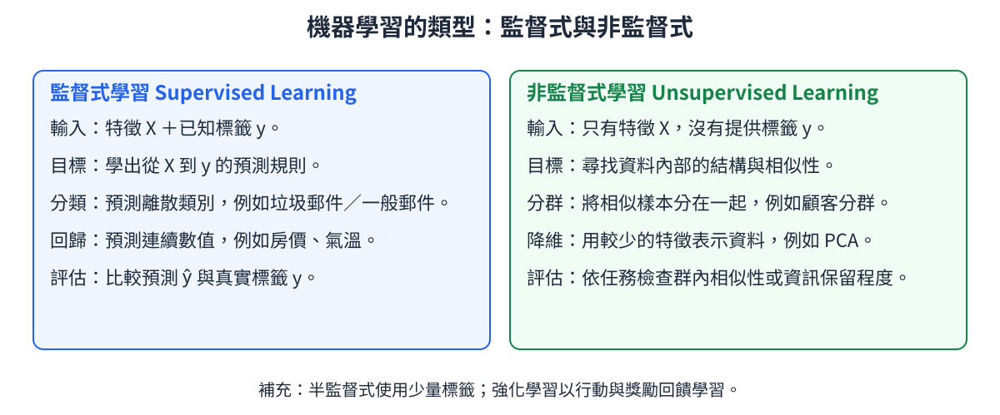

# 1. 機器學習的類型 (Types of Machine Learning)

<!-- interactive-glossary:start -->

🌐 **[開啟本章互動動畫教學](https://roberthsu2003.github.io/machine_learning/glossary/01-learning-paradigms/)**

動畫場景：[監督式：分類與回歸](https://roberthsu2003.github.io/machine_learning/glossary/01-learning-paradigms/#supervised) · [非監督式：聚類與降維](https://roberthsu2003.github.io/machine_learning/glossary/01-learning-paradigms/#unsupervised) · [學習類型比較](https://roberthsu2003.github.io/machine_learning/glossary/01-learning-paradigms/#paradigm-comparison)

<!-- interactive-glossary:end -->

機器學習（Machine Learning, ML）本質上是**讓電腦從數據中自動尋找規律，而非依賴人工程式碼一條條寫死規則**的科學。

依據「是否有標準答案提供給模型學習」以及「回饋機制的不同」，機器學習主要分為兩大主要類型：**監督式學習**與**非監督式學習**；在進階實務中，亦常結合**半監督式學習**與**強化學習**。

---

## 🎯 本章學習目標
1. 掌握**監督式學習**的核心機制，能精準區分**分類任務**與**回歸任務**。
2. 理解**非監督式學習**的探索本質，掌握**聚類**與**降維**的應用場景。
3. 能從資料特性（有無標籤）與商業需求出發，正確選定合適的學習類型。

---

## 1. 監督式學習 (Supervised Learning)

### 核心定義
監督式學習是指使用**帶有標籤（Ground Truth Label）**的訓練數據來訓練模型。模型透過學習輸入特徵 $X$ 與對應標籤 $y$ 之間的對應映射關係 $f(X) \approx y$，進而能夠對從未見過的新數據做出準確預測。

### 💡 生活直觀比喻：名師出高徒與刷題附詳解
> 監督式學習就像一位學生在做**附有詳細解答與正確答案的歷屆考題本**。  
> 學生每做完一題，就翻到最後一頁對答案（計算誤差 Loss），答錯了就修正自己的解題思考（調整權重參數），直到錯誤率降到最低為止。

#### 📊 觀念圖解
> 🎬 互動動畫：[監督式：分類與回歸](https://roberthsu2003.github.io/machine_learning/glossary/01-learning-paradigms/#supervised)

### 兩大主要任務類型
監督式學習依據預測目標的數據型態，分為兩大主要任務：

| 任務類型 | 標籤型態 | 預測目標特點 | 經典生活實例 | 常用代表算法 |
| :--- | :--- | :--- | :--- | :--- |
| **分類 (Classification)** | 離散類別 (Discrete) | 預測數據屬於哪一個類別標籤（二分類或多分類） | • 判斷信件是否為垃圾郵件 • 醫療影像診斷是否罹癌 • 信用卡交易是否為盜刷 | • 邏輯回歸 (Logistic Regression) • 決策樹 (Decision Tree) • 支援向量機 (SVM) • 隨機森林 (Random Forest) |
| **回歸 (Regression)** | 連續數值 (Continuous) | 預測一個可以在數線上連續變動的具體數量值 | • 根據地段坪數預測房價 • 預測明日氣溫與降雨量 • 預測下季度公司銷售額 | • 線性回歸 (Linear Regression) • 脊回歸 / Lasso 回歸 • 回歸樹 / GBDT • 神經網絡 (Neural Networks) |

### 經典範例解說
假設我們要預測房屋價格：
- **輸入特徵 $X$**：建物面積 = 100 平方公尺，房間數 = 2，距捷運站距離 = 300 公尺。
- **目標標籤 $y$**：成交價格 = 1,800 萬元。
- **模型任務**：找出 $X$ 與 $y$ 之間的函數映射。當市場出現一間全新房屋（面積 120 平方公尺，房間數 3）時，模型能精準推估其合理售價。

---

## 2. 非監督式學習 (Unsupervised Learning)

### 核心定義
非監督式學習是指在**完全沒有標籤（無標準答案）**的數據上進行學習。模型不依賴外界給予的正確答案，而是透過自主統計與幾何計算，發掘數據內部潛藏的內在結構、相似族群或低維流形模式。

### 💡 生活直觀比喻：讓小朋友分類彩色積木
> 想像把一大箱形狀各異、五顏六色的積木倒在地上，**不給任何指示或說明書**，讓小朋友自己整理。  
> 小朋友會憑直覺把「圓形的積木放在一起」、「紅色的積木分到同一堆」。雖然他並不知道這些積木的專有名詞，但他成功抓住了積木之間的「相似性特徵」。

#### 📊 觀念圖解
> 🎬 互動動畫：[非監督式：聚類與降維](https://roberthsu2003.github.io/machine_learning/glossary/01-learning-paradigms/#unsupervised)

### 兩大主要任務類型

| 任務類型 | 核心目標 | 實務價值 | 經典實例 | 代表算法 |
| :--- | :--- | :--- | :--- | :--- |
| **聚類 (Clustering)** | 將相似的數據點自動聚集為同一群，群內相似度高、群間差異大 | 探索未知的用戶分群或數據分佈 | • 電商顧客消費偏好分群 • 新聞主題自動分堆 • 基因表達譜分型 | • K-Means 聚類 • DBSCAN 密度聚類 • 階層聚類 (Hierarchical) |
| **降維 (Dimensionality Reduction)** | 在盡可能保留原始資訊的前提下，壓縮特徵維度 | 解決維度災難、消除特徵冗餘、資料視覺化 | • 將 100 維的基因特徵壓縮為 2 維以繪圖呈現 • 圖像壓縮與去噪 | • 主成分分析 (PCA) • t-SNE / UMAP • 自編碼器 (Autoencoder) |

### 🔍 降維小範例：把健檢表壓成一張散佈圖
> 想像全班 40 位同學的健檢資料，每人有身高、體重、腰圍、視力、肺活量……共 10 個數字，攤在桌上根本看不出誰和誰體型接近。降維就是請一位「整理高手」把這 10 個數字壓成平面上的 $(x, y)$ 兩個座標，讓體型接近的同學在圖上站得靠近。
- **保留什麼**：差異最大的方向（例如整體「大隻 vs 小隻」），這是區分同學最有用的資訊。
- **捨棄什麼**：重複的資訊與細微雜訊（例如身高和腿長高度相關，留一個就夠）。
- **生活比喻**：就像用手電筒把立體的手勢照成牆上的 2D 影子——影子看得出是兔子還是狗，但手指的前後距離不見了。
- **對應動畫**：本章「非監督式」動畫的投影模式可以手動旋轉投影方向；真實的 PCA 則是**自動找出資訊量最大的那個方向**，動畫是為了讓你先感受「投影一定會丟東西」。
- **何時用**：想把高維資料畫出來看、去掉重複特徵讓模型跑更快、幫圖片去噪。
- **注意**：壓縮一定會遺失資訊，且壓完的新座標軸通常難以用一句話解釋（不像原本的「身高」那麼直觀）。

---

## 3. 學習類型全景對照

#### 📊 觀念圖解
> 🎬 互動動畫：[學習類型比較](https://roberthsu2003.github.io/machine_learning/glossary/01-learning-paradigms/#paradigm-comparison)

[查看原始 PNG 圖片](./images/03_comparison.png)

### 核心對照矩陣

| 比較維度 | 監督式學習 (Supervised) | 非監督式學習 (Unsupervised) |
| :--- | :--- | :--- |
| **訓練數據組成** | 特徵矩陣 $X$ + **標準標籤 $y$** | 僅有特徵矩陣 $X$（**無標籤**） |
| **學習目標** | 預測未知樣本的輸出值（求對應） | 發現數據自身的結構、分佈與族群（求規律） |
| **人工作業成本** | **高**（需要大量人工標註數據） | **低**（可直接利用未經整理的原始數據） |
| **模型評估方式** | 客觀明確（準確率、召回率、MSE 等） | 較具主觀性（輪廓係數、重構誤差、領域專家解讀） |
| **常見應用領域** | 疾病診斷、人臉識別、股價走勢預測 | 潛在客群輪廓分析、異常詐欺交易偵測、圖像特徵壓縮 |

> [!NOTE]
> **拓展視野：其他現代學習類型**
> - **半監督式學習 (Semi-Supervised Learning)**：擁有大量未標記數據，但只有極少量昂貴的人工標籤。利用少量標籤引導大量未標籤數據，大幅降低標註成本。
> - **強化學習 (Reinforcement Learning, RL)**：沒有固定的數據集，智慧體（Agent）透過與環境互動試錯（Trial-and-Error），依據獲得的獎勵（Reward）或懲罰最大化長期累積回報（如 AlphaGo、自動駕駛）。
>
> ### 🔍 半監督學習：何時用？（標籤很貴的時候）
> - **何時用**：當「請人標答案」又貴又慢，但沒答案的資料多到滿出來時。例如醫院有 10 萬張 X 光片，卻只有 100 張有醫師確診標註；或是詐騙電話錄音有上萬通，只有幾百通被確認過。
> - **做法直覺**：先用 100 張有答案的學出初步判斷，再請模型幫「很有把握」的沒答案資料暫時貼上標籤，變成新的練習題；或要求模型「同一張片子轉個角度，判斷要一致」。少量答案帶動大量練習。
> - **小範例**：垃圾郵件過濾——人工只標 200 封，剩下 10 萬封讓模型先猜，對「垃圾味很重／很像正常信」的先採納，灰色地帶留給人工，越用越準。
> - **對應動畫**：切換「學習類型比較」動畫的半監督模式，看見模型同時吃進「少量 y＋大量無標籤」。
>
> ### 🔍 強化學習：何時用？（沒有標準答案，要靠試錯學決策的時候）
> - **何時用**：問題沒有事先寫好的正確答案，而是一連串決策做完才知道好不好，且允許（在模擬器裡）不斷試錯時。例如下棋、倉庫機器人取貨、資料中心冷氣節能。
> - **做法直覺**：智慧體（Agent）看環境 → 做行動 → 拿獎勵或懲罰 → 調整下次的選擇，目標是長期總分最高。監督式是「對答案」，強化學習是「做完才知道分數」。
> - **小範例 1（下棋）**：AlphaGo 下每一步沒有老師打分數，只有終盤贏（+1）或輸（−1）；它下了幾百萬盤棋，自己悟出人類沒下過的妙手。
> - **小範例 2（掃地機器人）**：撞到牆扣分、掃到新區域加分，幾千次碰撞後學會先沿牆走再 S 形覆蓋。
> - **對應動畫**：切換「學習類型比較」動畫的強化學習模式，那條橘色回饋箭頭就是「行動 → 環境 → 獎勵」再回來的路。

---

## 📌 本章精華速記
1. **監督式學習**看重「對齊答案」，核心是輸入到輸出的對應映射，分為**預測類別的分類**與**預測數值的回歸**。
2. **非監督式學習**看重「自發探索」，核心是資料內在結構的解析，主要代表為**分群聚類**與**特徵降維**。
3. 在真實機器學習專案中，通常先以非監督式方法（如 PCA、聚類）進行探索性數據分析（EDA），再透過監督式模型執行精準預測。

---

[📑 返回目錄](../README.md) | [⏭️ 下一章：02_數據結構](../02_數據結構/README.md)
