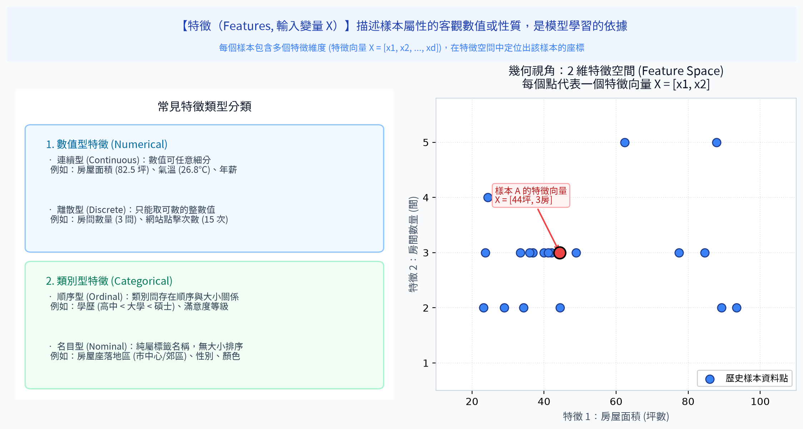
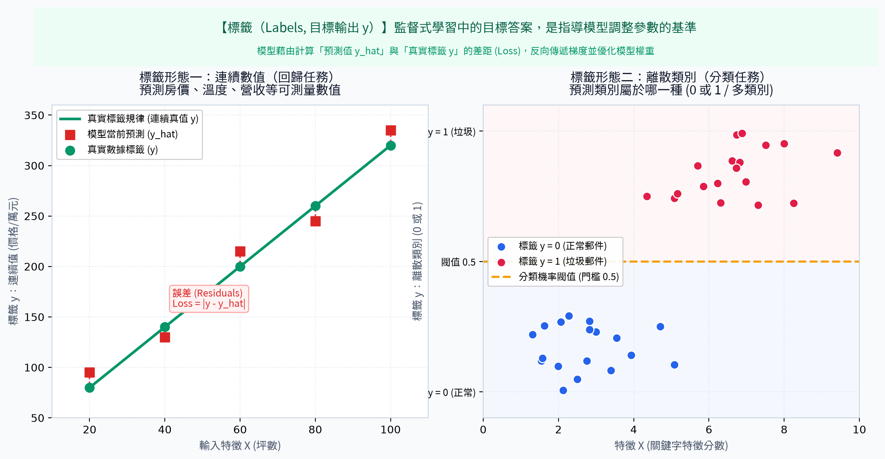
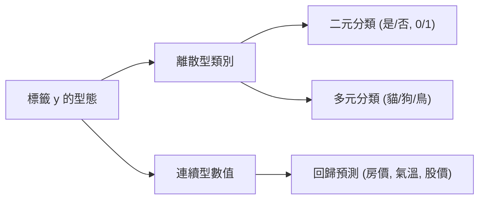
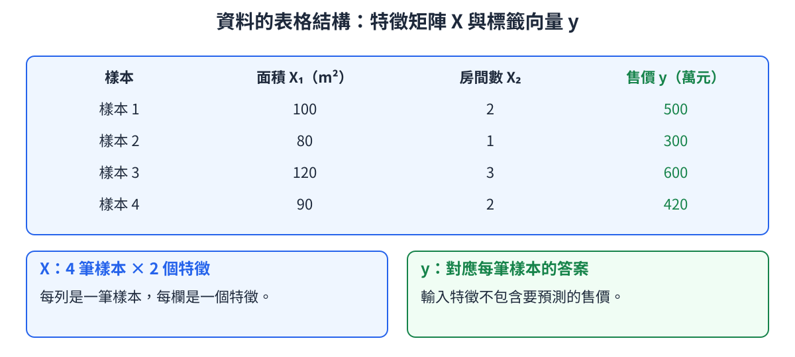

# 2. 數據結構 (Data Structures: Features & Labels)

<!-- interactive-glossary:start -->

🌐 **[開啟本章互動動畫教學](https://roberthsu2003.github.io/machine_learning/glossary/02-data-structures/)**

動畫場景：[特徵與資料型態](https://roberthsu2003.github.io/machine_learning/glossary/02-data-structures/#features) · [標籤與任務](https://roberthsu2003.github.io/machine_learning/glossary/02-data-structures/#labels) · [特徵矩陣 X 與標籤 y](https://roberthsu2003.github.io/machine_learning/glossary/02-data-structures/#matrix)

<!-- interactive-glossary:end -->

在機器學習中，演算法並不能直接理解現實世界中的真實物體（如一張房屋照片、一封商業信件或一位病患），而是必須將現實世界的對象抽象化為由**特徵 (Features)** 與 **標籤 (Labels)** 構成的結構化矩陣數據。

理解特徵與標籤的數學形式與組織架構，是進入機器學習建模的第一步。

---

## 🎯 本章學習目標
1. 深入理解**特徵 (Features)** 的本質，掌握常見的特徵資料型態。
2. 清楚界定**標籤 (Labels)** 的定義，理解其在不同任務中的角色。
3. 掌握機器學習標準數學表示法：特徵矩陣 $X$ 與標籤向量 $y$ 的組織形態。

---

## 1. 特徵 (Features, $X$)

### 核心定義
特徵是用來描述每一個樣本對象客觀屬性、性質或測量維度的變量。在統計學中通常被稱為**自變量 (Independent Variables)** 或**輸入變量**，在數學上以符號 $X$ 表示。

模型就是透過觀察與分析特徵的數值組合，來捕捉隱藏在特徵背後的規律與趨勢。

### 💡 生活直觀比喻：相親對象的個人履歷表
> 當你參加相親活動時，介紹人遞給你的個人基本資料卡：  
> 「年齡 28 歲、身高 175 cm、職業 工程師、年收入 120 萬、是否養寵物 是」——  
> 這些用來量化或描述這個對象各個面向的具體資訊指標，就是這筆資料的**特徵 (Features)**。

#### 📊 觀念圖解
> 🎬 互動動畫：[特徵與資料型態](https://roberthsu2003.github.io/machine_learning/glossary/02-data-structures/#features)

### 常見特徵資料型態

| 特徵類型 | 特點說明 | 經典範例 | 演算法處理要點 |
| :--- | :--- | :--- | :--- |
| **連續數值型 (Continuous)** | 數值具有連續性與度量衡意義，可進行加減乘除 | 房屋坪數、體重、氣溫、商品售價 | 通常需要進行特徵縮放（標準化/正規化） |
| **離散數值型 (Discrete)** | 以整數計數形式呈現的數值 | 房間數量、家庭成員人數、造訪次數 | 視模型而定，大多可直接作為數值輸入 |
| **次序型 (Ordinal)** | 具有明確大小或等級先後順序的類別 | 學歷（高中 < 大學 < 碩士）、顧客滿意度評級 | 適合採用標籤編碼 (Label Encoding) 保留順序 |
| **名義型 (Nominal)** | 單純的類別名稱，類別之間無高低大小之分 | 顏色（紅/藍/綠）、居住縣市、性別 | 必須使用獨熱編碼 (One-Hot Encoding) 避免誤導大小關係 |
| **非結構化型 (Unstructured)** | 文字、圖像、語音、影片等非表格形態資料 | 客服評論文字、X 光醫療影像 | 需透過特徵提取（如 TF-IDF、CNN、Embedding）轉為數值向量 |

---

## 2. 標籤 (Labels, $y$)

### 核心定義
標籤是我們希望模型預測的最終目標輸出或結果答案。在統計學中被稱為**因變量 (Dependent Variables)**、**目標變量 (Target)** 或**真實答案 (Ground Truth)**，在數學上以符號 $y$ 表示。

標籤通常僅在**監督式學習**中存在，模型在訓練期間透過比對自己的猜測 $\hat{y}$ 與真實標籤 $y$ 之間的差距來自我調整。

### 💡 生活直觀比喻：大考成績與錄取通知
> 接續上述履歷表的比喻，當你讀完對方的各項條件特徵後，最後所做的決定：  
> 「是否願意進一步交往？（願意 / 不願意）」——這就是**分類問題的標籤**。  
> 若是預測對方工作三年後的「具體存款金額（85 萬元）」——這就是**回歸問題的標籤**。

#### 📊 觀念圖解
> 🎬 互動動畫：[標籤與任務](https://roberthsu2003.github.io/machine_learning/glossary/02-data-structures/#labels)

### 標籤的任務型態區分

---

## 3. 數據結構的標準數學組織

#### 📊 觀念圖解
> 🎬 互動動畫：[特徵矩陣 X 與標籤 y](https://roberthsu2003.github.io/machine_learning/glossary/02-data-structures/#matrix)

[查看原始 PNG 圖片](./images/03_data_structure_example.png)

在實務中，機器學習數據集（Dataset）通常以二維表格或矩陣形式儲存：
- 每一**列 (Row)** 代表一個獨立的**樣本點 (Sample / Instance / Example)**。
- 每一**行 (Column)** 代表一個特定的**特徵 (Feature)**。
- 最後一欄（通常情況下）為目標**標籤 (Label / Target)**。

### 數學矩陣表達式

假設我們有 $N$ 個樣本，每個樣本包含 $D$ 個特徵，則：

$$X = \begin{bmatrix}
x_{11} & x_{12} & \cdots & x_{1D} \\
x_{21} & x_{22} & \cdots & x_{2D} \\
\vdots & \vdots & \ddots & \vdots \\
x_{N1} & x_{N2} & \cdots & x_{ND}
\end{bmatrix} \in \mathbb{R}^{N \times D}, \quad
y = \begin{bmatrix}
y_1 \\
y_2 \\
\vdots \\
y_N
\end{bmatrix} \in \mathbb{R}^N$$

### 實戰範例：房價預測數據集

| 樣本編號 (ID) | 面積（坪）[$X_1$] | 房數（間）[$X_2$] | 屋齡（年）[$X_3$] | 捷運距離（公尺）[$X_4$] | **成交價格（萬元）[$y$]** |
| :---: | :---: | :---: | :---: | :---: | :---: |
| 1 | 32.5 | 3 | 5 | 180 | **1,850** |
| 2 | 21.0 | 2 | 18 | 650 | **920** |
| 3 | 45.2 | 4 | 2 | 80 | **2,680** |

- **特徵矩陣 $X$**：形狀為 $(3, 4)$ 的二維陣列（3 筆樣本，4 個特徵）。
- **標籤向量 $y$**：形狀為 $(3,)$ 的一維向量。

> [!WARNING]
> **常見陷阱：數據洩漏 (Data Leakage)**  
> 絕對不能把「未來的資訊」或「與標籤高度等價的代用特徵」放入特徵矩陣 $X$ 中！  
> 例如：想預測「病患住院天數」，卻把特徵放進「出院結帳發票總金額」——因為只有在出院後才能得知結帳金額，這會導致模型在訓練時虛高 100 分，上線實戰卻完全無法預測！

---

## 📌 本章精華速記
1. **特徵 ($X$)** 是輸入資訊，是模型認識世界、推演結論的依據（自變量）。
2. **標籤 ($y$)** 是輸出答案，是監督式學習用來指引模型修正誤差的目標（因變量）。
3. 數據組織的標準架構為 **$N$ 個樣本列 $\times D$ 個特徵行** 的特徵矩陣 $X$ 搭配一維長度的標籤向量 $y$。

---

[⏮️ 上一章：01_機器學習的類型](../01_機器學習的類型/README.md) | [📑 返回目錄](../README.md) | [⏭️ 下一章：03_數據分割](../03_數據分割/README.md)
