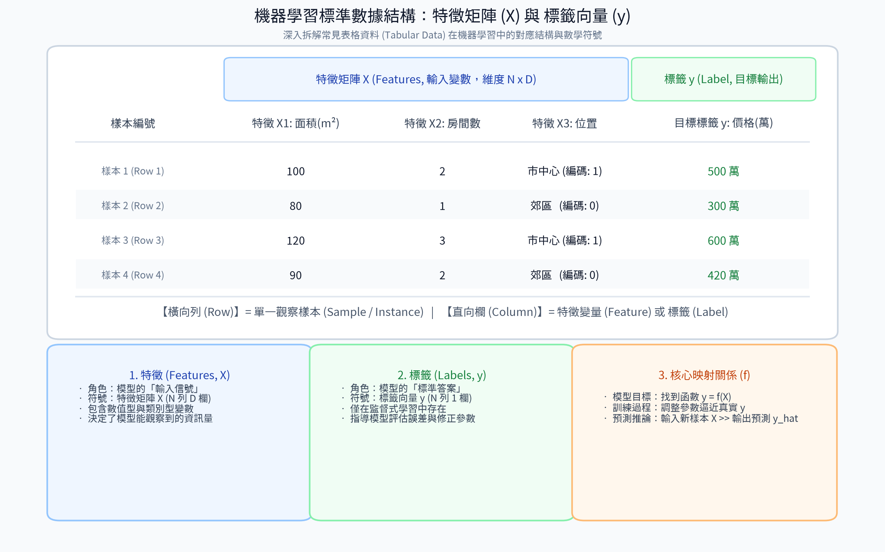

# 2. 數據結構

### 1. 特徵（Features）
**描述**：  
特徵是數據集中用來描述每個數據點的屬性或變量，通常表示為輸入變量 \( X \)。特徵是模型用來學習和進行預測的基礎，代表數據的特性或模式。特徵可以是數值型（如年齡、面積）、類別型（如性別、顏色）或其他形式。

#### 📊 觀念圖解

**特徵**：
- 特徵是數據的獨立變量，模型通過分析特徵來學習與標籤的關係。
- 特徵選擇與特徵工程（Feature Engineering）能顯著影響模型的學習效果與`預測準確度`。
- 特徵通常需要經過適當的預處理（如標準化、正規化），以確保模型能更有效地學習數據中的`規律`。

---

### 2. 標籤（Labels）
**描述**：  
標籤是數據集中每個數據點的目標輸出或結果，通常表示為 \( y \)。在監督式學習中，標籤是模型需要預測的變量，代表數據的真實答案或類別。標籤可以是連續值（回歸問題）或離散類別（分類問題）。

#### 📊 觀念圖解

**特徵**：
- 標籤是監督式學習的指導信號，模型通過比較預測值與真實標籤來優化。
- 標籤由數據收集者提供，通常需要`人工標註`。
- 非監督式學習中無標籤，僅有特徵。

---

### 3. 簡單範例與數據結構圖解

#### 📊 觀念圖解

假設你正在構建一個機器學習模型來預測房價（監督式學習中的回歸問題）。數據集可能如下：

| 房屋編號 | 面積（平方米） | 房間數 | 位置 | 價格（萬） |
|----------|----------------|--------|------|------------|
| 1        | 100            | 2      | 市中心 | 500        |
| 2        | 80             | 1      | 郊區   | 300        |
| 3        | 120            | 3      | 市中心 | 600        |

**特徵**：
- 面積（數值型特徵）
- 房間數（數值型特徵）
- 位置（類別型特徵）

**標籤**：
- 價格（連續值，作為回歸問題的目標）

**說明**：
- 在這個例子中，模型使用特徵（面積、房間數、位置）來學習與標籤（價格）之間的關係。訓練後，模型可以根據新房屋的特徵（例如面積 = 90 平方米，房間數 = 2，位置 = 郊區）預測其價格。
- 特徵是輸入，幫助模型理解房屋的特性；標籤是輸出，告訴模型真實的房價。

**另一個分類問題範例**：
假設你要預測電子郵件是否為垃圾郵件：
- **特徵**：郵件長度、發件人域名、關鍵詞頻率（如"免費"出現次數）。
- **標籤**：是否為垃圾郵件（是/否，類別型）。

---

### 4. 總結
- **特徵**：數據的輸入變量，描述數據點的屬性，用於模型學習。
- **標籤**：數據的目標輸出，僅在監督式學習中使用，指導模型預測。
- **關係**：模型通過學習特徵與標籤之間的映射關係，實現預測或分類任務。
