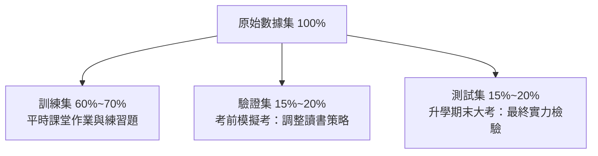
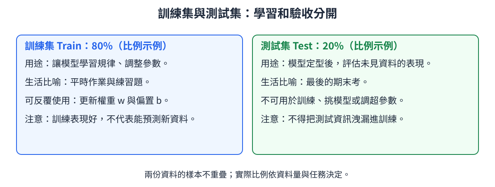
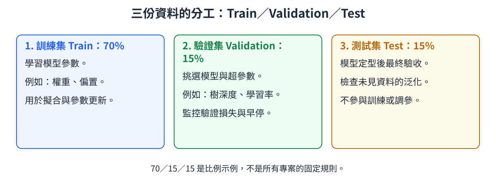
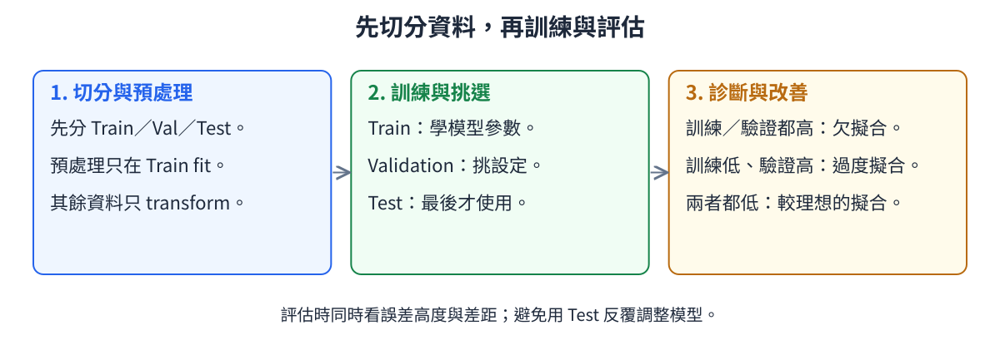

# 3. 數據分割 (Data Splitting)

<!-- interactive-glossary:start -->

🌐 **[開啟本章互動動畫教學](https://roberthsu2003.github.io/machine_learning/glossary/03-data-splitting/)**

動畫場景：[訓練／測試分割](https://roberthsu2003.github.io/machine_learning/glossary/03-data-splitting/#train-test) · [三份資料的角色](https://roberthsu2003.github.io/machine_learning/glossary/03-data-splitting/#train-validation-test) · [隨機、分層與時間切分](https://roberthsu2003.github.io/machine_learning/glossary/03-data-splitting/#split-strategies) · [資料洩漏與診斷](https://roberthsu2003.github.io/machine_learning/glossary/03-data-splitting/#leakage)

<!-- interactive-glossary:end -->

在機器學習專案中，**「用訓練過的數據來評估模型好壞」是最大的禁忌**。  
就像讓學生在考試前提前背熟了期末考卷的題目與答案一樣，即使考出滿分 100 分，也完全無法證明學生真正理解了知識，更無法預測他面對新題目時的能力。

因此，在模型接觸任何數據之前，我們必須將原始數據集科學地劃分為互不重疊的多個子集。

---

## 🎯 本章學習目標
1. 深入理解**訓練集 (Train)**、**驗證集 (Validation)** 與 **測試集 (Test)** 的職責劃分與核心機制。
2. 搞懂「為什麼需要驗證集」以及「為什麼測試集只能看一次」。
3. 掌握**隨機劃分**、**分層抽樣 (Stratified)** 與 **時間序列切分** 的適用情境與防坑守則。

---

## 1. 核心數據集劃分體系

### 💡 生活直觀比喻：求學考試三部曲

#### 📊 觀念圖解
> 🎬 互動動畫：[訓練／測試分割](https://roberthsu2003.github.io/machine_learning/glossary/03-data-splitting/#train-test)

[查看原始 PNG 圖片](./images/01_train_test_split.png)

---

### 三大子集的詳細職責定義

| 數據集種類 | 英文稱呼 | 典型比例 | 誰在使用？ | 具體任務與角色 |
| :--- | :--- | :---: | :---: | :--- |
| **訓練集** | **Training Set** | 60% ~ 80% | **模型算法** | 用於擬合模型，透過優化算法不斷調整內部**模型參數**（如神經網路權重 $W$、偏置 $b$）。 |
| **驗證集** | **Validation Set** | 10% ~ 20% | **工程師** | 用於**調整模型超參數**（如決策樹深度、學習率、正則化強度），並在訓練過程中監控是否發生過擬合，決定何時提早停止訓練（Early Stopping）。 |
| **測試集** | **Test Set** | 10% ~ 20% | **業務與專案負責人** | 在模型完全定型後，做為**終極泛化能力的客觀考卷**。此數據集在訓練與調優過程中必須被「封裝鎖死」，絕對不能參與任何學習或調參！ |

#### 📊 訓練集、驗證集與測試集三階段劃分圖解
> 🎬 互動動畫：[三份資料的角色](https://roberthsu2003.github.io/machine_learning/glossary/03-data-splitting/#train-validation-test)
> 🎬 互動動畫：[隨機、分層與時間切分](https://roberthsu2003.github.io/machine_learning/glossary/03-data-splitting/#split-strategies)

[查看原始 PNG 圖片](./images/02_three_way_split_validation.png)

---

## 2. 數據分割的核心實務原則

### 1. 隨機劃分 (Random Split)
- **原理**：將所有數據隨機打亂（Shuffle）後，依指定比例（如 80:20）切分。
- **適用場景**：樣本量充足、各類別分佈均勻、且各樣本點彼此獨立的標準數據集。

### 2. 分層抽樣劃分 (Stratified Split)
- **原理**：切分時保持各個子集中的**目標類別比例與原始數據集完全一致**。
- **適用場景**：**類別高度不平衡（Imbalanced Data）**的分類任務。
- **實例**：若罕見疾病在母體中僅佔 2%，分層切分能保證訓練集、驗證集與測試集中，罕見疾病樣本皆精準維持 2%，避免測試集完全沒分到罕見病人的極端偏差。

### 3. 時間序列切分 (Time-Series Split / Walk-Forward)
- **原理**：**嚴格禁止隨機打亂**！必須按照時間先後順序切分，以過去的歷史數據為訓練集，未來的數據為測試集。
- **適用場景**：股票價格、氣象預測、銷售額預測等具有時序相依性的數據。
- **核心守則**：嚴禁「拿明天的數據去訓練模型預測昨天的走勢」（防止時間穿越）。

---

## 3. 工作流程與常見表現診斷

在切分數據後，模型在訓練集與測試集上的誤差表現，直接揭示了模型的健康狀態：

#### 📊 數據分割實戰流程與表現診斷分析矩陣
> 🎬 互動動畫：[資料洩漏與診斷](https://roberthsu2003.github.io/machine_learning/glossary/03-data-splitting/#leakage)

[查看原始 PNG 圖片](./images/03_split_workflow_and_overfitting.png)

### 模型診斷速查指南

| 訓練集表現 (Train) | 測試集表現 (Test) | 模型當前狀態 | 核心本質 | 處方對策 |
| :---: | :---: | :---: | :--- | :--- |
| **差**（高誤差） | **差**（高誤差） | **欠擬合 (Underfitting)** | 模型太笨，沒學會規律（高偏差） | 增加模型複雜度、補充關鍵特徵、減少正則化約束 |
| **極佳**（零誤差） | **差**（高誤差） | **過度擬合 (Overfitting)** | 模型死記硬背雜訊（高變異數） | 增加訓練數據量、加入正則化、提早停止訓練、簡化模型 |
| **良好**（低誤差） | **良好**（低誤差） | **理想泛化 (Good Generalization)** | 成功學會通用規律 | 可以準備模型封裝與上線部署 |

---

## 4. 實戰致命禁忌：數據洩漏 (Data Leakage)

> [!CAUTION]
> **絕對禁止的致命錯誤：先做特徵縮放，才做數據分割！**  
> 
> **錯誤作法 ❌**：  
> `原始數據集 100 筆` ➔ 直接計算整個數據集的「平均值 $\mu$」與「標準差 $\sigma$」並進行標準化 ➔ 再切分為訓練集與測試集。  
> *(後果：測試集的統計分佈資訊已經提前洩漏進訓練過程，導致測試評估虛高！)*
> 
> **正確標準作法 ✅**：  
> 先將數據乾淨切分為 `Train` 與 `Test` ➔ **僅使用 `Train` 計算平均值與標準差** ➔ 用訓練集的參數去轉換 `Train`，並用相同的參數去轉換 `Test`！

---

## 📌 本章精華速記
1. **數據分割**是客觀評估模型真實實力、預防「死記硬背作弊」的基礎防火牆。
2. **訓練集**負責學參數，**驗證集**負責調超參，**測試集**留作最後大考且只能測一次。
3. 類別不平衡務必採用**分層抽樣 (Stratified)**；時序數據切忌隨機打亂，必須遵循**時間因果順序**。
4. 所有特徵工程與預處理計算，**嚴格限於訓練集完成後再應用於測試集**，嚴防數據洩漏。

---

[⏮️ 上一章：02_數據結構](../02_數據結構/README.md) | [📑 返回目錄](../README.md) | [⏭️ 下一章：04_特徵工程](../04_特徵工程/README.md)
