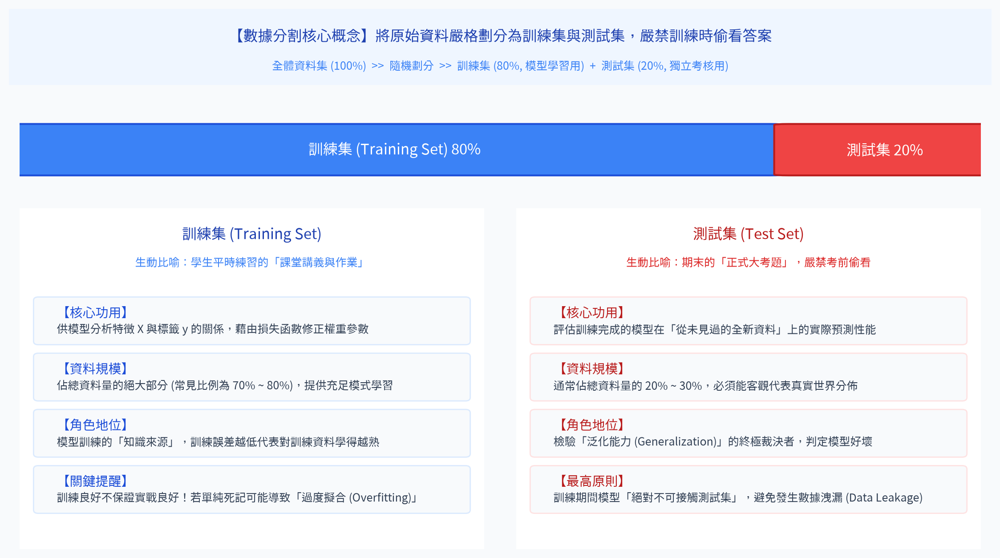
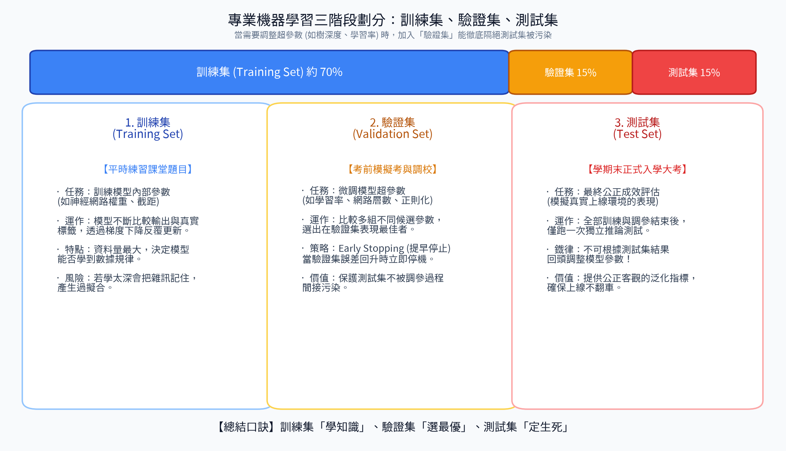
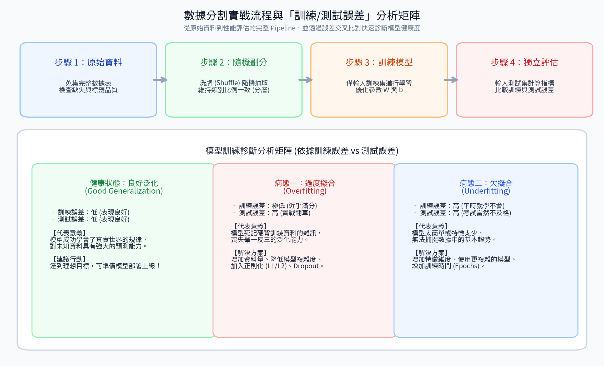

# 3. 數據分割

### 1. 訓練集（Training Set）
**描述**：  
訓練集是數據集的一部分，用於訓練機器學習模型。模型通過分析訓練集中的特徵和標籤，學習輸入與輸出之間的關係。訓練集通常占數據集的較大比例，以確保模型有足夠的數據來學習模式。

**特徵**：
- 包含特徵 \( X \) 和標籤 \( y \)。
- 用於優化模型參數，使模型在訓練數據上最小化預測誤差。
- 訓練集的`質量`和`數量`直接影響模型的學習效果。

---

### 2. 測試集（Test Set）
**描述**：  
測試集是數據集的另一部分，用於評估訓練好的模型在`未見數據`上的性能。測試集與訓練集獨立，模型在訓練過程中不會接觸測試集數據，以模擬模型在現實世界中的泛化能力。

**特徵**：
- 同樣包含特徵 \( X \) 和標籤 \( y \)，但僅用於評估，而非訓練。
- 用於計算模型的泛化誤差，檢驗是否發生欠擬合或過度擬合。
- 測試集的獨立性確保評估結果客觀反映模型的真實性能。

#### 📊 訓練集與測試集觀念圖解

---

### 3. 分割的目的
- **訓練集**：讓模型學習數據中的模式和關係。
- **測試集**：驗證模型對新數據的預測能力，評估其泛化性能。
- **避免過擬合**：如果模型僅在訓練集上表現良好，但在測試集上誤差高，則表明`模型過擬合`，無法泛化到新數據。

**常見分割比例**：
- 訓練集：測試集 = 70:30、80:20 或 90:10，具體取決於數據量和`問題需求`。
- 有時還會使用**驗證集**（Validation Set）來調整模型超參數，通常從訓練集中再分割出一部分。
  - 例如：假設你有 100 筆數據，先分成 80 筆訓練集和 20 筆測試集，然後再從 80 筆訓練集中分出 10 筆作為驗證集（剩下 70 筆繼續當訓練集）。這 10 筆驗證集用來測試不同模型參數的效果，幫助你選出最佳參數組合，最後再用測試集評估最終模型的表現。

#### 📊 訓練集、驗證集與測試集三階段劃分圖解

---

### 4. 簡單範例與工作流程
假設你有一個包含 100 條房屋數據的數據集，用於預測房價。每條數據包括特徵（面積、房間數）和標籤（價格）。你將數據集分割為訓練集和測試集：

- **數據分割**：
  - 訓練集：80 條數據（80%）
  - 測試集：20 條數據（20%）

- **數據示例**：

| 房屋編號 | 面積（平方米） | 房間數 | 價格（萬） | 數據集類型 |
|----------|----------------|--------|------------|------------|
| 1        | 100            | 2      | 500        | 訓練集     |
| 2        | 80             | 1      | 300        | 訓練集     |
| 3        | 120            | 3      | 600        | 測試集     |
| ...      | ...            | ...    | ...        | ...        |

**流程**：
1. **訓練階段**：使用訓練集（80 條數據）訓練線性回歸模型，模型學習面積、房間數與價格的關係。
2. **測試階段**：使用測試集（20 條數據）評估模型。輸入測試集的特徵（面積、房間數），比較模型預測的價格與真實價格，計算誤差（如均方誤差）。
3. **結果分析**：
   - 如果訓練集誤差低且測試集誤差也低，模型泛化良好。
   - 如果訓練集誤差低但測試集誤差高，模型可能過擬合。

#### 📊 數據分割實戰流程與表現診斷分析矩陣

**實際應用**：
- 在垃圾郵件分類任務中，訓練集用於學習郵件特徵（如關鍵詞頻率）與標籤（垃圾/非垃圾）的關係，測試集用於檢查模型是否能正確分類新郵件。

---

### 5. 總結
- **訓練集**：用於模型學習，包含大部分數據，幫助模型擬合特徵與標籤的關係。
- **測試集**：用於評估模型性能，獨立於訓練集，檢驗模型的泛化能力。
- **分割原則**：確保訓練集和測試集數據分佈一致，隨機分割以避免偏差。
