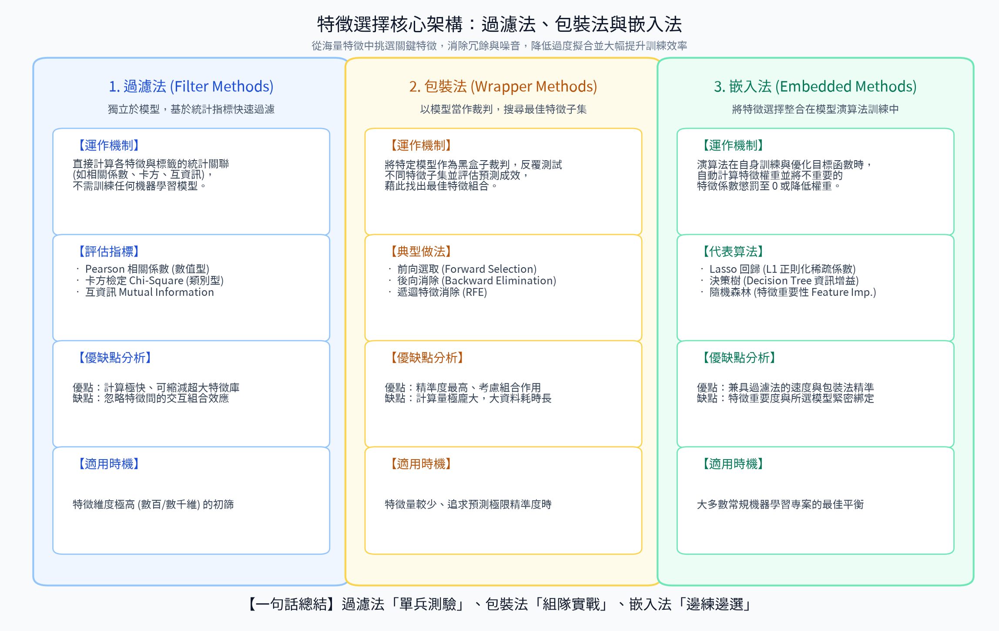
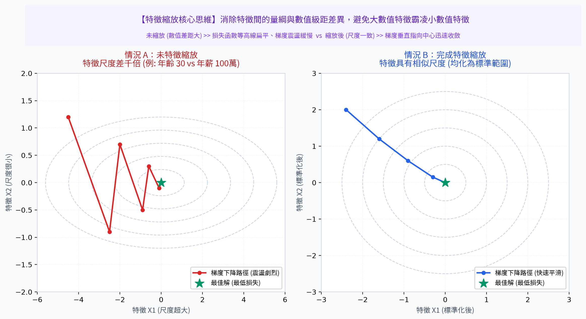
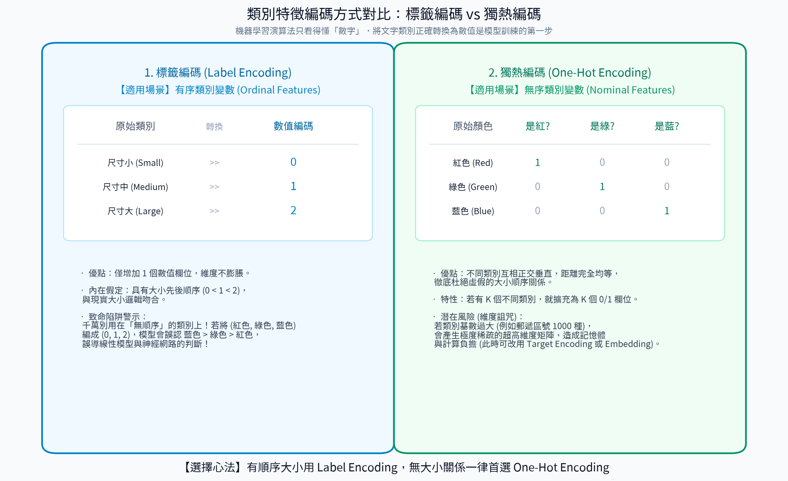

# 4. 特徵工程 (Feature Engineering)

> **「數據和特徵決定了機器學習的上限，而模型和演算法只是逼近這個上限而已。」**  
> —— 機器學習業界名言 (Garbage In, Garbage Out)

特徵工程是將原始數據轉化為更適合機器學習演算法消化、能更有效展現問題本質結構的特徵表示過程。即使使用最先進的模型架構，若輸入的特徵粗糙雜亂，模型也無法得到理想的預測效果。

---

## 🎯 本章學習目標
1. 掌握**特徵選擇**的三大核心流派（過濾法、包裝法、嵌入法）及其直觀原理。
2. 徹底搞懂**特徵縮放**（標準化 vs 正規化）的幾何原理，明白哪些模型必須縮放、哪些完全免疫。
3. 熟悉類別特徵處理：掌握**標籤編碼**與**獨熱編碼**的適用場景與潛在陷阱。

---

## 1. 特徵選擇 (Feature Selection)

### 核心定義
特徵選擇是從原始數據龐大的特徵維度中，挑選出與目標標籤相關性最高、資訊量最豐富且冗餘度最低的子集，同時剔除無關雜訊特徵。

### 核心價值
- **克服維度災難**：特徵維度過高會導致樣本空間極度稀疏，模型極易過擬合。
- **加速訓練與推論**：減少特徵數量能成倍縮減計算時間與記憶體開銷。
- **提升可解釋性**：讓工程師與領域專家更容易理解決策的核心依據。

#### 📊 觀念圖解

---

### 特徵選擇三大流派對比

| 流派 | 英文名 | 💡 直觀生活比喻 | 運作機制 | 代表方法 | 優缺點評價 |
| :--- | :--- | :--- | :--- | :--- | :--- |
| **過濾法** | **Filter Methods** | **履歷海選初篩** （未見面試官前先按學歷、年資硬指標過濾） | 不依賴任何機器學習模型，純粹依據各特徵與標籤的統計指標（如相關係數、變異數）獨立評分淘汰。 | • 變異數閾值 (低方差過濾) • 皮爾森相關係數 (Pearson) • 卡方檢定 ($\chi^2$ Test) • 互資訊法 (Mutual Info) | **優點**：運算飛快，適合超高維海選。 **缺點**：忽略了特徵之間的交互組合作用。 |
| **包裝法** | **Wrapper Methods** | **實戰面試淘汰賽** （換不同的五人小隊上場實測，看哪組配合得分最高） | 將特定模型作為黑盒子評估器，嘗試不同的特徵組合，直接以模型預測成敗來決定特徵留存。 | • 遞歸特徵消除 (RFE) • 前向搜尋 (Forward Selection) • 後向淘汰 (Backward Elimination) | **優點**：特徵組合效果最好、針對性強。 **缺點**：計算成本極高（需反覆訓練模型數百次）。 |
| **嵌入法** | **Embedded Methods** | **在日常工作中自動晉陞** （在工作訓練中直接讓實力強的權重變大、無能的被淘汰） | 特徵選擇與模型訓練融為一體，模型在學習權重時自動對不重要的特徵進行懲罰或降權。 | • L1 正則化 (Lasso 回歸) • 樹模型的特徵重要性 (Random Forest / GBDT Feature Importance) | **優點**：在特徵組合表現與計算效率間取得完美平衡。 **缺點**：高度相依於特定模型架構。 |

---

## 2. 特徵縮放 (Feature Scaling)

### 為什麼特徵縮放至關重要？
假設我們要預測房價，輸入兩項特徵：
- 特徵 $A$：**房屋年齡**（範圍 1 ~ 30 年）
- 特徵 $B$：**建坪面積**（範圍 100 ~ 5,000 平方公尺）

如果直接計算樣本間的距離（例如歐氏距離 $\sqrt{(A_1 - A_2)^2 + (B_1 - B_2)^2}$），面積的差距動輒數百數千，**其平方值將徹底淹沒房屋年齡的貢獻**！模型會誤以為年齡無關緊要。

此外，在梯度下降優化中，尺度懸殊會使損失函數等高線變成狹長橢圓，參數更新呈現劇烈的左右鋸齒反彈，收斂緩慢甚至發散；而縮放後等高線接近正圓，梯度能直接指向谷底！

#### 📊 觀念圖解

---

### 兩大主流縮放技術：標準化 vs 正規化

| 比較項目 | 標準化 (Standardization / Z-score) | 正規化 (Normalization / Min-Max Scaling) |
| :--- | :--- | :--- |
| **數學公式** | $$z = \frac{x - \mu}{\sigma}$$ | $$x_{\text{scaled}} = \frac{x - x_{\min}}{x_{\max} - x_{\min}}$$ |
| **轉換後分佈** | 平均值 $\mu = 0$，標準差 $\sigma = 1$（無固定邊界） | 嚴格縮放到特定區間，通常為 $[0, 1]$ |
| **對離群值敏感度** | **較不敏感 (Robust)**：保留了極端值的相對位置，不會擠壓主要數據 | **極度敏感**：只要出現一個極端特大值，所有正常數據都會被壓縮擠在 0 附近 |
| **適用場景** | • 特徵大致呈常態分佈 • 大多數依賴梯度下降的神經網絡、SVM、線性模型 | • 明確知道數據有硬性邊界（如像素 0~255） • K-NN 距離度量、影像處理特徵 |

### 💡 關鍵演算法免疫指南
- **必須做特徵縮放的演算法 ⚠️**：
  - **基於距離度量者**：K-NN、K-Means 聚類、支援向量機 (SVM)。
  - **依賴梯度下降者**：線性回歸、邏輯回歸、深層類神經網路 (ANN/CNN/RNN)。
  - **依賴變異數計算者**：主成分分析 (PCA)。
- **完全免疫、不需縮放的演算法 🛡️**：
  - **樹狀模型家族**：決策樹 (Decision Tree)、隨機森林 (Random Forest)、XGBoost、LightGBM。  
    *(原因：樹模型的劃分只關心該特徵數值的「前後排序相對位置」，不關心具體絕對數值的大小)*

---

## 3. 類別特徵編碼 (Categorical Encoding)

電腦只看得懂數字，無法直接將「台北、台中、高雄」或「男、女」丟進矩陣進行代數運算。

#### 📊 觀念圖解

---

### 1. 標籤編碼 (Label Encoding / Ordinal Encoding)
- **原理**：將每個文字類別對應到一個獨立整數（例如：高中=0, 大學=1, 碩士=2, 博士=3）。
- **唯一適用情境**：**有序類別特徵 (Ordinal Categories)**，即類別之間本身存在明確大小順序。
- **🚨 致命陷阱**：
  > [!WARNING]
  > **嚴禁在無序特徵上使用標籤編碼！**  
  > 若將「紅色=0, 藍色=1, 綠色=2」，線性模型或神經網路會誤以為「綠色 (2) > 藍色 (1) > 紅色 (0)」，甚至認為「紅加綠等於藍（$0 + 2 \approx 2 \times 1$）」，給模型注入虛假的數學大小關係！

### 2. 獨熱編碼 (One-Hot Encoding)
- **原理**：為每個無序類別創建一個專屬的二進位特徵（0 或 1），讓類別在幾何空間中互相正交垂直。
- **範例**：  
  - 「紅」➔ `[1, 0, 0]`  
  - 「綠」➔ `[0, 1, 0]`  
  - 「藍」➔ `[0, 0, 1]`  
- **適用場景**：**無序類別特徵 (Nominal Categories)**（如血型、縣市、性別）。
- **注意事項**：若類別種類過多（如郵遞區號有 300 種），會導致特徵矩陣極度稀疏（High Cardinality），此時需考慮 Target Encoding 或嵌入向量 (Embedding)。

---

## 📌 本章精華速記
1. **特徵工程**決定模型天花板，包含特徵提取、選擇、縮放與編碼。
2. **特徵縮放**能平衡各維度權重並加速梯度下降；距離模型（KNN/SVM）與神經網絡必做，樹模型免疫。
3. **標籤編碼**僅限用於「有序等級」（如教育程度），**無序類別**（如顏色）一律使用**獨熱編碼 (One-Hot)** 避免虛假大小誤導。
4. 特徵選擇能降維去噪，首選在計算效率與組合表現間取得平衡的**嵌入法 (Embedded)**。

---

[⏮️ 上一章：03_數據分割](../03_數據分割/README.md) | [📑 返回目錄](../README.md) | [⏭️ 下一章：05_模型參數](../05_模型參數/README.md)
