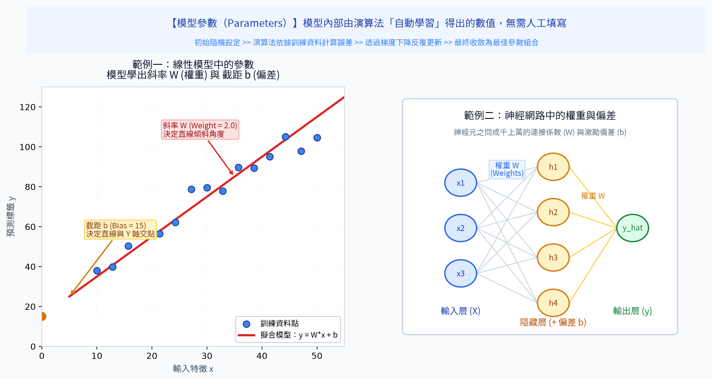
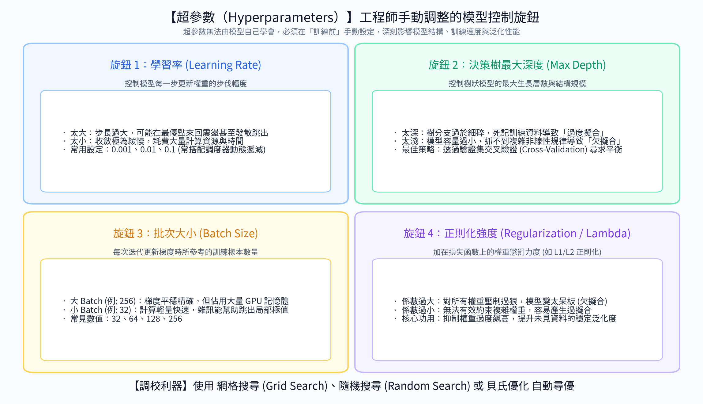
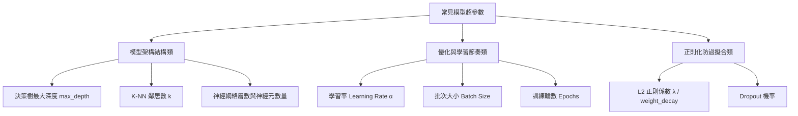
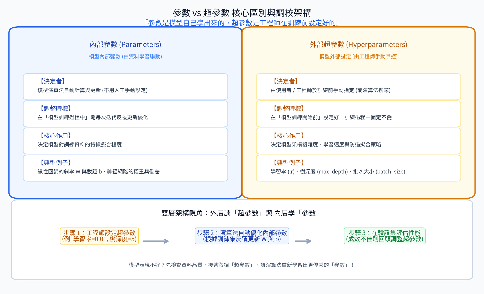

# 5. 模型參數 (Model Parameters & Hyperparameters)

在機器學習中，常常聽到工程師在討論「調參」、「模型權重」或「學習率」。許多初學者常將**參數 (Parameters)** 與 **超參數 (Hyperparameters)** 混為一談。

事實上，這兩者在機制的控制主體、決定時機以及調校方式上有著根本性的天壤之別。

---

## 🎯 本章學習目標
1. 深刻理解**模型參數 (Parameters)** 的內在特性與自主學習本質。
2. 掌握**超參數 (Hyperparameters)** 作為外部控制旋鈕的功能與常見種類。
3. 熟悉實務上調校超參數的經典搜尋策略（網格搜尋、隨機搜尋等）。

---

## 1. 模型參數 (Model Parameters)

### 核心定義
模型參數是指**模型在訓練過程中，根據訓練數據透過演算法自動學習與更新的內部變數**。工程師無法、也不應該手動去硬編碼這些參數的數值；它們是模型擬合數據經驗的直接載體。

模型訓練完成後，我們所保存下來的「模型檔（如 `.pkl`, `.pt`, `.onnx`）」，本質上就是這些海量參數數值的陣列集合！

### 💡 生活直觀比喻：學生大腦的神經突觸強度
> 學生在日復一日解題時，大腦神經元之間會自發建立連結與信號傳遞強度。  
> 這些**大腦內部自發形成的微觀突觸變化**，完全由大腦自動完成，這就是**模型參數**。

#### 📊 觀念圖解

### 經典算法中的具體參數

| 演算法模型 | 具體參數名稱 | 數學符號 | 物理意義 |
| :--- | :--- | :---: | :--- |
| **線性回歸 / 邏輯回歸** | 權重 (Weights) 與 截距偏置 (Bias) | $w, b$ | 決定回歸直線或分類超平面的斜率與上下平移位置 |
| **支援向量機 (SVM)** | 支援向量的權重與偏置 | $\alpha_i, b$ | 決定最大間隔決策邊界 |
| **神經網路 / 深度學習** | 權重矩陣與偏置向量 | $W^{[l]}, b^{[l]}$ | 數百萬至數千億個浮點數，決定神經信號前向傳播的放大與抑制 |

---

## 2. 超參數 (Hyperparameters)

### 核心定義
超參數是指**在模型開始訓練之前，必須由工程師手動指定或演算法外圍設定的控制參數**。模型在訓練過程中**無法自動學習這些超參數**，它們決定了模型的結構容量、訓練節奏與約束邊界。

「調參俠（Tuning）」在日常工作中所微調的，99% 指的都是超參數！

### 💡 生活直觀比喻：老師安排的課表與複習計畫
> 學生自己不能決定今天上幾小時課。  
> 是**老師與家長手動設定**了「每週刷幾回題本、每天自習 2 小時、設定鬧鐘間隔」——  
> 這些外部設定決定了學習的環境與節奏，這就是**超參數**。

#### 📊 觀念圖解

### 實務常見的核心超參數清單

---

## 3. 參數 vs 超參數 終極對照

#### 📊 觀念圖解

### 核心對照表

| 比較維度 | 模型參數 (Parameters) | 超參數 (Hyperparameters) |
| :--- | :--- | :--- |
| **誰來決定數值？** | **模型演算法**（透過數據自動優化） | **機器學習工程師**（人工經驗或搜尋腳本） |
| **決定的時機點** | **訓練期間 (During Training)** 動態迭代更新 | **訓練開始前 (Before Training)** 必須預先確定 |
| **可否由數據直接學出？** | **可以**（最小化 Loss Function） | **不行**（無法透過單純的訓練集求導得出） |
| **儲存位置** | 固化於模型檔案（構成模型結構權重） | 寫在配置檔、程式碼建構子引數中 |
| **主要功能** | 描述數據規律，完成從輸入到輸出的映射 | 控制模型複雜度，引導訓練收斂，防範過擬合 |

---

## 4. 如何尋找最佳超參數？(Hyperparameter Tuning)

由於超參數無法靠梯度下降自動求出，實務上我們依賴**驗證集 (Validation Set)** 評估不同超參數組合的效果：

| 調優策略 | 運作機制 | 💡 直觀比喻 | 優缺點評價 |
| :--- | :--- | :--- | :--- |
| **網格搜尋 (Grid Search)** | 窮舉排列組合。例如學習率試 $[0.1, 0.01]$、樹深度試 $[3, 5, 7]$，逐一暴力嘗試全部 $2 \times 3 = 6$ 種組合。 | 網格地毯式地表搜索 | **優點**：不遺漏設定範圍內的任何點。 **缺點**：維度稍多時計算量指數級爆炸。 |
| **隨機搜尋 (Random Search)** | 在指定的超參數分佈區間內隨機抽樣 $N$ 組進行評估。 | 隨機投擲飛鏢抽查 | **優點**：通常比網格搜尋更有效率，能在有限運算預算內探索更廣的連續空間。 |
| **貝氏優化 (Bayesian Optimization)** | 根據前幾次嘗試的成敗結果，建立代理機率模型（如 Optuna），智慧推測下一個最可能帶來突破的參數點。 | 經驗豐富的老獵人循跡追蹤 | **優點**：當前工業界最推崇的高效調參方案，極大節省運算成本。 |

---

## 📌 本章精華速記
1. **參數是「學」出來的**：由數據透過損失函數驅動自動調整（如權重 $W$、偏置 $b$）。
2. **超參數是「定」出來的**：由工程師在訓練前預先設定的外部旋鈕（如學習率、樹深度、Batch Size）。
3. 調校超參數的唯一客觀法庭是**驗證集 (Validation)**，切忌使用測試集調參。
4. 在實務調參時，推薦優先使用**隨機搜尋 (Random Search)** 或 **貝氏優化 (Optuna)** 取代笨重的網格窮舉。

---

[⏮️ 上一章：04_特徵工程](../04_特徵工程/README.md) | [📑 返回目錄](../README.md) | [⏭️ 下一章：06_優化算法](../06_優化算法/README.md)
