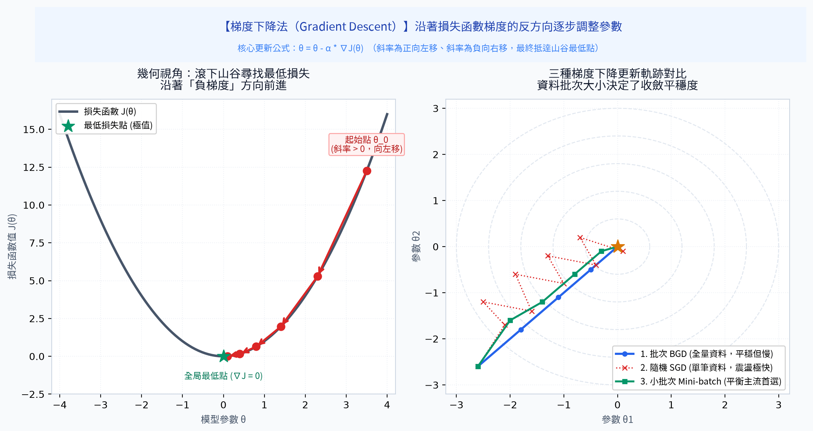
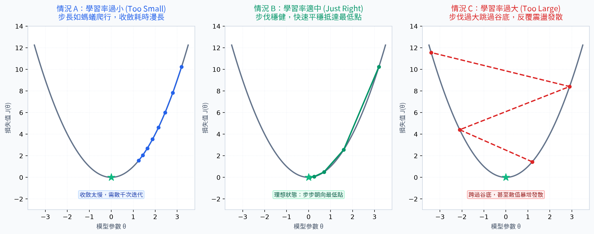
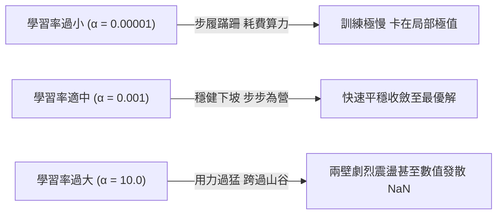
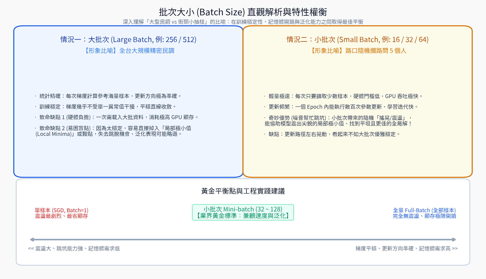
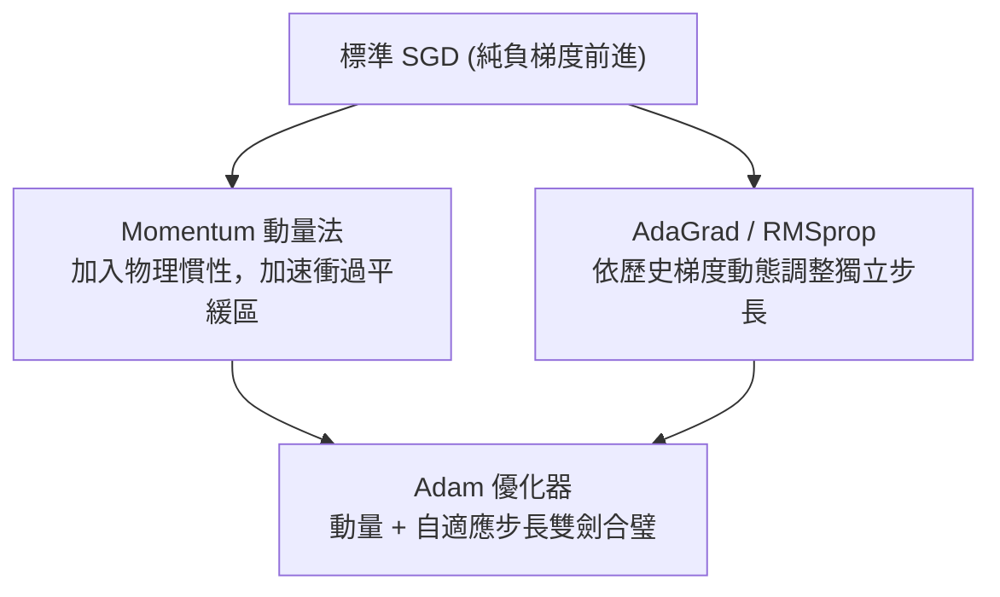

# 6. 優化算法 (Optimization Algorithms)

在機器學習中，模型一開始的參數通常是隨機初始化的（預測結果往往荒腔走板）。  
**優化算法（Optimizer）就是引導模型參數從「一無所知」走向「精準預測」的導航儀**，它的任務是沿著損失函數的地形，找到讓預測誤差最小化的一組最佳參數 $\theta^*$。

---

## 🎯 本章學習目標
1. 掌握**梯度下降法 (Gradient Descent)** 的數學直覺與幾何物理意義。
2. 搞懂**學習率 ($\alpha$)** 的步長效應，理解震盪與發散的原因。
3. 熟悉 **Batch Size（批次大小）** 的性能與泛化權衡，通曉常用優化器的演進脈絡。

---

## 1. 梯度下降法 (Gradient Descent)

### 核心定義
梯度下降法是一種基於一階導數的數值迭代優化算法。它計算損失函數 $J(\theta)$ 對參數 $\theta$ 的**梯度向量 $\nabla J(\theta)$**，並沿著**負梯度方向（局部最陡峭下降方向）**更新參數，步步逼近損失函數的極小值點。

### 💡 生活直觀比喻：濃霧中盲眼摸索下山
> 想像你被蒙上雙眼、置身於濃霧瀰漫的群山之中，任務是走到地勢最低的山谷底部。  
> 雖然你看不到全貌，但你可以用腳感受腳下地面的傾斜坡度（計算梯度）。  
> 只要**每一次都朝著腳下最陡的斜坡向下跨出一小步（沿負梯度前進）**，持續反覆這一步驟，最終就能抵達山谷盆地！

#### 📊 觀念圖解

---

### 核心參數更新公式

$$\theta_{\text{new}} = \theta_{\text{old}} - \alpha \cdot \nabla J(\theta)$$

- $\theta$：模型參數（如權重 $w$ 與偏置 $b$）。
- $\nabla J(\theta)$：損失函數對參數的偏微分梯度（決定**前進方向**，數值為正表示向右上升，減去它即向左下降）。
- $\alpha$：**學習率 (Learning Rate)**，決定每次更新的**步伐大小 (Step Size)**。

---

### 梯度下降的三大實戰變體

| 變體名稱 | 每次更新使用的數據量 | 💡 比喻 | 優點 | 缺點 |
| :--- | :--- | :--- | :--- | :--- |
| **批次梯度下降 (Batch GD, BGD)** | **全部訓練樣本 (100%)** | 收集全校所有學生意見後才做決定 | 梯度估算精準，路徑平滑直達極值點。 | 當數據量龐大（數百萬筆）時，單步計算極其緩慢且耗盡記憶體。 |
| **隨機梯度下降 (Stochastic GD, SGD)** | **僅隨機抽取單一筆樣本 ($N=1$)** | 走在路上隨機抓一個路人問話就做決定 | 每步計算極快，具強烈隨機噪聲，容易跳出局部鞍點。 | 更新路徑劇烈劇烈震盪，難以平穩收斂在最低點。 |
| **小批次梯度下降 (Mini-Batch GD)** | **隨機抽取一小批樣本 (如 32, 64, 128)** | 每次抽樣一個小組（如 32 人）開會定案 | **兼具 BGD 的穩定度與 SGD 的高速度**，能充分利用 GPU 並行加速。 | 需要額外調整 Batch Size 超參數。當前深度學習絕對標準首選！ |

---

## 2. 學習率 (Learning Rate, $\alpha$)

學習率是優化算法中最核心、最敏感的超參數。

#### 📊 觀念圖解

### 步長大小引發的性能光譜

### 實務調優策略
1. **典型初始值**：常見的嘗試起點為 $0.001$、$0.01$。
2. **學習率衰減 (Learning Rate Decay / Scheduling)**：
   - 訓練初期（離谷底尚遠）：使用較大學習率大步快跑。
   - 訓練後期（接近最優點）：動態調小學習率（如 Cosine Annealing），細緻落入谷底最深處。

---

## 3. 批次大小 (Batch Size)

#### 📊 觀念圖解

### 💡 直觀理解：民調抽樣的比喻
- **大批次（如 512, 1024 / 大規模民調）**：問話人次多，誤差小，決策方向穩如泰山；但耗費大量記憶體 (VRAM)。有時過於「拘謹」，容易跌入尖銳的局部不良極值（泛化稍差）。
- **小批次（如 16, 32 / 街頭隨機抽問幾人）**：問話速度極快，記憶體佔用極低。雖然每次更新的方向有些搖晃震盪，但**適度的噪聲反而能將模型震出平庸的淺坑（鞍點），尋找到更寬廣、泛化更好的全局平坦最優谷底**！

> [!TIP]
> **GPU 硬體加速法則**：  
> 在配置 Batch Size 時，幾乎總是設定為 **2 的次方數**（如 16, 32, 64, 128, 256, 512）。這是因為 GPU 的硬體計算單元（CUDA Cores / Tensor Cores）在 2 的次方記憶體對齊下吞吐效率最高！

---

## 4. 拓展視野：現代優化器家族演進

從純粹的梯度下降到現代頂尖優化器，演算法經歷了以下演進：

- **為什麼大家愛用 Adam？**：  
  Adam (Adaptive Moment Estimation) 同時保留了「慣性衝力（避免卡在鞍點）」與「自適應步長（頻繁變動的特徵小步走、罕見變動的特徵大步走）」，是目前大多數機器學習與深度學習任務中表現最魯棒、最省心的默認選擇！

---

## 📌 本章精華速記
1. **梯度下降**沿著損失函數最陡峭的反方向下山，推動參數持續走向最小誤差。
2. **學習率**決定前進步長；太小收斂牛步，太大震盪發散，適度配合衰減策略效果最佳。
3. **小批次 (Mini-batch)** 是現代工業界標準，兼顧計算效率、GPU 平行吞吐與噪聲泛化優勢。
4. 現代專案若不知從何選起，首選 **Adam 優化器** 作為穩健的強力起步基準。

---

[⏮️ 上一章：05_模型參數](../05_模型參數/README.md) | [📑 返回目錄](../README.md) | [⏭️ 下一章：07_常見算法](../07_常見算法/README.md)
