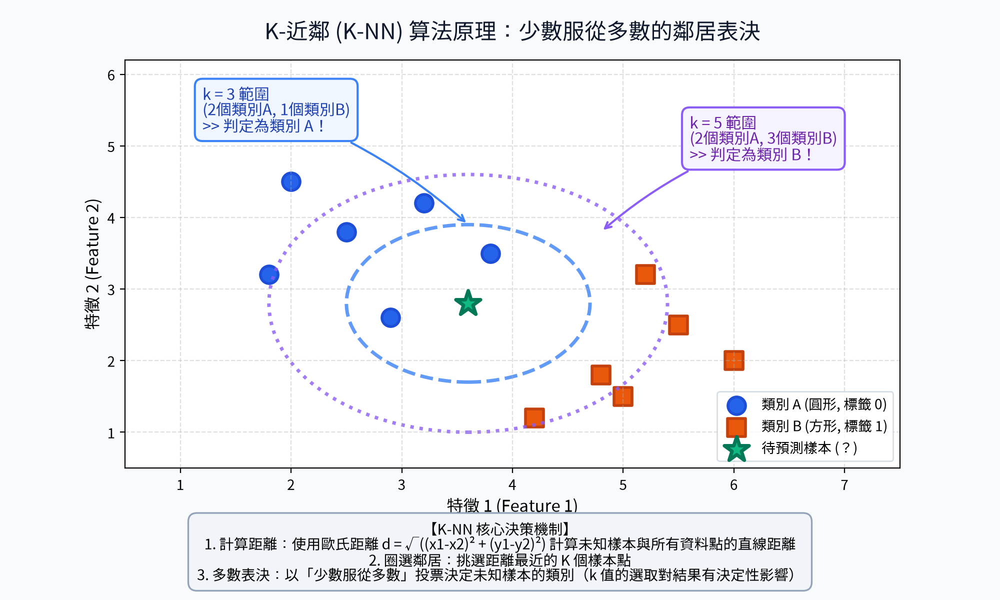
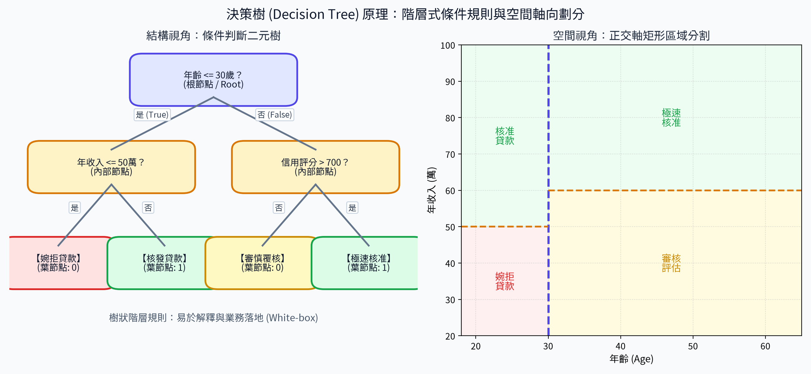
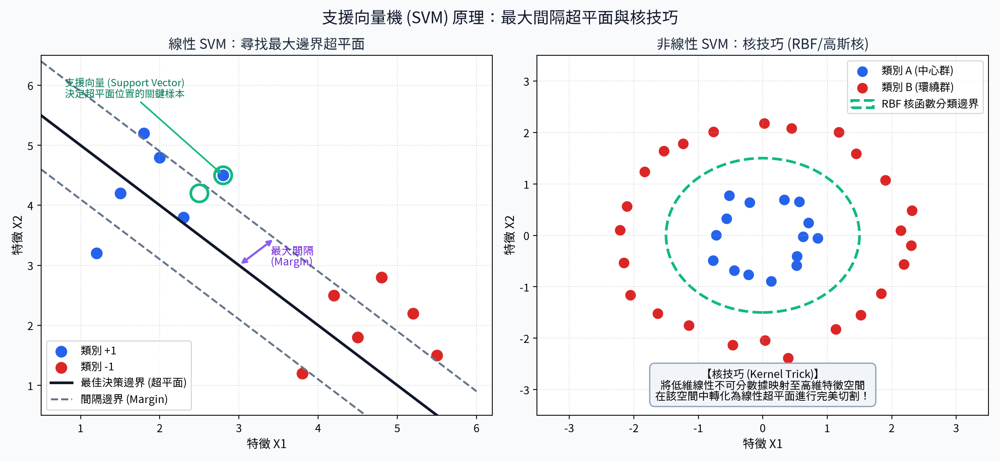
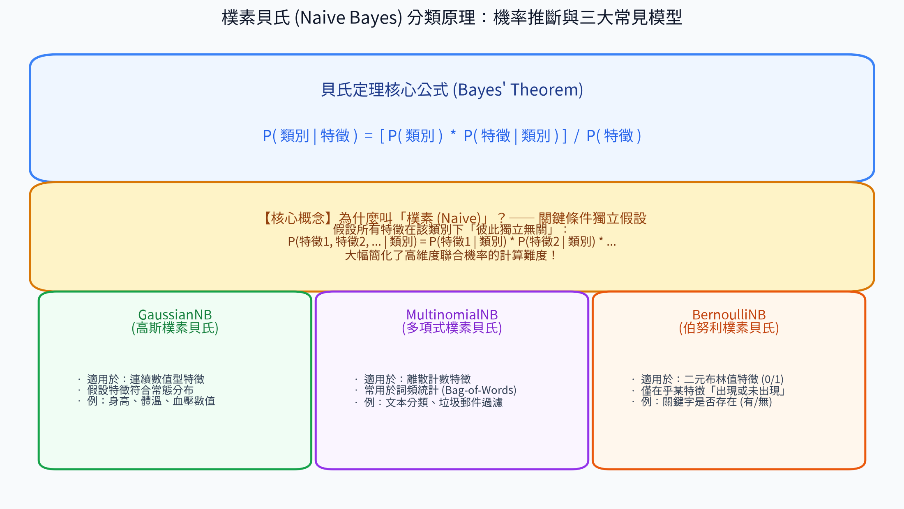

# 7. 常見算法 (Common ML Algorithms)

在經典機器學習領域中，有四種極具代表性、哲學思想各異且歷久彌新的核心演算法：**K-近鄰 (K-NN)**、**決策樹 (Decision Tree)**、**支援向量機 (SVM)** 與 **樸素貝氏 (Naive Bayes)**。

理解它們各自背後的數學哲學、空間劃分幾何直覺以及適用邊界，是構建演算法直覺與面試選型的必修課。

---

## 🎯 本章學習目標
1. 掌握四大經典演算法（KNN、決策樹、SVM、樸素貝氏）的底層核心直覺。
2. 搞懂各演算法的關鍵超參數與防範過擬合策略。
3. 具備演算法選型直覺，能透過特性速查表針對特定任務挑選最適模型。

---

## 1. K-近鄰 (K-NN, K-Nearest Neighbors)

### 核心定義
K-NN 是一種基於「幾何距離度量」的非參數化算法。其核心哲學是**「物以類聚，人以群分」**——當需要預測一個未知新樣本的類別時，找出特徵空間中離它最近的 $K$ 個鄰居，並以「少數服從多數」的投票表決（分類）或鄰居平均值（回歸）作為預測輸出。

### 💡 生活直觀比喻：問路過的街坊鄰居
> 你剛搬進一個新社區，想知道這棟房子的租金行情。  
> 你不需要研究房地產大盤趨勢，只要**敲開左鄰右舍最近的 5 戶人家大門（$k=5$），問問他們每個月付多少租金，然後取個平均數**即可！

#### 📊 觀念圖解

### 關鍵超參數與幾何特點
- **懶惰學習 (Lazy Learning)**：模型在訓練階段完全不做任何計算（只把數據存入記憶體），所有計算全推遲到「預測推論時」才計算距離。
- **超參數 $k$ 值的權衡**：
  - $k$ 太小（如 $k=1$）：只要最近的鄰居剛好是異常雜訊點，預測立刻出錯，**極易過擬合 (Overfitting)**，決策邊界破碎支離。
  - $k$ 太大（如 $k=100$）：納入了太多遠處無關的鄰居，決策邊界過於平滑，**極易欠擬合 (Underfitting)**，且受樣本類別不平衡嚴重干擾。
- **🚨 關鍵預處理**：**必須做特徵縮放**！否則尺度大的特徵將完全主宰幾何距離。

---

## 2. 決策樹 (Decision Tree)

### 核心定義
決策樹是一種基於樹狀階層結構的預測模型。模型從根節點（Root）出發，透過對特徵進行一系列「若條件成立則走左分支，否則走右分支」的二元規則判斷，逐步將樣本劃分至純度更高的子集，最終在葉節點（Leaf）輸出結果。

### 💡 生活直觀比喻：二十個問題 (20 Questions) 與流程圖
> 就像玩「二十個問題」猜謎遊戲：  
> 「它是活的嗎？➔ 是」➔「它是哺乳動物嗎？➔ 是」➔「它會汪汪叫嗎？➔ 是」➔ 結論：「它是狗！」  
> 這種層層遞進的 if-else 邏輯樹，就是決策樹的本質。

#### 📊 觀念圖解

### 幾何視角與核心特點
- **正交超平面切割**：在幾何特徵空間中，決策樹的每一次條件分支，都相當於**畫出一條平行於座標軸的正交切線**，將空間切割為許多長方形區塊。
- **白盒模型 (White-box Model)**：可解釋性極高，規則可直接轉譯為業務業務邏輯（如銀行核貸審核流程）。
- **完全免疫特徵縮放**：只在乎特徵數值的相對大小排列，不需要做標準化或歸一化。
- **防過擬合關鍵超參數**：
  - `max_depth`：限制樹的最大深度，防止樹無止境生長直到記住所有訓練點。
  - `min_samples_split` / `min_samples_leaf`：限制分裂與葉節點所需的最低樣本數。

---

## 3. 支援向量機 (SVM, Support Vector Machine)

### 核心定義
SVM 是一種追求**「最大化間隔（Maximum Margin）」**的經典演算法。它的目標是在特徵空間中尋找一個最佳的決策超平面（Hyperplane），使得兩類樣本距離該超平面最近的點（即**支援向量**）之間的幾何安全邊界距離達到最大。

### 💡 生活直觀比喻：鋪設最寬的安全中央分隔島
> 在分隔兩向車道的道路時，你希望在兩側車流之間**留出最寬的安全隔離帶**。  
> 兩側最靠近邊緣的那幾輛車（支援向量），直接決定了分隔島能建得多寬。遠處停在停車場的車輛怎麼移動，都不會影響這條隔離帶的位置！

#### 📊 觀念圖解

### 核心法寶與關鍵超參數
- **支援向量 (Support Vectors)**：只有緊貼安全間隔邊緣的少數幾個關鍵樣本點決定了超平面的位置，這賦予了 SVM 極高的數學穩定性（Robust）。
- **核技巧 (Kernel Trick)**：當低維數據線性不可分（如環狀分佈）時，透過核函數（如高斯核 RBF、多項式核 Poly）**隱式將數據投影至高維特徵空間**，在高維空間中輕鬆一刀切開！
- **超參數 $C$ (容錯懲罰項)**：
  - $C$ 很大：嚴格容錯（Hard Margin），不准任何樣本越界，邊界極窄，易過擬合。
  - $C$ 很小：寬鬆容錯（Soft Margin），允許部分樣本稍微越過間隔，邊界較寬，泛化能力較強。
- **🚨 關鍵預處理**：**必須做特徵縮放**！

---

## 4. 樸素貝氏 (Naive Bayes)

### 核心定義
樸素貝氏是一種基於貝氏定理（Bayes' Theorem）與**「特徵條件獨立性大膽假設」**的機率生成分類演算法。它計算未知樣本屬於各類別的後驗機率 $P(C \mid X)$，並推選機率最高者作為最終預測。

### 核心公式

$$P(C \mid X) = \frac{P(C) \cdot P(X \mid C)}{P(X)}$$

### 為什麼叫做「樸素 (Naive)」？
它大膽做了一個在現實中幾乎不成立的假設：**在給定類別的條件下，所有特徵之間彼此互相獨立、互不影響**。  
（例如：預測一封信是否為垃圾郵件時，假設「免費」和「中獎」這兩個單詞出現的機率完全無關）。雖然這個假設看似天真幼稚，但在實務上（特別是文本與高維特徵）運算極度簡化，且分類效果出奇優異！

#### 📊 觀念圖解

### 三大常見模型類型
1. **高斯樸素貝氏 (GaussianNB)**：特徵為連續數值（如身高、血壓、體溫），假設服從常態高斯分佈。
2. **多項式樸素貝氏 (MultinomialNB)**：特徵為離散計數值（如單詞在文章中出現的次數），文本分類與垃圾郵件過濾首選。
3. **伯努利樸素貝氏 (BernoulliNB)**：特徵為二元布林值（0 或 1，僅關心單詞「有出現」或「沒出現」）。

---

## 5. 四大演算法特性速查矩陣

| 演算法 | 模型類型 | 可解釋性 | 訓練速度 | 推論速度 | 必須特徵縮放？ | 抵抗過擬合能力 | 經典擅長場景 |
| :--- | :---: | :---: | :---: | :---: | :---: | :---: | :--- |
| **K-NN** | 距離幾何 / 懶惰學習 | 中 | **極快**（無訓練） | **極慢**（逐筆算距離） | **是 ⚠️** | 差（依賴 $k$ 調優） | 小樣本、多分類、推薦系統 |
| **決策樹** | 規則樹狀 / 白盒模型 | **極高** | 快 | 極快 | **否 🛡️** | 差（極易無節制生長） | 業務決策、風控審核、特徵探索 |
| **SVM** | 最大間隔 / 黑盒模型 | 低 | 慢（高維大樣本耗時） | 快 | **是 ⚠️** | **強**（依賴核函數與 $C$） | 高維數據、文本分類、小樣本精準預測 |
| **樸素貝氏** | 機率生成 / 統計模型 | 高 | **極快** | **極快** | **否 🛡️** | 良好 | 垃圾郵件過濾、情感分析、新聞分類 |

---

## 📌 本章精華速記
1. **K-NN**：物以類聚少數服從多數，推論慢、依賴距離縮放。
2. **決策樹**：階層規則軸向切割，可解釋性滿分，無需縮放但須限制樹深防過擬合。
3. **SVM**：追求最大幾何安全隔離帶，核技巧解決非線性，對高維數據極度強悍。
4. **樸素貝氏**：條件獨立性假設簡化聯合機率，計算飛快，文字分類的性價比之王。

---

[⏮️ 上一章：06_優化算法](../06_優化算法/README.md) | [📑 返回目錄](../README.md) | [⏭️ 下一章：08_集成學習](../08_集成學習/README.md)
