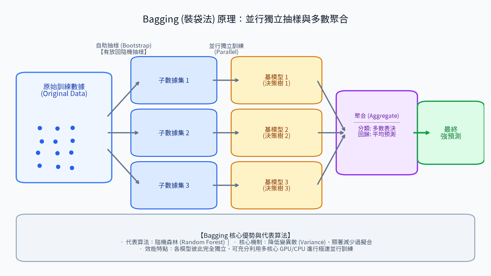
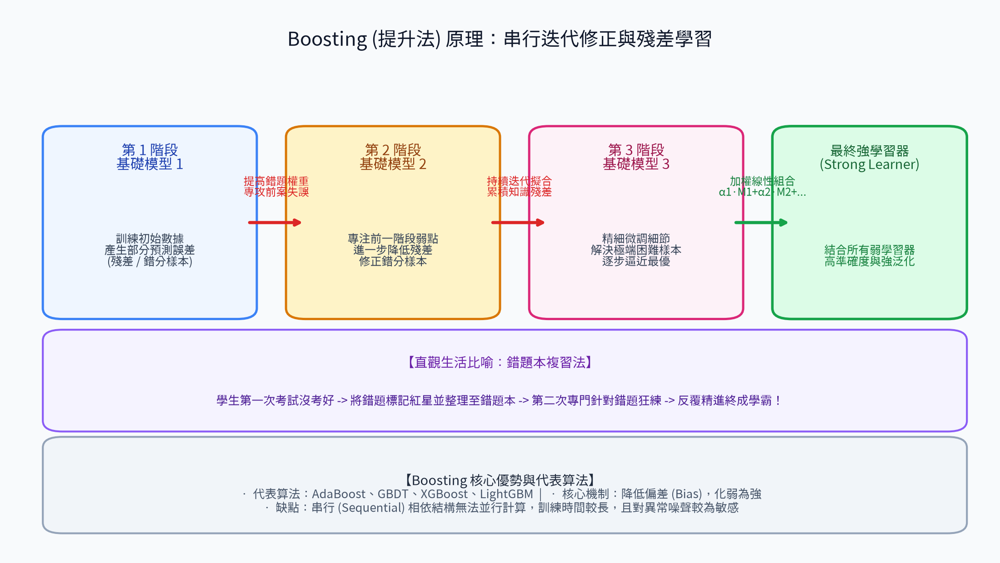
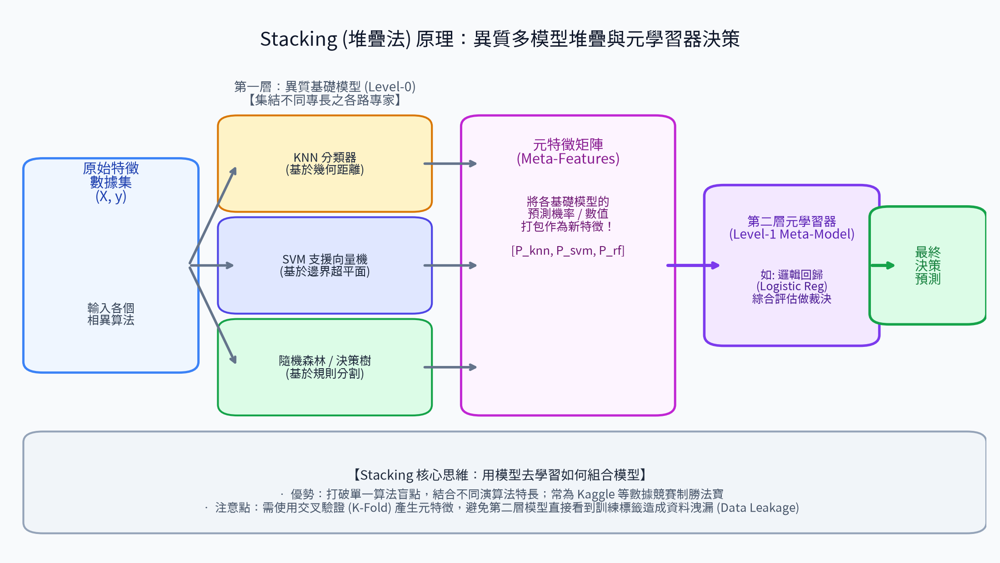

# 8. 集成學習 (Ensemble Learning)

<!-- interactive-glossary:start -->

🌐 **[開啟本章互動動畫教學](https://roberthsu2003.github.io/machine_learning/glossary/08-ensemble-learning/)**

動畫場景：[Bagging](https://roberthsu2003.github.io/machine_learning/glossary/08-ensemble-learning/#bagging) · [Boosting](https://roberthsu2003.github.io/machine_learning/glossary/08-ensemble-learning/#boosting) · [Stacking](https://roberthsu2003.github.io/machine_learning/glossary/08-ensemble-learning/#stacking)

<!-- interactive-glossary:end -->

> **「三個臭皮匠，勝過一個諸葛亮。」**  
> —— 集成學習的核心哲學

集成學習（Ensemble Learning）是一種「結合眾人智慧」的強大機器學習策略。其核心思想是：**將多個弱學習器（Weak Learners，如多棵簡單決策樹）組合起來，構成一個預測能力極強的強學習器（Strong Learner）**，以獲得比任何單一模型都更優異、更穩健的泛化表現。

---

## 🎯 本章學習目標
1. 掌握集成學習三大核心架構：**Bagging**、**Boosting** 與 **Stacking** 的底層原理。
2. 理解為什麼 **Bagging 降變異數 (Variance)**，而 **Boosting 降偏差 (Bias)**。
3. 熟悉工業界三大殺手級工具（Random Forest, XGBoost, LightGBM）的選型考量。

---

## 1. Bagging (裝袋法 / Bootstrap Aggregating)

### 核心定義
Bagging 透過「自助抽樣 (Bootstrap)」從原始數據中有放回地隨機抽取多個子集，**並行 (Parallel)** 訓練多個互不干擾的同質基礎模型，最後將所有模型的預測結果進行「多數投票（分類）」或「平均計算（回歸）」來完成最終決策。

### 💡 生活直觀比喻：群眾智慧專家會診
> 一位病患拿著病歷，同時掛號了 10 位不同科別但資歷相同的醫生（各自看過部分檢查報告）。  
> 每位醫生獨立給出診斷，最後全體投票：「若 8 位醫生說有病，2 位說沒病，則最終判定為有病」。  
> 這種並行獨立表決，能有效過濾掉單一醫生因一時疏忽造成的誤診。

#### 📊 觀念圖解

### 代表算法：隨機森林 (Random Forest)
隨機森林在標準 Bagging 基礎上更進一步：除了對**「樣本進行隨機抽樣 (Bootstrap)」**外，在每個樹節點分裂時還對**「特徵進行隨機挑選 (Feature Subsampling)」**！  
雙重隨機性使得森林中的每一棵樹風格迥異，極大增加了模型的多樣性。

### 核心特點
- **降變異數 (Reduce Variance)**：單棵未剪枝決策樹極易過擬合，但百棵樹平均之後，決策邊界變得極度平滑穩健。
- **支援極速平行運算**：每棵樹完全獨立，能直接吃滿多核心 CPU / GPU。
- **對異常值與噪聲具備強大抗性**。

---

## 2. Boosting (提升法)

### 核心定義
Boosting 是一種**串行 (Sequential，循序推進)** 迭代的集成技術。新模型並非獨立訓練，而是專門針對前一個模型「預測錯誤或殘差較大」的樣本進行針對性強化訓練，步步為營，將多個弱學習器依序提升為頂尖強學習器。

### 💡 生活直觀比喻：學霸的「錯題本複習法」
> 學生做完第一次模擬考，把所有寫錯的題目圈起來抄入「錯題本」。  
> 第二輪複習時，將 80% 的精力專門攻克錯題本中的難題；第三輪再針對前兩輪依舊搞不懂的死角加強練習……  
> 如此反覆迭代，知識盲區被逐一消滅，最終成為全能考霸！

#### 📊 觀念圖解

### 代表算法
- **AdaBoost**：主動調高上一輪被預測錯誤樣本的權重，強制後續模型關注困難點。
- **梯度提升機 (GBDT)**：每一輪建立新樹，直接去擬合上一輪模型的「殘差 (Residuals)」。
- **XGBoost / LightGBM / CatBoost**：現代工業界霸主，在 GBDT 基礎上加入二階泰勒展開、正則化項與直方圖優化，效率與精度達到巔峰。

### 核心特點
- **降偏差 (Reduce Bias)**：模型持續攻克極限難題，在競賽與實務中往往具備超越 Bagging 的最高預測精度。
- **訓練相依無法平行**：後一棵樹依賴前一棵樹的殘差輸出，訓練必須串行等待。
- **對噪聲異常值敏感**：若標籤存在人工輸入錯誤，Boosting 容易走火入魔硬背錯誤。

---

## 3. Stacking (堆疊融合法)

### 核心定義
Stacking 是一種多層次（Multi-level）的異質模型融合技術。它在第一層集合多種**不同演算法機制（如 SVM、KNN、隨機森林、神經網絡）**的基礎學習器，再由第二層的「元學習器 (Meta-Learner)」來學習如何分配權重並做出終極判決。

### 💡 生活直觀比喻：法院的陪審團與主任法官
> 法庭上有 5 位性格與專長完全不同的陪審團員（一位精通法條細節、一位擅長心理學、一位看重物證）。  
> 他們各自提交一份審判意見書給「主任法官（元學習器）」。主任法官根據過往案件經驗，評估各位專家的可信度，最終敲下法槌完成定讞判決。

#### 📊 觀念圖解

### 核心運作要點
- **第一層 (Level-0 基礎學習器)**：盡量挑選**不同原理**的異質模型，互補短板。
- **第二層 (Level-1 元學習器)**：通常使用簡單、不易過擬合的模型（如邏輯回歸 Logistic Regression）。
- **🚨 防資料洩漏機制**：產生第一層預測特徵時，**必須採用嚴格的 K-Fold Out-of-Fold 交叉驗證**，絕不可讓第二層模型直接接觸訓練集的原始標籤！

---

## 4. 集成學習三大巨頭終極比較

| 比較維度 | Bagging (裝袋法) | Boosting (提升法) | Stacking (堆疊法) |
| :--- | :--- | :--- | :--- |
| **基礎模型關係** | **並行獨立 (Parallel)** | **串行相依 (Sequential)** | **分層堆疊 (Layered)** |
| **基礎模型多樣性** | 同質模型（通常為深度決策樹） | 同質模型（通常為淺層弱決策樹） | **異質模型**（SVM, KNN, 樹模型混搭） |
| **核心優化目標** | **降低變異數 (Variance)**，防過擬合 | **降低偏差 (Bias)**，提升擬合精度 | **博採眾長**，消除單一演算法盲點 |
| **結合輸出方式** | 簡單多數表決 / 平均值 | 加權累加組合 ($\sum \alpha_t h_t(x)$) | 透過元模型 (Meta-Learner) 再次訓練 |
| **計算效率** | 極高（天然多核心平行加速） | 較慢（無法完全並行） | 慢（需維護與訓練多套框架） |
| **工業界代表** | **隨機森林 (Random Forest)** | **XGBoost / LightGBM** | **Kaggle 數據競賽王牌組合** |

---

## 📌 本章精華速記
1. **Bagging 降變異數**：自助抽樣、並行訓練、多數決，以隨機森林為代表。
2. **Boosting 降偏差**：錯題本逐輪補殘差，精度最高，以 XGBoost、LightGBM 為代表。
3. **Stacking 融百家**：利用元學習器整合異質算法長處，競賽衝分利器但工程維護重。

---

[⏮️ 上一章：07_常見算法](../07_常見算法/README.md) | [📑 返回目錄](../README.md) | [⏭️ 下一章：09_評估指標](../09_評估指標/README.md)
