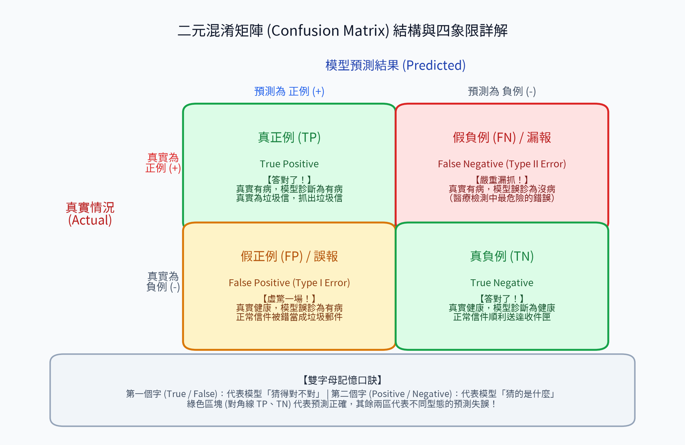
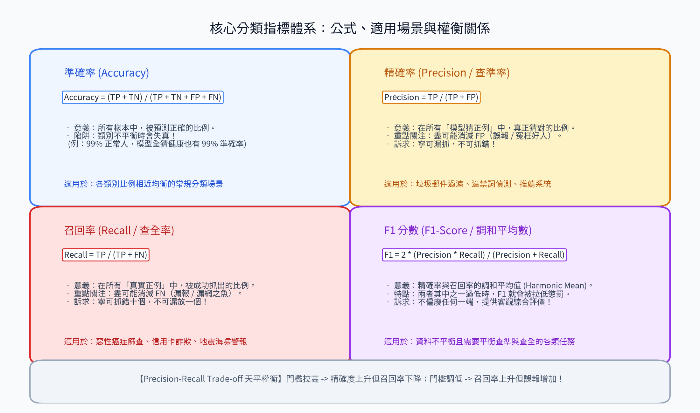
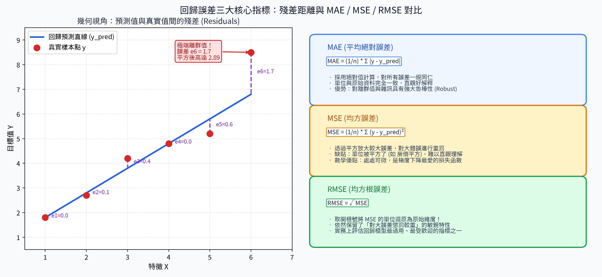
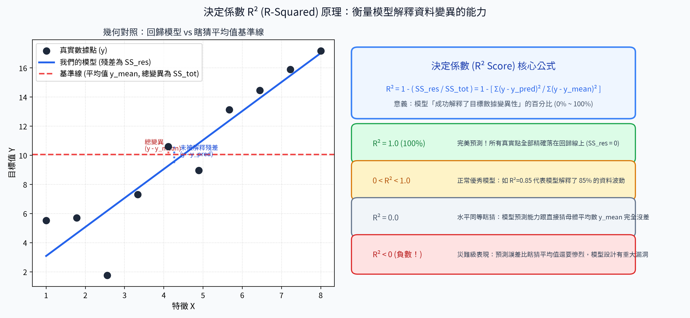

# 9. 評估指標 (Performance Metrics)

在機器學習專案中，評估指標（Evaluation Metrics）是用來客觀衡量模型好壞、診斷學習盲點與推動模型調優的指南針。不同的任務型態（分類 vs 回歸）以及不同的業務關注點（如漏報代價 vs 誤報代價），需要選用合適的評估指標。

---

## 分類指標 (Classification Metrics)

### 混淆矩陣 (Confusion Matrix)

**描述**：  
混淆矩陣是一個二維表格，用於精確總結分類模型的預測結果。它將樣本按「真實標籤」與「預測標籤」交叉統計，完整呈現四種可能的情境：真正例 (TP)、真負例 (TN)、假正例 (FP) 與假負例 (FN)。

**核心組成概念**：
- **真正例 (True Positive, TP)**：真實為正類，模型亦精確預測為正類（例如：病患確實染病，檢測結果為陽性）。
- **真負例 (True Negative, TN)**：真實為負類，模型亦精確預測為負類（例如：健康受檢者，檢測結果為陰性）。
- **假正例 (False Positive, FP / Type I Error 第一型錯誤 / 誤報)**：真實為負類，模型卻錯誤預測為正類（例如：健康受檢者被誤診為陽性，虛驚一場）。
- **假負例 (False Negative, FN / Type II Error 第二型錯誤 / 漏報)**：真實為正類，模型卻錯誤預測為負類（例如：病患確實染病，檢測卻誤判為陰性，嚴重漏網）。

> 💡 **雙字母記憶口訣**：
> - **第一個字 (True / False)**：代表模型「猜得對不對」。
> - **第二個字 (Positive / Negative)**：代表模型「猜的是哪一類」。

---

### 分類指標體系 (Accuracy, Precision, Recall, F1)

混淆矩陣是所有衍生分類評估指標的基石。在不同的商業與工程場景中，需要根據誤報或漏報的代價，選擇不同的權衡指標：

#### 1. 準確率 (Accuracy)
- **描述**：整體被正確分類的樣本比例。
- **公式**：`Accuracy = (TP + TN) / (TP + TN + FP + FN)`
- **適用場景**：類別分佈均勻對稱的標準數據集。
- **致命陷阱**：在**類別高度不平衡 (Imbalanced Data)** 時會嚴重失真（例如：1000 人中只有 5 人患罕見疾病，模型即使無腦全猜健康，準確率依然高達 99.5%，卻完全抓不出任何病人）。

#### 2. 精確率 (Precision / 查準率)
- **描述**：在所有被模型預測為「正類」的樣本中，實際上真正為正類的比例。
- **公式**：`Precision = TP / (TP + FP)`
- **關注焦點**：**極力消滅 FP（誤報）**。寧可保守漏抓，也絕不能冤枉好人！
- **經典場景**：垃圾郵件過濾（不能把正常工作郵件當垃圾扔掉）、推薦系統、法庭定罪判定。

#### 3. 召回率 (Recall / 查全率 / 敏感度 Sensitivity)
- **描述**：在所有「實際為正類」的樣本中，被模型成功抓出的比例。
- **公式**：`Recall = TP / (TP + FN)`
- **關注焦點**：**極力消滅 FN（漏報）**。寧可抓錯十個，也絕不能漏放一個！
- **經典場景**：重大惡性腫瘤篩檢、信用卡盜刷偵測、地震防空預警。

#### 4. F1 分數 (F1-Score)
- **描述**：精確率與召回率的**調和平均數 (Harmonic Mean)**。
- **公式**：`F1-score = 2 * (Precision * Recall) / (Precision + Recall)`
- **特點**：調和平均數會對極端小值施加嚴厲懲罰。只要 Precision 或 Recall 其中一者過低，F1 就會被大幅拉低。
- **適用場景**：數據不平衡，且業務上同時重視精準度與覆蓋面的綜合評估。

---

## 回歸指標 (Regression Metrics)

回歸任務的輸出為連續數值（如房價、溫度、營收）。我們透過評估「真實值 $y$」與「預測值 $\hat{y}$」之間的垂直誤差（殘差）來衡量模型擬合品質。

### 回歸誤差指標 (MAE vs MSE vs RMSE)

#### 1. 平均絕對誤差 (MAE, Mean Absolute Error)
- **公式**：`MAE = (1/n) * Σ |y - ŷ|`
- **特點**：
  - 取絕對值計算，對所有樣本誤差給予線性權重。
  - 誤差單位與原始標籤完全相同，非常直觀好懂。
  - **抗噪性強**：對離群值與極端異常值不敏感（Robust）。

#### 2. 均方誤差 (MSE, Mean Squared Error)
- **公式**：`MSE = (1/n) * Σ (y - ŷ)²`
- **特點**：
  - 透過平方放大較大的誤差，對極端預測錯誤施加重罰。
  - 數學性質極佳（處處連續可微），是梯度下降優化器最常使用的損失函數。
  - **缺點**：單位被平方了（例如：房價誤差單位變成「元²」），缺乏直觀的物理意義。

#### 3. 均方根誤差 (RMSE, Root Mean Squared Error)
- **公式**：`RMSE = √MSE`
- **特點**：
  - 對 MSE 開平方根，**成功將誤差單位還原回原始物理尺度**。
  - 保留了 MSE「對大誤差高度敏感、給予更重懲罰」的優良特性。
  - 實務競賽與工業界中最受推崇的回歸評估指標之一。

---

### 決定係數 (R² 分數 / R-Squared)

**描述**：  
衡量回歸模型**解釋數據總變異性能力**的無量綱標準化指標。它以「直接猜母體平均數 $\bar{y}$ 的基準模型」為對照組，評估模型相比瞎猜平均數到底進步了多少。

**公式**：

`R² = 1 - (SS_res / SS_tot)`

$$R^2 = 1 - \frac{SS_{\text{res}}}{SS_{\text{tot}}} = 1 - \frac{\sum_{i=1}^{n} (y_i - \hat{y}_i)^2}{\sum_{i=1}^{n} (y_i - \bar{y})^2}$$

- $SS_{\text{res}}$（殘差平方和 / Residual Sum of Squares）：模型尚未解釋的預測誤差平方總和 $\sum (y_i - \hat{y}_i)^2$
- $SS_{\text{tot}}$（總平方和 / Total Sum of Squares）：數據本身的總波動變異平方和 $\sum (y_i - \bar{y})^2$

**數值意義與性能光譜**：
- **$R^2 = 1.0$ (100%)**：完美預測！所有樣本點分毫不差精準落在回歸直線上。
- **$0 < R^2 < 1.0$**：正常優秀模型。數值越接近 1 代表模型擬合度越高（例如 $R^2 = 0.85$ 表示模型解釋了數據中 85% 的波動）。
- **$R^2 = 0.0$**：水平等同瞎猜。模型預測能力跟直接猜母體平均數 $\bar{y}$ 毫無差異。
- **$R^2 < 0.0$ (負數！)**：災難級表現。模型的預測誤差比直接猜均值還要離譜，說明模型架構設計存在重大錯誤。
