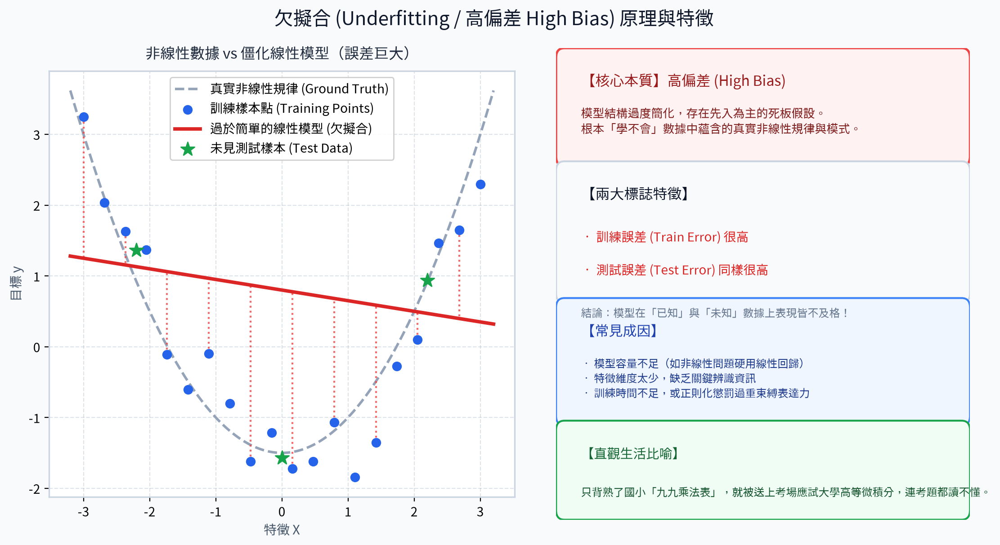
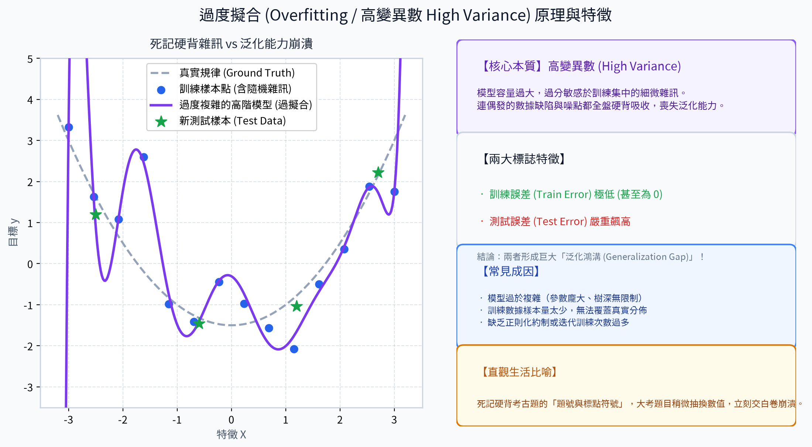
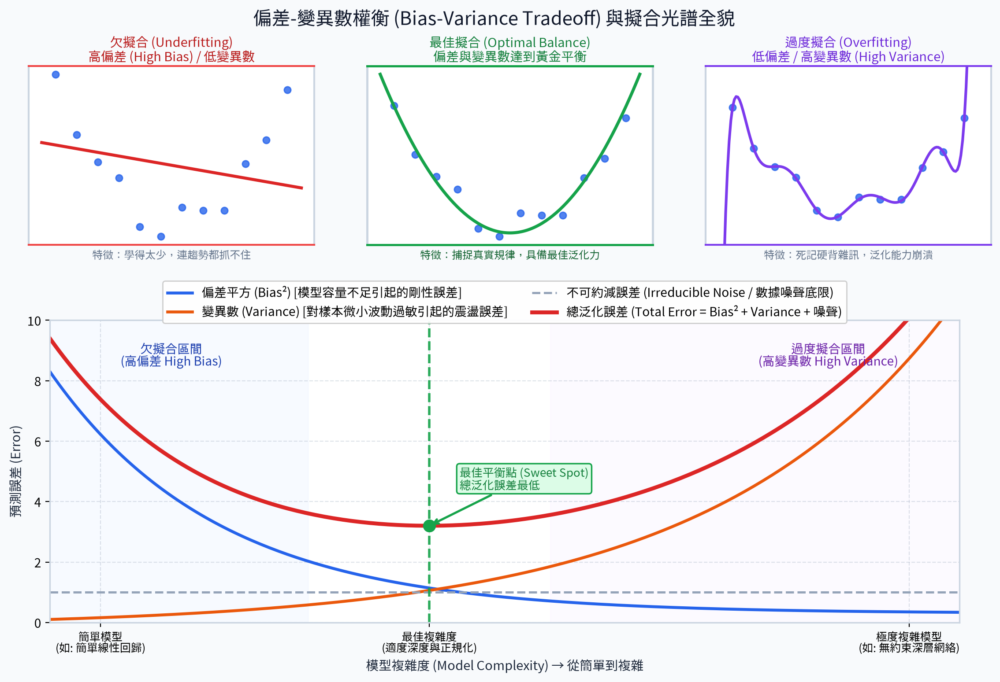
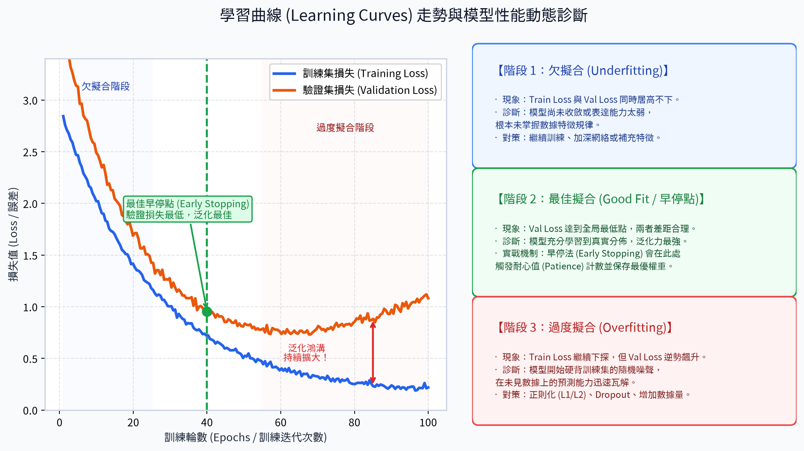
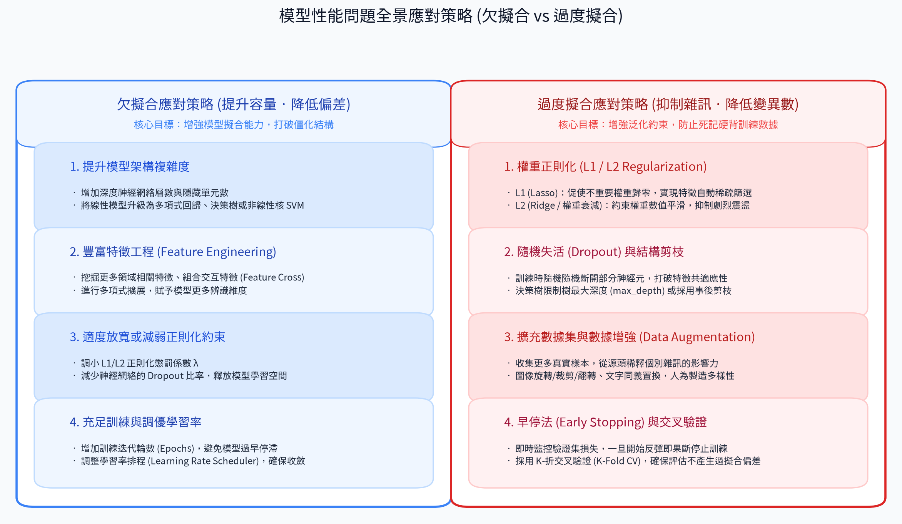

# 10. 模型性能問題 (Model Performance Issues)

在機器學習專案中，我們訓練模型的終極目標不是在「已知的訓練集」上考 100 分，而是讓模型具備優異的**泛化能力 (Generalization Ability)** —— 能夠準確預測現實世界中從未見過的全新數據。

在模型訓練與調優的過程中，最常見且最具挑戰性的兩大性能陷阱就是**欠擬合 (Underfitting)** 與 **過度擬合 (Overfitting)**。理解這兩種狀態的本質、數學機理與診斷手法，是每位機器學習工程師的必修基本功。

---

## 1. 欠擬合 (Underfitting / 高偏差 High Bias)

### 描述
**欠擬合**是指模型結構過於簡單、表達能力不足，無法有效捕捉訓練數據中的潛在規律與特徵關係。此時模型甚至連訓練集本身的規律都學不會，導致在**訓練數據和測試數據上的預測表現均極為糟糕**。

### 核心本質：高偏差 (High Bias)
- **偏差 (Bias)** 衡量的是模型預測的期望值與真實值之間的差距。
- 欠擬合代表模型存在嚴重的**先入為主偏見**（例如：數據本質為二次曲線，模型卻硬性假設它是一條死板的直線）。這種剛性結構限制了學習上限，即使給予再多數據也無濟於事。

### 標誌性特徵
- **訓練誤差 (Training Error) 居高不下**：連看過無數次的題目都做不對。
- **測試誤差 (Testing Error) 同樣極高**：新題目自然更是一塌糊塗。
- 模型在「已知」與「未知」數據上表現皆不及格。

### 直觀範例與生活比喻
- **數學範例**：欲擬合具備非線性關係的數據 $y = x^2$。若強行採用簡單線性回歸模型 $y = wx + b$，一條直線永遠無法貼合拋物線的彎曲趨勢，兩端與中央必然產生巨大的殘差。
- **生活比喻**：學生只背熟了國小的「九九乘法表」，就被直接推上考場應試大學「高等微積分」—— 因為知識體系容量嚴重不足，連題目的符號都看不懂。

### 常見誘發原因
1. **模型容量不足 (Insufficient Capacity)**：算法過於簡陋（如線性模型處理複雜非線性問題、神經網絡層數過淺）。
2. **特徵維度不足 (Lack of Features)**：輸入的特徵太少，缺少能有效區分目標的關鍵預測維度。
3. **正則化懲罰過重**：正則化係數 $\lambda$ 設定過大，過度束縛了模型的權重調整空間。
4. **訓練不充分**：迭代輪數 (Epochs) 太少，或學習率設置過小導致權重尚未收斂。

---

## 2. 過度擬合 (Overfitting / 高變異數 High Variance)

### 描述
**過度擬合**是指模型過於複雜、參數量過於龐大，以至於「用力過猛」，不僅學習了真實的規律，還把訓練數據中的隨機雜訊、測量誤差與偶發異常個例全盤死記硬背下來。這會導致模型在訓練集上表現近乎完美，但在未見過的測試數據上**泛化能力徹底崩潰**。

### 核心本質：高變異數 (High Variance)
- **變異數 (Variance)** 衡量的是當訓練數據發生微小擾動時，模型預測結果的震盪幅度。
- 過擬合模型對訓練數據的細節過度敏感。如果換一批稍有不同的訓練樣本，模型訓練出的參數曲線就會劇烈改變，呈現極高的不穩定性。

### 標誌性特徵
- **訓練誤差 (Training Error) 極低**：幾乎為 0，能完美命中每一個訓練點。
- **測試誤差 (Testing Error) 嚴重飆高**：面對真實世界新樣本時預測錯得離譜。
- 訓練誤差與測試誤差之間形成巨大的**泛化鴻溝 (Generalization Gap)**。

### 直觀範例與生活比喻
- **數學範例**：對 10 個稍微帶有高斯噪聲的數據點，使用高達 10 階的多項式回歸。模型為了強行穿過每一個噪點，生成了一條劇烈上下震盪的瘋狂曲線。當新測試點輸入時，曲線預測值可能飛向無窮大或極小值。
- **生活比喻**：學生考前死記硬背歷屆考古題，連「題目序號、排版逗號與印刷瑕疵」都硬背成答案的一部分。真正大考時，題目只稍微抽換了一個數字，該生立刻腦袋空白交白卷。

### 常見誘發原因
1. **模型過度複雜 (Excessive Complexity)**：模型自由度過高（例如神經網絡參數量遠大於樣本數、決策樹未設深度限制）。
2. **訓練樣本量不足 (Small Dataset)**：樣本過少，無法代表總體的真實統計分佈，模型容易將個案誤認成通則。
3. **數據雜訊過多 (Noisy Data)**：標籤錯誤或測量噪聲被高複雜度模型當成規律硬記。
4. **缺乏正則化約束**：權重數值被允許隨意膨脹震盪。
5. **訓練迭代過多 (Over-training)**：神經網絡訓練輪數過長，越過最佳泛化點後繼續死背細節。

---

## 3. 偏差-變異數權衡 (Bias-Variance Tradeoff)

機器學習的核心任務，實質上就是在**偏差 (Bias)** 與 **變異數 (Variance)** 之間尋找最佳平衡點。

### 泛化誤差的數學分解
統計學習理論證明，對於任何監督式學習回歸問題，模型的**總預期泛化誤差 (Total Expected Error)** 可以嚴格分解為三部分：

$$\text{Total Error} = \text{Bias}^2 + \text{Variance} + \sigma^2$$

- **偏差平方 ($\text{Bias}^2$)**：源自模型簡化假設所帶來的系統性誤差。模型越簡單，偏差越大。
- **變異數 ($\text{Variance}$)**：源自模型對特定訓練集隨機波動的敏感性。模型越複雜，變異數越大。
- **不可約減誤差 ($\sigma^2$, Irreducible Error)**：數據採集過程本身無法消除的本底噪聲與客觀隨機性，這是任何算法都不可能跨越的誤差底限。

### 擬合光譜三態對比

| 擬合狀態 | 偏差 (Bias) | 變異數 (Variance) | 訓練集表現 | 測試集表現 | 根本癥結 |
| :--- | :---: | :---: | :---: | :---: | :--- |
| **欠擬合 (Underfitting)** | **高 (High)** | 低 (Low) | ❌ 差 | ❌ 差 | 智商/容量不足，學不會 |
| **最佳擬合 (Optimal Fit)** | **低 (Low)** | **低 (Low)** | ✅ 好 | ✅ 好 | 抓到本質規律，黃金平衡 |
| **過度擬合 (Overfitting)** | 低 (Low) | **高 (High)** | ✅ 極佳 (過好) | ❌ 差 | 死背硬記雜訊，無法舉一反三 |

### 權衡曲線走勢啟示 (U 型曲線)
如圖所示：
1. 當模型複雜度由「簡單」向「複雜」提升時，模型表達力增強，**偏差平方 ($\text{Bias}^2$) 迅速衰減**。
2. 與此同時，模型對數據波動的敏感度開始升高，**變異數 ($\text{Variance}$) 單調遞增**。
3. 兩者疊加後的「總泛化誤差」呈現經典的 **U 型曲線**。
4. **甜蜜點 (Sweet Spot)**：總誤差最低的頂點。機器學習調參（如網格搜尋、超參數優化）的實質目的就是推動模型落入此處。

---

## 4. 學習曲線與性能診斷 (Learning Curves & Diagnosis)

如何判斷目前訓練的模型到底是「欠擬合」還是「過擬合」？最實用、最直觀的工程診斷工具就是**學習曲線 (Learning Curves)**。

### 學習曲線的觀測維度
學習曲線繪製了模型的**訓練損失 (Training Loss)** 與**驗證損失 (Validation Loss)** 隨著「訓練輪數 (Epochs)」或「訓練樣本量」推進的動態走勢：

#### 階段 1：欠擬合階段 (Underfitting Zone)
- **曲線特徵**：在訓練初期，Training Loss 與 Validation Loss **雙雙居高不下**，且下降趨勢明顯。
- **診斷結論**：模型尚未充分收斂，或者模型架構表達力太薄弱，根本未掌握數據特徵規律。
- **處方箋**：繼續給予訓練迭代次數、增強網絡深度或補充有效特徵。

#### 階段 2：最佳擬合甜蜜點 (Optimal / Early Stopping Point)
- **曲線特徵**：Validation Loss 抵達全局最低谷，且與 Training Loss 保持適度、健康的微小差距。
- **診斷結論**：模型此時完美捕捉到了母體數據的真實概率分佈，泛化能力達到峰值。
- **工程落地**：**早停法 (Early Stopping)** 正是依賴此處機制，在驗證損失不再改善時自動存檔最佳權重並安全停機。

#### 階段 3：過度擬合階段 (Overfitting Zone)
- **曲線特徵**：Training Loss 依然勢如破竹地向下滑落（甚至接近 0），但 Validation Loss 卻**觸底反彈、逆勢飆升**。
- **診斷結論**：兩條曲線之間的差距演變成巨大的**泛化鴻溝 (Generalization Gap)**。這代表模型已經開始把算力浪費在硬背訓練集特有的雜訊上，在新數據上的泛化能力急劇惡化。
- **處方箋**：立即停機、引入正則化 (L1/L2)、加入 Dropout 或進行數據擴增。

---

## 5. 模型性能問題全景應對策略 (Solutions & Prevention)

針對欠擬合與過度擬合這兩種截然相反的病症，必須對症下藥。以下是工業界最完備的解決對策體系：

### 欠擬合急救箱：提升容量 · 降低偏差

當模型陷入欠擬合時，首要目標是**給模型「鬆綁與充能」**，全面增強其表達能力：

1. **提升模型架構複雜度**：
   - 將簡單的線性模型升級為多項式回歸、決策樹、隨機森林、GBDT 等非線性算法。
   - 在深度神經網絡中增加網絡深度（層數）與寬度（隱藏單元數）。
2. **豐富特徵工程 (Feature Engineering)**：
   - 挖掘更多與業務強相關的領域特徵。
   - 進行特徵交叉 (Feature Crossing) 或多項式特徵衍生，賦予模型更多維度的辨識依據。
3. **減弱或放寬正則化約束**：
   - 縮小正則化係數 $\lambda$（如調小 Ridge/Lasso 懲罰強度）。
   - 調低神經網絡中 Dropout 的隨機丟棄比率，給模型足夠的自由度擬合數據。
4. **充分訓練與調整學習率**：
   - 增加訓練輪數 (Epochs)，防止在未收斂前過早終止。
   - 優化學習率排程 (Learning Rate Scheduler)，避免因學習率過小陷入停滯或過大而震盪無法前進。

---

### 過度擬合降妖杵：抑制雜訊 · 降低變異數

當模型陷入過度擬合時，首要目標是**給模型「戴上緊箍咒」**，強力遏制其硬背雜訊的能力：

1. **權重正則化 (L1 / L2 Regularization)**：
   - **L1 正則化 (Lasso 回歸)**：在損失函數中加入權重絕對值和 $\lambda \sum |w_i|$。其幾何特性會迫使許多不重要特徵的權重精確歸零，實現**自動特徵篩選 (Sparsity)**。
   - **L2 正則化 (Ridge 回歸 / 權重衰減 Weight Decay)**：在損失函數中加入權重平方和 $\frac{1}{2}\lambda \sum w_i^2$。它會嚴厲懲罰過大的權重值，促使模型參數分佈平滑，抑制曲線劇烈震盪。
2. **隨機失活 (Dropout) 與結構剪枝**：
   - **Dropout (深度學習專屬)**：在每次前向傳播訓練時，隨機以一定概率 $p$「切斷」部分神經元的連接。迫使每個神經元獨立學習穩健特徵，打破神經元之間的惡性共適應性 (Co-adaptation)。
   - **決策樹剪枝 (Pruning)**：設置最大樹深 (`max_depth`)、最小葉子節點樣本數 (`min_samples_leaf`) 進行預剪枝，或在樹生長完成後依複雜度進行事後剪枝。
3. **擴充訓練數據與數據擴增 (Data Augmentation)**：
   - **增加真實數據**：數據越多，雜訊所佔的比例越小，真實的統計規律就越清晰。
   - **數據增強**：在電腦視覺中運用圖像旋轉、隨機裁剪、水平翻轉、顏色微調；在自然語言處理中運用同義詞替換、隨機插入等，在不增加標註成本的前提下人為製造多樣性。
4. **早停法 (Early Stopping)**：
   - 在訓練過程中即時監控獨立驗證集的損失。一旦驗證損失在連續多個輪數（耐心值 Patience）內不再下降並開始反彈，立即中止訓練並恢復驗證損失最低時的模型權重。
5. **交叉驗證 (K-Fold Cross Validation)**：
   - 將訓練數據平均切分為 $K$ 份，輪流以 $K-1$ 份訓練、1 份驗證。
   - 能有效消除單次切分數據所帶來的隨機偏差，確保模型超參數評估客觀真實。

---

## 6. 總結速查對照表

| 診斷維度 | 欠擬合 (Underfitting) | 良好擬合 (Good Fit) | 過度擬合 (Overfitting) |
| :--- | :--- | :--- | :--- |
| **數學本質** | 高偏差 (High Bias)、低變異數 | 偏差與變異數取得最佳平衡 | 低偏差、高變異數 (High Variance) |
| **訓練集誤差** | ❌ 很高 | ✅ 低且穩定 | ✅ 極低（甚至為 0） |
| **測試集誤差** | ❌ 很高 | ✅ 低且接近訓練誤差 | ❌ 嚴重飆高 |
| **學習曲線特徵** | 兩條損失線均在高處徘徊不降 | 兩條線均平穩滑落且差距微小 | 訓練線持續探底，驗證線逆勢回彈飆升 |
| **主要成因** | 模型太簡單、特徵太少、正則化過強 | 複雜度適中、數據充分、正規化得宜 | 模型太複雜、樣本太少、訓練過度、欠缺約束 |
| **核心處方** | • 加深網絡/增加參數 • 擴充新特徵與特徵交叉 • 減小正則化係數 $\lambda$ • 增加訓練輪數 | 持續監控並部署上線 | • 引入 L1/L2 正則化 • 加入 Dropout / 限制樹深 • 擴充數據集 / Data Augmentation • 早停法 (Early Stopping) |
