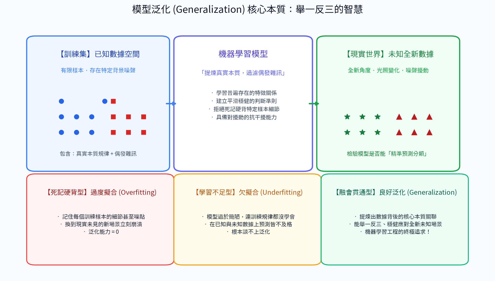
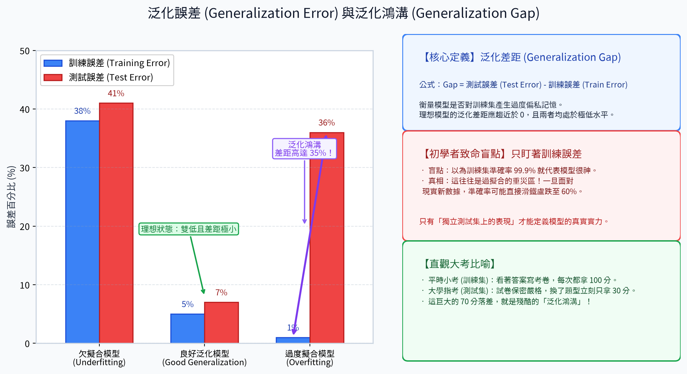
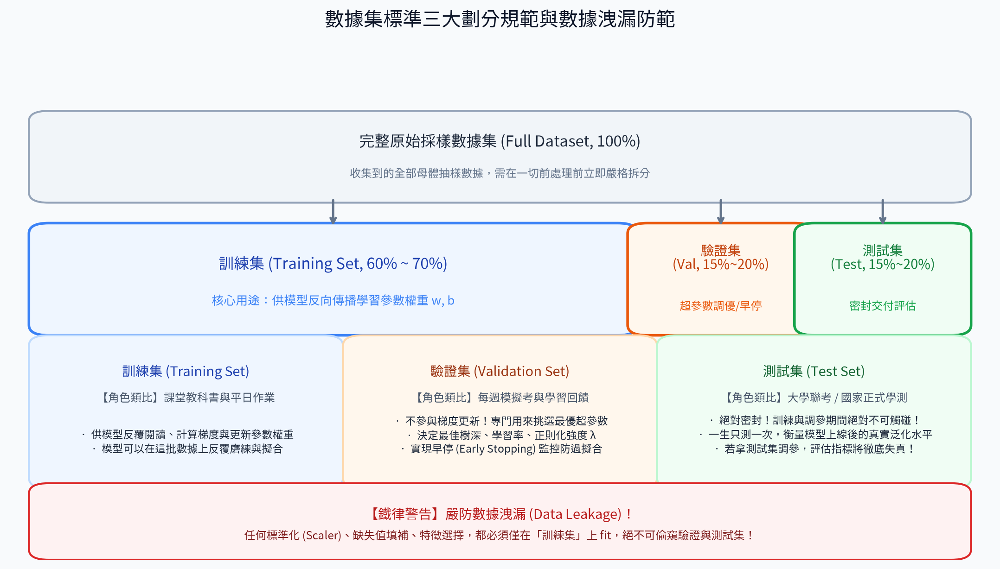
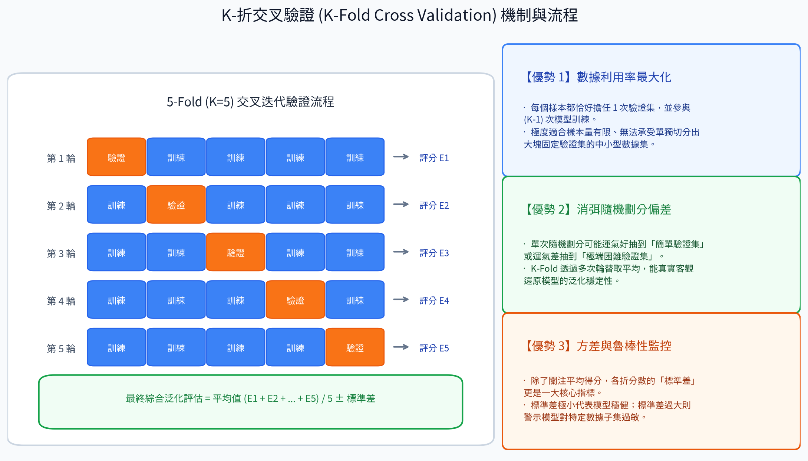
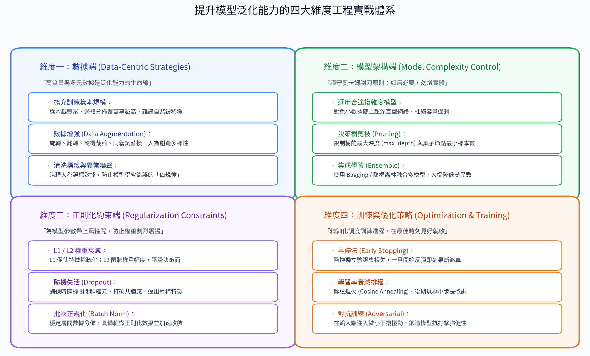
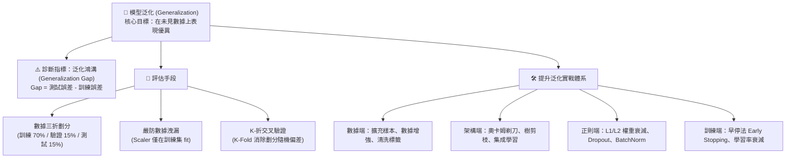

# 11. 模型泛化 (Model Generalization)

在機器學習專案中，我們衡量一個模型好壞的唯一終極標準，不是看它在「看過的訓練數據」上能考幾分，而是看它面對「從未見過的現實新數據」時，是否依然能做出準確、穩定且可靠的預測。

這種**將在訓練集上學到的規律知識，成功推廣並應用到未知新環境的能力**，就稱為**模型泛化 (Generalization)**。泛化是機器學習有別於傳統「資料庫查詢與硬編碼規則」的最核心靈魂。

---

## 1. 模型泛化的核心本質 (What is Generalization?)

### 描述
**模型泛化**是指機器學習模型對未見過的新樣本（測試數據或真實生產環境數據）表現出優異預測能力的綜合素養。換言之，模型不僅能有效擬合歷史訓練數據，更能從容應對未來帶有噪聲、角度變化或分佈微調的獨立新數據點。

### 本質剖析：死記硬背 vs 融會貫通
- **死記硬背 (Memorization / 過擬合)**：模型記住了訓練樣本特定的背景顏色、局部噪聲或偶發個例（例如：誤以為「背景有綠色草地」才叫狗）。一旦換到室內瓷磚環境，預測立刻瓦解。
- **融會貫通 (Generalization / 良好泛化)**：模型透過大量樣本提煉出普遍適用的本質特徵（例如：辨識狗的臉部輪廓、耳朵形狀與毛髮紋理），能過濾偶發干擾，學會真正的內在規律。

### 良好泛化的三大標誌
1. **誤差雙低且接近**：訓練集誤差與獨立測試集誤差均處於低水平，且兩者差距極小。
2. **抗噪性與強健性 (Robustness)**：面對數據中的微小擾動、測量噪聲或極端離群值時，預測不會發生劇烈震盪。
3. **成功避開極端陷阱**：在結構過於死板的「欠擬合」與過度放縱的「過度擬合」之間取得黃金平衡。

### 直觀生活比喻
- **學生做作業 vs 聯考應試**：
  - 欠擬合學生：連課本基礎概念都沒讀懂，平時作業跟大考都拿零分。
  - 過擬合學生：死背歷年考古題的題號與選項順序，平時作業滿分，大考題目稍微抽換數值立刻交白卷。
  - 具備良好泛化力的學霸：徹底搞懂公式背後的推導邏輯與物理意義，無論大考出什麼從沒見過的新題型，都能輕鬆舉一反三、迎刃而解。

---

## 2. 泛化誤差與泛化鴻溝 (Generalization Gap & Spectrum)

在統計學習理論中，評估泛化能力有著明確的數學量化指標。

### 經驗風險 vs 期望風險
- **經驗誤差 (Empirical Error / 訓練誤差 $E_{\text{train}}$)**：模型在已知訓練樣本集上的平均損失。
- **泛化誤差 (Generalization Error / 期望風險 $E_{\text{test}}$)**：模型在整個真實世界潛在母體分佈上的預期損失。

### 泛化鴻溝 (Generalization Gap) 的定義
泛化差距衡量了模型在「未知測試集」與「已知訓練集」之間的表現落差：

$$\text{Generalization Gap} = E_{\text{test}} - E_{\text{train}}$$

### 三大擬合狀態的泛化光譜對比

| 模型狀態 | 訓練誤差 ($E_{\text{train}}$) | 測試誤差 ($E_{\text{test}}$) | 泛化鴻溝 (Gap) | 泛化能力診斷 |
| :--- | :---: | :---: | :---: | :--- |
| **欠擬合 (Underfitting)** | 38% (很高) | 41% (很高) | ~3% (小) | ❌ 差（模型容量太弱，連訓練集都學不會） |
| **過度擬合 (Overfitting)** | 1% (極低) | 36% (很高) | **35% (巨大！)** | ❌ 嚴重失真（死記硬背訓練集，上線立刻崩潰） |
| **良好泛化 (Good Generalization)** | **5% (低)** | **7% (低)** | **~2% (極小)** | ✅ **極佳（理想黃金狀態，具備真實預測力）** |

> ⚠️ **初學者的致命盲點：只盯著訓練誤差！**  
> 許多初學者誤以為「訓練集準確率達到 99.9% 就代表模型很完美」，這往往是過度擬合的重災區！**只有獨立測試集上的泛化表現，才能定義模型的真實生產力。**

---

## 3. 數據集標準劃分與獨立同分佈假設 (Data Splitting & I.I.D.)

為了客觀檢驗模型的真實泛化能力，必須遵循嚴謹的數據劃分規範。

### 機器學習的基石：獨立同分佈假設 (I.I.D.)
機器學習算法能夠有效泛化的數學前提，是假設所有樣本均滿足**獨立同分佈 (Independent and Identically Distributed, I.I.D.)** —— 即訓練數據、驗證數據與未來的生產數據，都是從同一個客觀世界的總體概率分佈 $P(X, Y)$ 中獨立採樣而來的。

> 💡 **警惕分佈偏移 (Distribution Shift)**：若現實世界數據分佈隨時間發生劇烈改變（如金融詐欺手法的演變、使用者行為因疫情突變），模型即使泛化能力再強，表現也會大幅衰退，此時需要重新收集數據並持續微調更新模型。

### 數據集三折劃分黃金體系

1. **訓練集 (Training Set, 60% ~ 70%)**：
   - **角色類比**：平日教科書與課堂作業。
   - **職責**：直接參與反向傳播梯度更新，供模型學習內部參數（權重 $w$ 與偏置 $b$）。
2. **驗證集 (Validation Set, 15% ~ 20%)**：
   - **角色類比**：每週模擬考與學習成效回饋。
   - **職責**：**絕不參與梯度更新！** 專門供工程師調優超參數（樹深、學習率、正則化強度 $\lambda$）、架構選擇以及執行早停法 (Early Stopping)。
3. **測試集 (Test Set, 15% ~ 20%)**：
   - **角色類比**：大學聯考 / 國家正式升學學測。
   - **職責**：**全程完全密封！** 在模型開發與調參的所有階段絕對不可觸碰。只有當模型最終確定、準備交付時，才進行一次性終極考核，評估其真實泛化水平。

### 鐵律原則：嚴防「數據洩漏 (Data Leakage)」
數據洩漏是指測試集或驗證集的資訊，在不知不覺中提前滲透進了訓練過程（例如：在拆分數據集之前就對全量數據做了 `StandardScaler` 標準化或特徵篩選）。這會讓模型產生「作弊式的高分假象」，一旦部署到生產環境，預測性能將出現毀滅性暴跌！
- **正確做法**：必須先完成數據拆分，各項特徵預處理（Scaler / Imputer）**只在訓練集上執行 `.fit()`**，再將擬合好的規則 `.transform()` 到驗證集與測試集上。

---

## 4. K-折交叉驗證：評估泛化能力的最穩健機制 (K-Fold CV)

如果手頭的樣本總量有限，單純切出固定的驗證集會浪費寶貴的訓練數據，且容易因為「單次隨機切分的運氣好壞」導致評估結果失真。這時**K-折交叉驗證 (K-Fold Cross Validation)** 是業界公認最穩健的評估手法。

### 運作流程 (以 5-Fold 為例)
1. **等分數據**：將全部數據隨機均勻拆分為 $K=5$ 個互斥的子集（稱為 Fold 1 到 Fold 5）。
2. **多輪迭代輪替**：
   - **第 1 輪**：Fold 1 作為驗證集，其餘 4 份合併為訓練集 $\rightarrow$ 評估得出分數 $E_1$。
   - **第 2 輪**：Fold 2 作為驗證集，其餘 4 份合併為訓練集 $\rightarrow$ 評估得出分數 $E_2$。
   - **第 3~5 輪**：依此類推，輪流讓每個 Fold 都恰好擔任一次驗證集。
3. **聚合最終評估**：
   $$\text{CV Score} = \frac{1}{K}\sum_{i=1}^{K} E_i \pm \text{標準差 } \sigma$$

### K-折交叉驗證的三大核心優勢
- **數據利用率最大化**：每個樣本都當過 1 次驗證集，並參與了 $K-1$ 次訓練，沒有任何數據被白白浪費。
- **消除劃分隨機偏差**：有效避免「恰好抽到過於簡單或極端困難的驗證集」所產生的評估偏差。
- **提供模型方差穩定度**：除了關注平均得分，各折分數的「標準差 $\sigma$」更能客觀反映模型是否具備穩健的抗干擾能力（標準差越小，泛化越穩健）。

---

## 5. 提升泛化能力的四大維度工程實戰體系

想要在實務競賽與工業生產中打造泛化能力頂尖的模型，必須從「數據、模型、正則、優化」四大維度全方位協同推進：

### 維度一：數據端 (Data-Centric Strategies)
> *「高品質與多元化的數據，是模型泛化能力的生命線。」*
1. **擴充樣本規模**：大數據定律證明，訓練樣本越龐大、分佈覆蓋越全面，隨機噪聲對模型的干擾就越弱。
2. **數據增強 (Data Augmentation)**：
   - **圖像領域**：隨機旋轉、水平翻轉、隨機裁剪、亮暗色調微調、CutMix / Mixup。
   - **文本領域**：同義詞置換、隨機刪減、反向翻譯 (Back-Translation)。
   - **核心價值**：在不增加額外標註成本的情況下，以合成手段豐富數據多樣性，迫使模型學習實質不變性。
3. **清洗標籤與異常雜訊**：嚴格過濾錯誤標註數據，防止模型將人為失誤誤認成通則規律。

---

### 維度二：模型架構端 (Model Complexity Control)
> *「謹守奧卡姆剃刀原則 (Occam's Razor)：若無必要，勿增實體。」*
1. **匹配問題複雜度**：小規模 tabular 數據切忌盲目硬上百層深度網絡，簡單的問題使用線性回歸、邏輯回歸或淺層決策樹往往泛化更佳。
2. **決策樹剪枝 (Pruning)**：設置最大樹深 (`max_depth`)、葉節點最小樣本數 (`min_samples_leaf`)，剪除對微小雜訊過敏的末端分支。
3. **集成學習 (Ensemble Learning)**：使用 Bagging（如隨機森林）將多個低偏差的基礎模型進行投票平均，能在不犧牲擬合精度的前提下**大幅度平滑決策面、削弱模型變異數 (Variance)**。

---

### 維度三：正則化約束端 (Regularization Constraints)
> *「為模型參數帶上緊箍咒，強力遏制權重劇烈震盪。」*
1. **L1 / L2 權重衰減 (Weight Decay)**：
   - **L1 (Lasso)**：加入絕對值懲罰 $\lambda \sum |w|$，促使次要特徵權重精準歸零，實現**特徵稀疏化篩選**。
   - **L2 (Ridge)**：加入平方和懲罰 $\frac{1}{2}\lambda \sum w^2$，壓制極端過大的權重數值，使模型預測邊界平滑自然。
2. **隨機失活 (Dropout)**：深度學習的防過擬合王牌。訓練期間隨機遮蔽部分神經元，打破神經元之間的惡意共適應 (Co-adaptation)，逼迫每個神經元學會獨立自主的強健表徵。
3. **批次正規化 (Batch Normalization)**：穩定隱藏層輸入分佈，不僅顯著加速神經網絡收斂，更自帶輕度正則化效果。

---

### 維度四：訓練與優化策略 (Optimization & Training)
> *「精細化調度訓練進程，在泛化最佳的黃金時刻見好就收。」*
1. **早停法 (Early Stopping)**：實時監控獨立驗證集的損失走勢，一旦驗證損失在數個輪數 (Patience) 內不再下降並開始反彈，立即中止訓練並還原至最佳歷史權重。
2. **學習率衰減排程 (Learning Rate Scheduling)**：採用餘弦退火 (Cosine Annealing) 或階梯式衰減，在訓練後期以極小步長精細微調，防止跳出平坦優良的泛化極小值點。
3. **對抗訓練 (Adversarial Training)**：在輸入端人為注入微小的對抗性擾動梯度，鍛造模型在惡劣干擾環境下的強健防禦力。

---

## 6. 總結速查思維導圖

