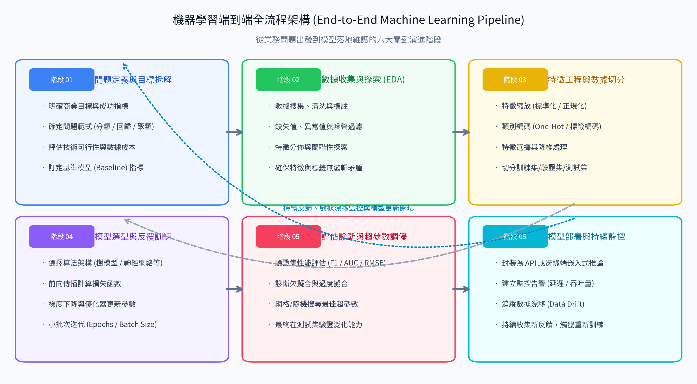
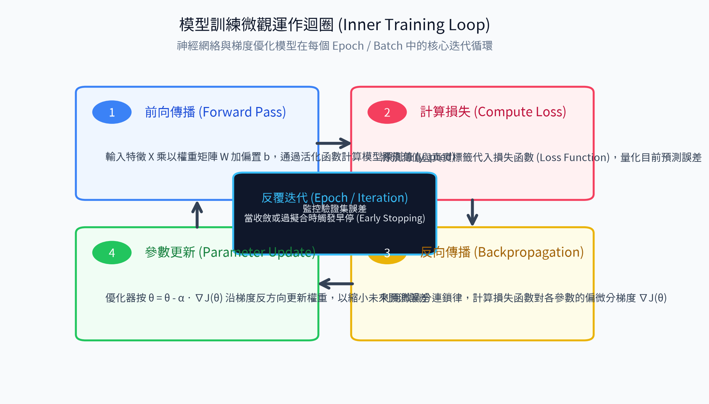
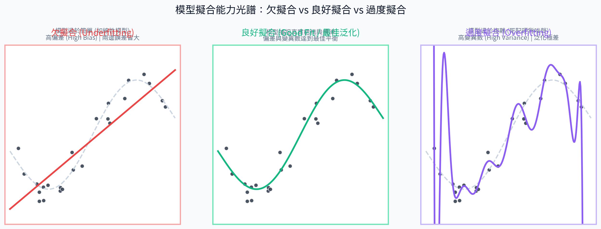

# 12. 機器學習訓練過程 (End-to-End Machine Learning Pipeline)

在學習了前面的數據結構、特徵工程、優化算法、評估指標與模型泛化之後，我們已經掌握了機器學習大廈的所有基石模組。

**本章是全書的集大成篇**。我們將把所有零散的概念串聯起來，從宏觀視角一覽一個專業機器學習專案從「業務問題出發」到「模型訓練調優」再到「落地部署與閉環監控」的完整生命週期（End-to-End ML Pipeline）。

---

## 🎯 本章學習目標
1. 掌握機器學習專案的**宏觀六大階段生命週期**，理解各階段的承接關係。
2. 搞懂模型訓練的**微觀運作迴圈 (Inner Training Loop)**，精確計算 Epoch、Iteration 與 Batch Size。
3. 建立全域工程思維，熟記機器學習實戰的**黃金檢查清單 (Practitioner's Checklist)**。

---

## 1. 宏觀全景：機器學習端到端生命週期

一個真實世界的機器學習專案，遠遠不只是呼叫 `model.fit()` 那麼簡單。如下圖所示，真正的機器學習系統是一個涵蓋六大演進階段、且具備持續回饋修正的工程閉環：

#### 📊 觀念圖解

---

### 六大核心演進階段詳解

| 階段序號 | 階段名稱 | 核心任務 | 對應前續章節 | 實戰產出物 |
| :---: | :--- | :--- | :---: | :--- |
| **01** | **問題定義與目標拆解** | • 明確商業目標與成功指標（KPI） • 確定機器學習範式（監督 vs 非監督、分類 vs 回歸） • 定立基準線（Baseline Model）以衡量後續成效 | [01_學習範式](../01_學習範式/README.md) | 專案規格書、核心評估指標清單 |
| **02** | **數據收集與探索 (EDA)** | • 數據清洗、去重與缺失值/異常值過濾 • 探索特徵分佈與關聯性矩陣 • 驗證標籤品質，確保無人為標註錯誤 | [02_數據結構](../02_數據結構/README.md) | 探索性分析報告、清洗後乾淨數據集 |
| **03** | **特徵工程與數據切分** | • 執行特徵縮放（標準化/正規化） • 類別特徵編碼（One-Hot / 標籤編碼） • 嚴格依照時間或分層抽樣劃分 Train / Val / Test • **嚴防數據洩漏 (Data Leakage)** | [03_數據分割](../03_數據分割/README.md) [04_特徵工程](../04_特徵工程/README.md) | 特徵矩陣 $X$、標籤向量 $y$、切分後的三大子集 |
| **04** | **模型選型與反覆訓練** | • 挑選候選演算法（樹模型、SVM、神經網絡等） • 執行微觀訓練迴圈（前向傳播、計算損失、梯度反傳） • 利用集成學習（Random Forest、XGBoost）強化實力 | [06_優化算法](../06_優化算法/README.md) [07_常見算法](../07_常見算法/README.md) [08_集成學習](../08_集成學習/README.md) | 候選模型權重檔案 |
| **05** | **評估診斷與超參數調優** | • 透過學習曲線診斷欠擬合或過度擬合 • 利用驗證集進行網格/隨機/貝氏搜尋超參數 • 最終由鎖定的測試集給出無偏的客觀泛化評估 | [05_模型參數](../05_模型參數/README.md) [09_評估指標](../09_評估指標/README.md) [10_模型性能問題](../10_模型性能問題/README.md) [11_模型泛化](../11_模型泛化/README.md) | 最佳超參數組合、終極測試評估報告 |
| **06** | **模型部署與持續監控** | • 將模型封裝為 REST API、微服務或邊緣推論模組 • 監控系統推論延遲、記憶體用量與吞吐量 • **追蹤數據漂移 (Data Drift)**，觸發動態重訓更新 | 全書貫通 | 生產環境服務、即時監控儀表板 |

---

## 2. 微觀深潛：模型訓練迭代核心迴圈 (The Inner Loop)

當我們在「階段 04」啟動模型訓練時，演算法內部正在高速執行以數據批次為單位的微觀迭代循環：

#### 📊 觀念圖解

### 訓練迴圈的四步舞曲
1. **第一步：前向傳播 (Forward Pass)**  
   輸入一批特徵數據 $X$，通過當前的模型參數矩陣 $W$ 與偏置 $b$，計算出模型的預測輸出 $\hat{y}$。
2. **第二步：計算損失 (Compute Loss)**  
   將預測值 $\hat{y}$ 與真實標籤 $y$ 傳入損失函數（如 MSE、Cross-Entropy），算出當前猜測的差距數值。
3. **第三步：反向傳播 (Backpropagation)**  
   利用微積分連鎖律，計算損失函數對各層參數的偏微分梯度 $\nabla J(\theta)$。
4. **第四步：參數更新 (Parameter Update)**  
   優化器（如 Adam、SGD）依照更新規則 $\theta \leftarrow \theta - \alpha \nabla J(\theta)$ 調整權重，完成一次經驗學習。

---

### 💡 關鍵術語數學關係：Epoch vs Batch Size vs Iteration

很多初學者經常混淆這三個術語，請牢記以下定義與公式：

- **Batch Size（批次大小）**：每次參數更新時，模型「一口吞下」的樣本數量（如 64 筆）。
- **Iteration（迭代步數）**：參數更新發生的**次數**（完成一個 Batch 的四步舞曲就是 1 次 Iteration）。
- **Epoch（訓練輪數）**：模型**將「整個訓練數據集」完整看過一遍**的週期。

#### 核心換算公式

$$\text{1 個 Epoch 所需的 Iterations} = \left\lceil \frac{\text{訓練集總樣本數 } N}{\text{Batch Size}} \right\rceil$$

> **實戰算術題**：  
> 假設訓練集共有 $10,000$ 筆數據，設定 $\text{Batch Size} = 64$：  
> - 每個 Epoch 需要進行 $\lceil 10,000 / 64 \rceil = 157$ 次參數更新迭代 (Iterations)。  
> - 若訓練設定 $10$ 個 Epochs，則模型總共會經歷 $157 \times 10 = 1,570$ 次迭代更新！

---

## 3. 訓練健康度診斷與擬合光譜對照

在反覆迭代的過程中，模型會經歷不同的擬合狀態。我們必須隨時觀察學習曲線，確保模型落在黃金平衡點上：

#### 📊 觀念圖解

### 訓練狀態健康度速查表

| 診斷指標 | 欠擬合 (Underfitting) | 良好擬合 (Good Fit / 最佳泛化) | 過度擬合 (Overfitting) |
| :--- | :--- | :--- | :--- |
| **幾何視角** | 用僵硬直線擬合彎曲數據（如一次多項式） | 用平滑曲線貼合主要真實結構（如二次多項式） | 用瘋狂震盪曲線穿過所有噪聲點（如十五次多項式） |
| **數學本質** | **高偏差 (High Bias)** | **偏差與變異數達到最佳平衡** | **高變異數 (High Variance)** |
| **訓練集誤差** | ❌ 很高（連看過的題目都不會） | ✅ 低且平穩 | ✅ 極低（甚至完美 0 誤差） |
| **驗證集誤差** | ❌ 很高（新題目同樣考砸） | ✅ 低且非常接近訓練誤差 | ❌ 嚴重飆高（面對新題目原形畢露） |
| **診斷結論** | 模型太笨、特徵太少、沒學會知識 | **理想境界，具備強大泛化能力** | 模型用力過猛、死記硬背雜訊 |
| **對策處方** | • 換用更強大的非線性模型 • 擴充新特徵與交互維度 • 調低正則化懲罰 $\lambda$ | • 保持當前架構 • 執行最終測試集驗收 | • 引入 L1/L2 正則化與 Dropout • 擴充數據集與 Data Augmentation • 設置早停法 (Early Stopping) |

---

## 4. 機器學習工程師實戰黃金檢查清單 (Practitioner's Checklist)

在啟動任何機器學習專案時，請依序核對以下 8 項關鍵準則：

- [ ] **1. 明確問題本質**：確認是監督式（分類/回歸）還是非監督式任務，定義量化商業 KPI。
- [ ] **2. 鎖定第一道防火牆**：第一時間乾淨劃分訓練集、驗證集與測試集；**測試集封裝至上線前才開啟**。
- [ ] **3. 杜絕數據洩漏**：所有標準化 Scaler、編碼器與特徵選擇器，**嚴格僅在訓練集上 `fit()`**。
- [ ] **4. 檢查類別平衡**：面對不平衡數據，切分時務必採用分層抽樣 (Stratified Split)，評估指標捨棄 Accuracy 改用 F1 / PR-AUC。
- [ ] **5. 搭建 Baseline 模型**：先用最簡單的線性模型或隨機森林建立效能基準線，作為後續複雜調優的對照組。
- [ ] **6. 特徵縮放與演算法適配**：若選用 KNN、SVM 或神經網絡，務必先完成特徵標準化。
- [ ] **7. 監控驗證集損失曲線**：嚴格配置 Early Stopping 早停機制，防止模型訓練過頭滑入過擬合深淵。
- [ ] **8. 監控生產環境數據漂移**：上線後持續追蹤輸入數據分佈與業務反饋，建立持續自動化重訓管線。

---

## 📌 本章精華速記
1. 機器學習專案是從**問題定義、數據探索、特徵工程、模型選型、評估調優到部署監控**的六大階段閉環。
2. 訓練微觀核心是**前向傳播 ➔ 算 Loss ➔ 反向傳播算梯度 ➔ 優化器更新權重**的反覆迭代。
3. $\text{Iterations per Epoch} = \lceil N / \text{Batch Size} \rceil$；Epoch 是全體看一遍，Iteration 是更新一次。
4. 始終以**驗證集**引導超參數調優與早停，以**測試集**完成最終泛化評估，嚴守防資料洩漏底線。

---

[⏮️ 上一章：11_模型泛化](../11_模型泛化/README.md) | [📑 返回目錄](../README.md)
