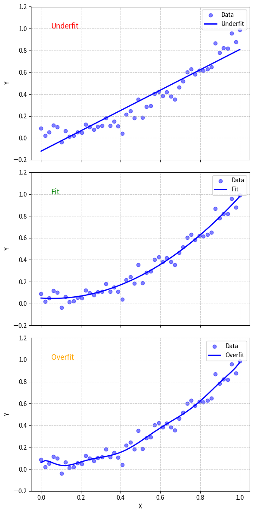

# 訓練流程, 模型的泛化(Generalization),過渡擬合(Overfitting)和欠擬合(Underfitting)
### ML的整個「訓練過程」：這裡以監督式學習(Supervised Learning)為例

| **階段**   | **要做的事**  | **說明**                                  |
| ----------- | --------- | --------------------------------------- |
| 1. (訓練前)  | 決定資料集與分析資料      | 你想要預測的是什麼資料? 這邊需要先知道 example、label、features的概念。 |
| 2. (訓練前) | 決定問題種類   | 依據資料，會知道是什麼類型的問題。regression problem(回歸問題)? classification problem(分類問題)?          |
| 3. (訓練前)  | 決定ML模型(ML models)     | 依據問題的種類，會知道需要使用什麼對應的ML模型。回歸模型(Regression model)? 分類模型(Classification model)? |
| 4. (訓練前) | (模型裡面的參數)     | ML模型裡面的參數(parameters)與超參數(hyper-parameters)   |
| 5. (訓練中) 調整模型  | 評估當前模型好壞    | 損失函數(Loss Functions)：使用損失函數評估目前模型的好與壞。以MSE(Mean Squared Error), RMSE(Root Mean Squared Error), 交叉熵(Cross Entropy)為例。 |
| (訓練中) 調整模型  | 修正模型參數    | 以梯度下降法 (Gradient Descent)為例：決定模型中參數的修正「方向」與「步長(step size)」 |
| 7. (訓練中) 調整腳步 | 調整學習腳步 | 透過學習速率(learning rate)來調整ML模型訓練的步長(step size)，調整學習腳步。|
| 8. (訓練中) 加快訓練 | 取樣與分堆 | 設定batch size，透過batch從訓練目標中取樣，來加快ML模型訓練的速度。(此參數在訓練前設定，為hyper-parameter)。與迭代(iteration),epoch介紹。 |
| 9. ((訓練中) 完成訓練 | (loop) -> 完成 | 重覆過程(評估當前模型好壞 -> 修正模型參數)，直到能通過「驗證資料集(Validation)」的驗證即可結束訓練。 |
| 10. (訓練後) | 訓練結果可能問題 | 「不適當的最小loss?」 |
| 11. (訓練後) | 訓練結果可能問題 | 欠擬合(underfitting)?過度擬合(overfitting)?  |
| 12. (訓練後) | 評估 - 性能指標 | 性能指標(performance metrics)：以混淆矩陣(confusion matrix)分析，包含「Accuracy」、「Precision」、「Recall」三種評估指標。  |
| 13. (訓練後) | 評估 - 新資料適用性 | 泛化(Generalization)：對於新資料、沒看過的資料的模型適用性。 |
| 14. (訓練後) | 評估 - 模型測試 | 使用「獨立測試資料集(Test)」測試. 使用交叉驗證(cross-validation)(又稱bootstrapping)測試. |

### 泛化(generalize)：指ML模型「對未知資料集」的預測能力。

> 泛化(generalize)能力差：等於預測「對未知資料集」的預測能力能力差。  
> 但如果對「對自己的資料」的預測能力很好，有可能是發生了過度擬合(overfitting)的現象。

### ★ 欠擬合(underfitting) 與 過度擬合(overfitting)

| **比較**   | **‌欠擬合(underfitting)**  | **過度擬合(overfitting)** |
| ----------- | --------- | --------------------------------------- |
| (訓練前) | (可能)決定了太簡單的模型 | (可能)決定了太複雜的模型 |
| (訓練中) | (可能)訓練太早結束 | (可能)訓練過頭，也就是太晚結束 |
| (訓練後)對自已的資料 | 訓練後發現模型「對自已的資料」預測能力太差 | 訓練後發現模型「對自已的資料」預測能力非常好(可能好到沒有誤差) |
| (訓練後)對新的資料 | (對自己的資料都不行了還要試新資料嗎XD) | 訓練後發現模型「對新的資料」預測能力非常差 |
| 代表的意義 | 我們的模型「對自已的資料」沒辦法達到理想的預測能力 | 我們的模型「對新的資料」沒辦法達到理想的預測能力，然而對「對自已的資料」預測能力非常好。 |

> [!TIP]
> 「最佳的ML模型訓練結果」應該介於欠擬合(underfitting) 與 過度擬合(overfitting)之間。

#### 用圖簡單解釋 欠擬合(underfitting) 與 過度擬合(overfitting)

使用Matplotlib 來展示欠擬合 (underfitting) 和過度擬合 (overfitting) 的概念，並搭配簡單的例子來說明這兩個現象在機器學習中的區別。

假設我們有一個簡單的非線性數據集，並嘗試用不同複雜度的模型來擬合它：

[**實作的ipynb**](./README.ipynb)

### 擬合模型：
- **欠擬合**：用一次多項式（直線）擬合，無法捕捉數據的非線性趨勢。
- **適當擬合**：用二次多項式（拋物線）擬合，與真實數據的趨勢匹配。
- **過度擬合**：用 10 次多項式擬合，過分捕捉噪聲，導致曲線過於複雜。

