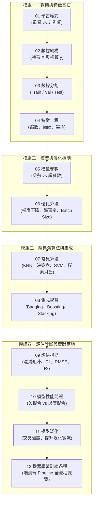

# 🤖 機器學習核心名詞解釋與知識地圖

歡迎來到**機器學習核心概念與名詞解釋全景手冊**！  
本教學目錄為機器學習學習者、資料科學家與工程師精心設計，旨在用**最直觀的生活比喻、最清晰的數學幾何直覺、高品質繁體中文視覺化圖解與實戰避坑指南**，將原本枯燥抽象的機器學習概念轉化為易讀易懂的系統化知識。

---

## 🗺️ 學習路線圖與四大知識模組

```mermaid
flowchart TD
    subgraph G1 ["模組一：數據與特徵基石"]
        M1["01 學習範式<br>(監督 vs 非監督)"]
        M2["02 數據結構<br>(特徵 X 與標籤 y)"]
        M3["03 數據分割<br>(Train / Val / Test)"]
        M4["04 特徵工程<br>(縮放、編碼、選擇)"]
        M1 --> M2
        M2 --> M3
        M3 --> M4
    end

    subgraph G2 ["模組二：模型與優化機制"]
        M5["05 模型參數<br>(參數 vs 超參數)"]
        M6["06 優化算法<br>(梯度下降、學習率、Batch Size)"]
        M5 --> M6
    end

    subgraph G3 ["模組三：經典演算法與集成"]
        M7["07 常見算法<br>(KNN、決策樹、SVM、樸素貝氏)"]
        M8["08 集成學習<br>(Bagging、Boosting、Stacking)"]
        M7 --> M8
    end

    subgraph G4 ["模組四：評估診斷與實戰落地"]
        M9["09 評估指標<br>(混淆矩陣、F1、RMSE、R²)"]
        M10["10 模型性能問題<br>(欠擬合 vs 過度擬合)"]
        M11["11 模型泛化<br>(交叉驗證、提升泛化實戰)"]
        M12["12 機器學習訓練過程<br>(端到端 Pipeline 全流程總覽)"]
        M9 --> M10
        M10 --> M11
        M11 --> M12
    end

    M4 --> M5
    M6 --> M7
    M8 --> M9
```

---

## 📚 完整章節導覽手冊

| 模組分組 | 編號 | 章節主題 | 核心學習內容與亮點 | 導覽連結 |
| :--- | :---: | :--- | :--- | :---: |
| **模組一：數據與特徵** | **01** | **[學習範式](./01_學習範式/README.md)** | 監督式學習（分類/回歸）、非監督式學習（聚類/降維）、半監督與強化學習全景對比 | [📖 閱讀章節](./01_學習範式/README.md) |
| | **02** | **[數據結構](./02_數據結構/README.md)** | 特徵矩陣 $X$ 與標籤向量 $y$ 的組織形態、五大特徵型態、相親履歷生活比喻 | [📖 閱讀章節](./02_數據結構/README.md) |
| | **03** | **[數據分割](./03_數據分割/README.md)** | 訓練集、驗證集與測試集的三部曲職責、分層抽樣、時序分割、嚴防數據洩漏 | [📖 閱讀章節](./03_數據分割/README.md) |
| | **04** | **[特徵工程](./04_特徵工程/README.md)** | 特徵縮放幾何直覺（標準化 vs 正規化）、類別編碼陷阱（One-Hot vs 標籤編碼）、特徵選擇三大流派 | [📖 閱讀章節](./04_特徵工程/README.md) |
| **模組二：參數與優化** | **05** | **[模型參數](./05_模型參數/README.md)** | 內部參數（學出來的權重）vs 外部超參數（工程師調校的旋鈕）、網格/隨機/貝氏搜尋策略 | [📖 閱讀章節](./05_模型參數/README.md) |
| | **06** | **[優化算法](./06_優化算法/README.md)** | 濃霧下山直覺、梯度下降三大變體、學習率步長效應、Batch Size 民調抽樣比喻、Adam 演進脈絡 | [📖 閱讀章節](./06_優化算法/README.md) |
| **模組三：經典算法** | **07** | **[常見算法](./07_常見算法/README.md)** | K-NN（物以類聚）、決策樹（白盒階層切割）、SVM（最大間隔與核技巧）、樸素貝氏（條件機率推斷） | [📖 閱讀章節](./07_常見算法/README.md) |
| | **08** | **[集成學習](./08_集成學習/README.md)** | 三個臭皮匠勝過諸葛亮：Bagging（隨機森林降方差）、Boosting（XGBoost 降偏差）、Stacking 融合 | [📖 閱讀章節](./08_集成學習/README.md) |
| **模組四：評估與實戰** | **09** | **[評估指標](./09_評估指標/README.md)** | 混淆矩陣雙字母口訣、分類四大指標（漏報 vs 誤報權衡）、ROC-AUC、回歸四大指標（MAE, MSE, RMSE, $R^2$） | [📖 閱讀章節](./09_評估指標/README.md) |
| | **10** | **[模型性能問題](./10_模型性能問題/README.md)** | 欠擬合（學不會/死板直線）vs 過度擬合（死記硬背雜訊）、偏差-變異數權衡、學習曲線診斷 | [📖 閱讀章節](./10_模型性能問題/README.md) |
| | **11** | **[模型泛化](./11_模型泛化/README.md)** | 泛化鴻溝量化、K 折交叉驗證、從數據/架構/正則化/訓練四維度提升泛化實力 | [📖 閱讀章節](./11_模型泛化/README.md) |
| | **12** | **[機器學習訓練過程](./12_機器學習訓練過程/README.md)** | **全書集大成篇**：宏觀端到端六大階段 Pipeline、微觀訓練迭代迴圈、擬合光譜與實戰檢查清單 | [📖 閱讀章節](./12_機器學習訓練過程/README.md) |

---

## 💡 本教程閱讀建議
1. **零基礎初學者**：建議按照 `01 ➔ 12` 的編號循序漸進閱讀，各章均有生動的生活比喻與觀念圖解，可快速建立扎實的心智模型。
2. **面試複習與實戰查閱**：每一章末尾皆有「📌 本章精華速記」與「特性對照表格」，可直接跳至對應主題快速複習高頻考點與常見陷阱。
3. **專案開發啟動**：在動工新專案前，推薦直接研讀 [第 12 章：機器學習訓練過程](./12_機器學習訓練過程/README.md) 中的「實戰黃金檢查清單」。
