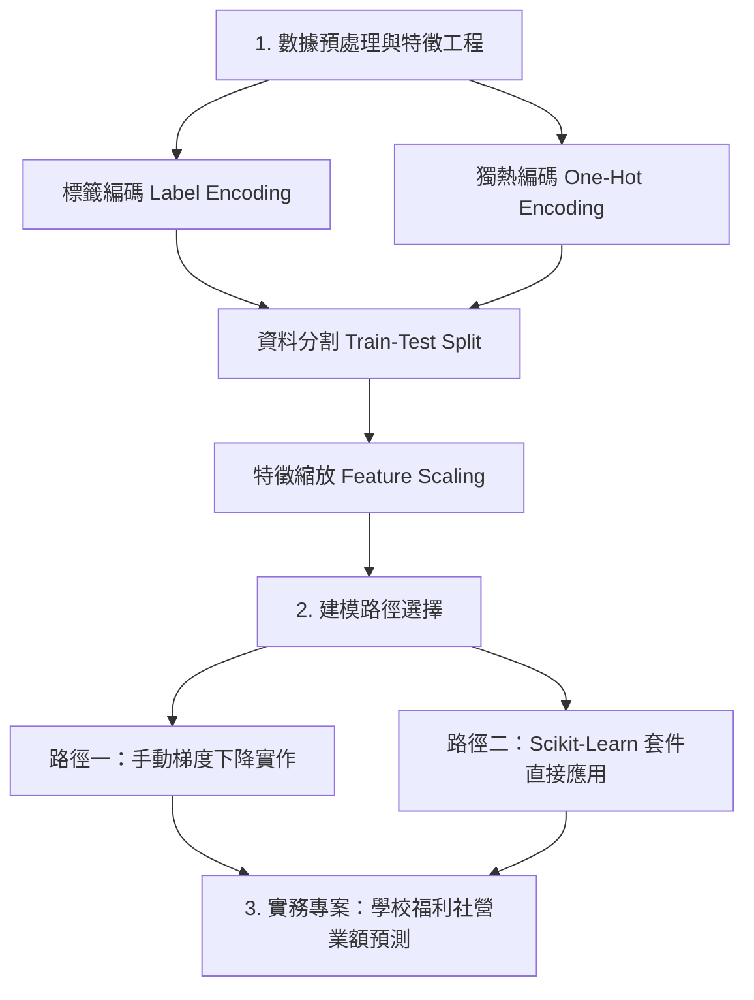

# 多元線性迴歸 (Multiple Linear Regression)

多元線性迴歸是用來探討多個自變數（輸入特徵）與一個應變數（目標連續數值）之間關係的統計與機器學習模型。方程式表示如下：

$$\hat{y} = w_1 x_1 + w_2 x_2 + \dots + w_n x_n + b$$

- **$x_1, x_2, \dots, x_n$**：輸入的特徵變數。
- **$w_1, w_2, \dots, w_n$**：各特徵對應的權重（斜率）。
- **$b$**：偏差（截距）。

本章節將引導您學習從數據的前處理（編碼與縮放）、手動實作梯度下降優化，到使用 Scikit-Learn 自動建模的完整路徑，並附帶一個真實福利社營業額預測的專案實作。

---

## 🗺️ 學習地圖 (Learning Map)



---

## 📚 講義與範例對照 (Slides & Notebook Reference)

為了方便您的學習，下方對照表將簡報檔（Jambord 檔）與對應的 Jupyter Notebook 實作檔案進行了關聯：

| 學習主題 | 講義簡報 (說明jam) | 實作檔案 (Jupyter Notebook) |
| :--- | :--- | :--- |
| **多元線性迴歸概念** | 🔗 [1多元線性迴歸說明.jam](./說明jam/1多元線性迴歸說明.jam) | - |
| **類別變數編碼** | 🔗 [2label_encoding.jam](./說明jam/2label_encoding.jam)<br>🔗 [3one_hot_encoding.jam](./說明jam/3one_hot_encoding.jam) | [multiple_linear_regression1.ipynb](./multiple_linear_regression1.ipynb)<br>[multiple_linear_regression2.ipynb](./multiple_linear_regression2.ipynb) |
| **梯度下降與公式運算** | 🔗 [4granient_descent.jam](./說明jam/4granient_descent.jam) | [multiple_linear_regression1.ipynb (手動梯度下降實作)](./multiple_linear_regression1.ipynb) |
| **特徵縮放與套件實作** | 🔗 [5Feature_scaling.jam](./說明jam/5Feature_scaling.jam) | [multiple_linear_regression2.ipynb (Scikit-Learn 實作)](./multiple_linear_regression2.ipynb) |
| **福利社營業額預測專案** | - | [學校福利社營業額預測目錄](./學校福利社營業額預測/) |

---

## 1️⃣ 數據預處理與特徵工程 (Data Preprocessing)

在將資料送入多元線性迴歸模型之前，必須先對原始資料（例如 [Salary_Data2.csv](./Salary_Data2.csv)）進行處理，包含文字型特徵的轉碼與特徵縮放。

### 1. 標籤編碼 (Label Encoding)
- **概念**：適用於**具有高低順序性**的文字欄位（例如學歷 `EducationLevel`）。
- **映射方式**：高中以下 $\rightarrow$ 0，大學 $\rightarrow$ 1，碩士以上 $\rightarrow$ 2。
- **程式碼實作**：
  ```python
  education_mapping = {'高中以下': 0, '大學': 1, '碩士以上': 2}
  data['EducationLevel'] = data['EducationLevel'].map(education_mapping)
  ```

### 2. 獨熱編碼 (One-Hot Encoding)
- **概念**：適用於**無高低順序性**的文字欄位（例如居住城市 `City`：城市A、城市B、城市C）。我們不使用 0, 1, 2（這會暗示順序），而是為各城市建立獨立的二元欄位。
- **程式碼實作**（使用 Scikit-Learn `OneHotEncoder`）：
  ```python
  from sklearn.preprocessing import OneHotEncoder
  
  # 建立獨熱編碼器，以防測試集出現未知類別，handle_unknown 設為 'ignore'
  onehot_encoder = OneHotEncoder(categories=[['城市A', '城市B', '城市C']], handle_unknown='ignore')
  
  # 輸入必須為二維 DataFrame
  city_encoded = onehot_encoder.fit_transform(data[['City']])
  
  # 將稀疏矩陣轉為陣列並寫回 data
  data[['CityA', 'CityB', 'CityC']] = city_encoded.toarray()
  
  # 刪除原始文字欄位與基準欄位，以避免多重共線性 (Dummy Variable Trap)
  data = data.drop(['City', 'CityC'], axis=1)
  ```

### 3. 資料分割 (Train-Test Split)
- **概念**：將資料集分割為訓練集與測試集（例如測試集佔 20%），其最主要目的為**評估模型在未知新數據上的準確度與泛化能力**。
- **程式碼實作**：
  ```python
  from sklearn.model_selection import train_test_split
  x_train, x_test, y_train, y_test = train_test_split(x, y, test_size=0.2, random_state=76)
  ```

### 4. 特徵縮放 (Feature Scaling)
- **概念**：在多元線性迴歸中，不同特徵的數值範圍可能極為懸殊（如年資是 1~10，年收入是數十萬）。這會導致梯度下降時收斂速度極慢或產生震盪。我們使用 `StandardScaler` 將特徵進行標準化（使其均值為 0，標準差為 1）以**加速收斂**。
- **程式碼實作**：
  ```python
  from sklearn.preprocessing import StandardScaler
  
  scaler = StandardScaler()
  # 僅用訓練集擬合 scaler，防止數據洩漏 (Data Leakage)
  x_train_scaled = scaler.fit_transform(x_train.to_numpy())
  x_test_scaled = scaler.transform(x_test.to_numpy())
  ```

---

## 2️⃣ 建模路徑選擇 (Model Training)

### 🛠️ 路徑一：手動實作梯度下降 (底層學習)
透過自行撰寫成本函數與梯度計算公式，手動更新權重 $w$ 與截距 $b$，這有助於徹底掌握梯度下降與矩陣運算的數學本質。

🔗 **[手動實作 Notebook 範例](./multiple_linear_regression1.ipynb)**
- 實作手動的 `compute_cost`（成本函數）
- 實作手動的 `compute_gradient` 與 `gradient_descent` (optimizer)

### 📦 路徑二：Scikit-Learn 套件直接應用 (實務上手)
使用業界常用的 Scikit-Learn 機器學習套件，直接調用 `LinearRegression` 類別，在極短代碼內完成訓練與預測。

🔗 **[Scikit-Learn 套件建模實作範例](./multiple_linear_regression2.ipynb)**
- `model.fit(x_train, y_train)` 模型訓練
- `model.coef_` 與 `model.intercept_` 參數提取

---

## 🏫 實務專案案例：學校福利社營業額預測

當您完成了數據前處理與模型訓練後，您可以前往我們的實務專案案例進行整合練習：

🔗 **[專案目錄：學校福利社營業額預測](./學校福利社營業額預測/)**

該專案包含一個完整的機器學習流水線（ML Pipeline）實作：
1. **[generate_dataset.ipynb](./學校福利社營業額預測/generate_dataset.ipynb)**：模擬生成福利社的營業額數據（包含氣溫、降雨量、請假人數與活動日等特徵）。
2. **[data_analysis.ipynb](./學校福利社營業額預測/data_analysis.ipynb)**：進行探索性數據分析（EDA），繪製散佈圖、箱形圖與相關性熱圖。
3. **[multiple_linear_regression.ipynb](./學校福利社營業額預測/multiple_linear_regression.ipynb)**：進行多元線性迴歸建模，並比較「標準化前後」的預測性能（MSE、RMSE、$R^2$ Score）。
4. **[predict_new_data.ipynb](./學校福利社營業額預測/predict_new_data.ipynb)**：載入訓練好的模型，預測未來的新數據。
