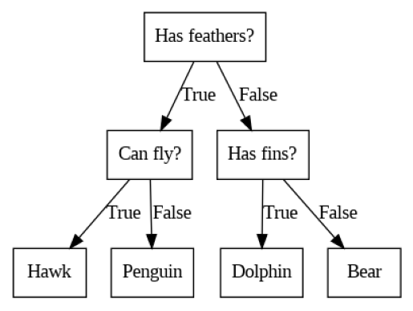
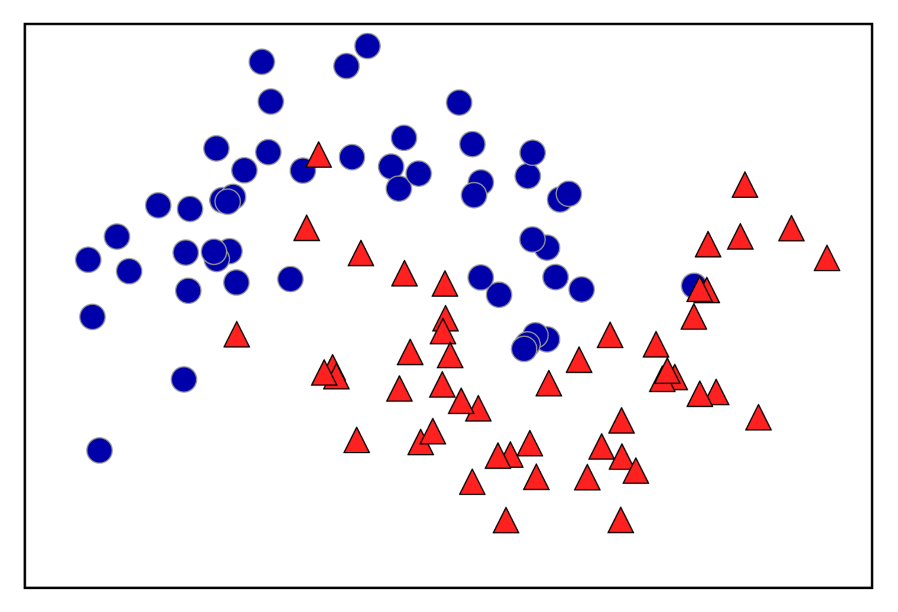
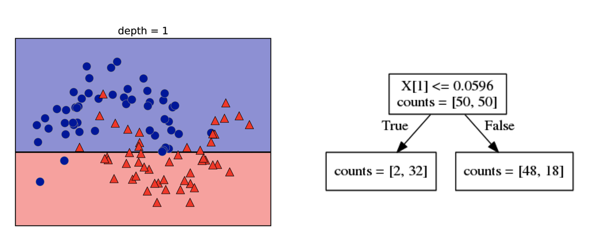
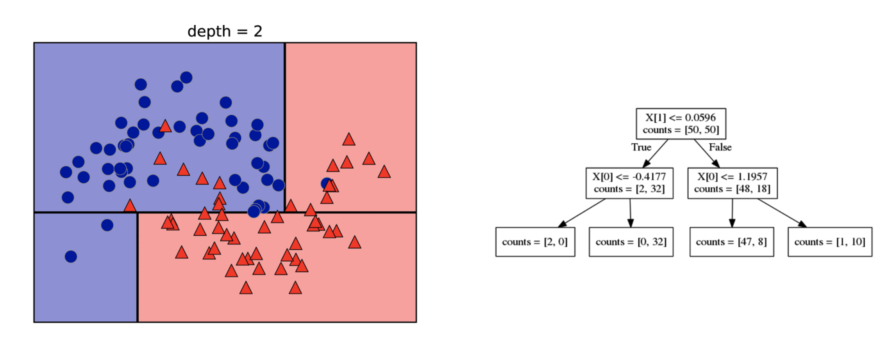
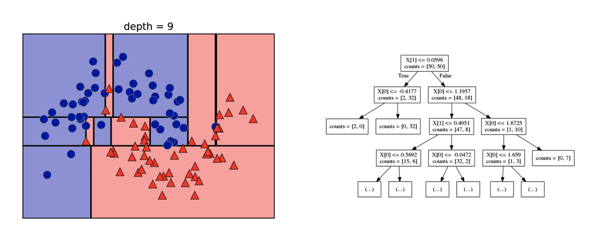
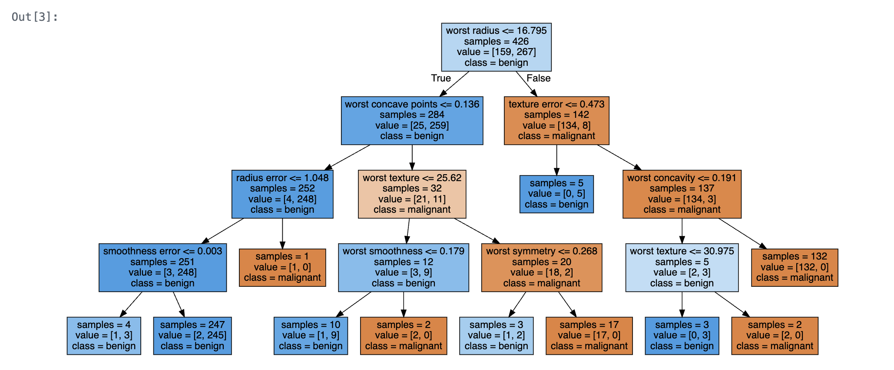

# 樹狀模型_決策樹 DecisionTreeClassifier
## 注意:
- 解釋決策樹的基本概念，以及它如何用於分類。
- 解釋樹的深度、節點、葉子等概念。
- 嘗試修改 max_depth 參數，觀察模型的變化。
- 介紹其他評估指標，例如精確度、召回率和 F1 分數。
- 嘗試使用其他數據集，例如手寫數字數據集，來進行決策樹分析。
- 解釋決策樹的優缺點，例如易於理解、容易過擬合等。
- 介紹其他樹狀模型，例如隨機森林和梯度提升樹。
- 解釋如何使用決策樹來處理迴歸問題。

判斷樹是廣泛用於分類和迴歸任務的模型。本質上，它們學習 if/else 問題的層次結構，從而得出決策。

這些問題類似於「20 Questions」遊戲中的問題。假設您想要區分以下四種動物：`熊`、`鷹`、`企鵝`和`海豚`。您的目標是盡可能少地提出 if/else 問題，從而得到正確的答案。你可以先問一下這種動物是否有羽毛，這個問題將可能的動物範圍縮小到只有兩種。如果答案是“是”，您可以提出另一個問題，以幫助您區分鷹和企鵝。例如，你可以問這種動物是否會飛。如果動物沒有羽毛，那麼你可能的選擇是海豚和熊，你需要問一個問題來區分這兩種動物, 例如，詢問該動物是否有鰭。用機器學習的術語來說，我們建立了一個模型，使用「有羽毛」、「能飛」和「有鰭」這三個特徵來區分四類動物（鷹、企鵝、海豚和熊）。

[產生此圖片的-實作ipynb](./demo1.ipynb)

在此圖中，樹中的每個節點代表一個問題或一個包含答案的終端節點（也稱為葉子）。這些邊緣將一個問題的答案與您要問的下一個問題連接起來。

### 建立一個Decision trees

讓我們來看看二維分類資料集建構決策樹的過程。此資料集由兩個半月形組成，每個類別由 75 個資料點組成。我們將這個資料集稱為 two_moons。

學習決策樹意味著學習 if/else 問題的序列，以便我們最快得到真正的答案。在機器學習設定中，這些問題被稱為測試（不要與測試集混淆，測試集是我們用來測試以了解我們的模型的通用性的數據）。通常資料不會像動物範例中那樣以二元是/否特徵的形式出現，而是表示為連續特徵，下圖所示的 2D 資料集。對連續資料使用的測試形式為“特徵 i 是否大於值 a？”

為了建立樹，演算法會搜尋所有可能的測試，並找到對目標變數最具參考價值的測試。下圖顯示了選取的第一個測試。在 x[1]=0.0596 處垂直分割資料集可獲得最多的資訊；它能最好地區分第 1 類中的點和第 2 類中的點。頂部節點也稱為根，代表整個資料集，由屬於類別 0 的 50 個點和屬於類別 1 的 50 個點組成。透過測試 x[1] 是否 <= 0.0596 來完成分割，以黑線表示。如果測試結果為真，則將一個點指派給左節點，包含 2 個屬於 0 類的點和 32 個屬於 1 類的點。否則，該點將被指派到右節點，該節點包含 48 個屬於類別 0 的點和 18 個屬於類別 1 的點。這兩個節點分別對應頂部和底部區域。儘管第一次分割很好地分離了兩個類，但底部區域仍然包含屬於類 0 的點，而頂部區域仍然包含屬於類 1 的點。

透過重複在兩個區域中尋找最佳測試的過程，我們可以建立更準確的模型。顯示左側和右側區域最具資訊量的下一個分割是基於 x[0], 這個遞歸過程產生一個決策二元樹，每個節點包含一個測試。或者，您可以將每個測試視為沿著一個軸拆分當前正在考慮的資料部分。這可以將演算法視為建立層級分割。由於每個測試只涉及單一特徵，因此區域總是與軸線平行。

樹狀結構的葉子包含的資料點都有相同的目標值，稱為 pure。相同目標值的樹葉稱為「pure」。此資料集的最終分割如以下所示

對於新資料點的預測是透過檢查該點在特徵空間分割的哪個區域，然後預測該區域中的大多數目標（或在pure leaf的情況下的單一目標）。該區域可以從樹根開始向左或向右遍歷，視測試是否達成而定。

要進行預測，我們會根據每個節點中的測試來遍歷這棵樹，並找出新資料點所在的樹葉。此資料點的輸出是此葉子中訓練點的平均目標。

### 控制決策樹的複雜性

通常，按照這裡描述的方式建立一棵樹並繼續下去直到所有葉子都是純淨的，`這會導致模型非常複雜並且與訓練資料高度擬合`。pure leaf的存在意味著一棵樹在`訓練集上的準確率為 100%`；訓練集中的每個資料點都位於具有正確多數類別的leaf中。如下圖左側可以看到過度擬合的情況。

您可以看到，在所有屬於類別 0 的點的中間，有被確定為屬於類別 1 的區域。另一方面，在最右邊屬於 0 個類別的點周圍有一小條帶，預測為 0 個類別。這並不是人們想像中的決策邊界的樣子，決策邊界主要關注遠離該類別中其他點的單一異常點。

`有兩種常見的策略可以防止過度擬合`：提前停止樹的創建（也稱為`預修剪pre-pruning`），或建立樹，然後刪除或折疊包含很少資訊的節點（也稱為`後修剪post-pruing或僅修剪pruning`）預先修剪的可能標準包括限制`樹的最大深度`、`限制葉子的最大數量`，或要求`節點中的點數最少以繼續分裂`它。

scikit-learn 中的決策樹在`DecisionTreeRegressor` 和 `DecisionTreeClassifier` 類別中實作。scikit-learn 只實現了預剪枝(pre-pruning)，而不是後修剪(post-pruning)。

讓我們更詳細地看看預修剪對乳癌資料集的影響。與往常一樣，我們會匯入資料集並將其分為訓練部分和測試部分。然後，我們使用完全開發樹的預設（生長樹直到所有葉子都pure）來建立模型。我們修復樹中的 random_state，它在內部用於打破平局

[生長樹直到所有leaf都pure-實作ipynb](./demo2.ipynb)

現在讓我們對樹木進行預剪枝，這樣樹就不會再生長了,我們之前的樹完美地適合訓練資料。一種選擇是在達到一定深度後停止建造樹。這裡我們設定max_depth=4，表示只能問四個連續的問題。限制樹的深度可以減少過度擬合。這會導致訓練集上的準確率降低，但測試集上的準確率會提高：

[限制(max_depth=4)-實作ipynb](./demo3.ipynb)

### 分析決策樹

我們可以使用樹模組中的 export_graphviz 函數來視覺化樹。這會以 .dot 文件格式寫入文件，這是一種用於儲存圖形的文字文件格式。我們設定了一個選項來為節點著色，以反映每個節點中的多數類，並傳遞類別和特徵名稱，以便可以正確標記樹：

[圖形化decision tree-實作ipynb](./demo4.ipynb)

## 實作:

[**DecisionTreeClassifier model實作**](./sklearn實作1.ipynb)  
[**書店文具物品分類實作**](./sklearn實作2)