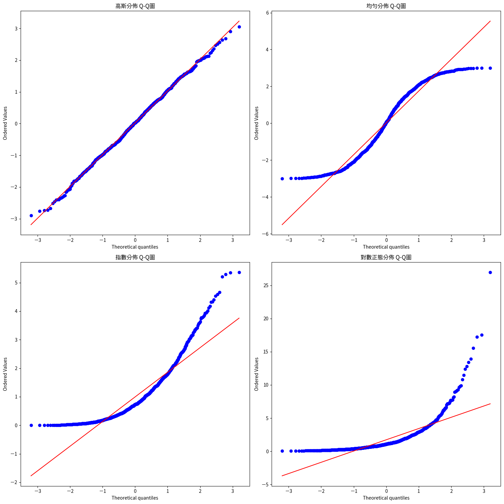

## Quantile-Quantile Plot（簡稱 Q-Q 圖）

是一種圖形工具，用於檢查數據的分佈是否符合某個特定的理論分佈，或者比較兩個數據集的分佈是否相似。

### 什麼是Quantile

**➜最簡單的說法**

> **分量就是把數據平均分成幾等份的一種方式。**

---

** ➜舉例：切西瓜的比喻**

想像你有一大條西瓜（代表全部的數據），  
你要把它切成 **4 等份**，每一份都有一樣多的人（或資料點），  
切的那些點，就是「**四分位數（quartiles）**」。

- 🥇 第一四分位數（Q1）：25% 的位置  
- 🥈 第二四分位數（Q2，也叫中位數 Median）：50% 的位置  
- 🥉 第三四分位數（Q3）：75% 的位置

---

** ➜第 `p` 分位數（p-quantile）：**

> 第 `p` 分位數（p-quantile）是指落在 **p 百分比位置上的數值**。

例如：
- 第 `0.9` 分位數表示有 90% 的數據比它小，10% 的數據比它大。

---

**➜Q-Q 圖的用途**

Q-Q 圖通過比較**數據的分量(quantiles)**與**理論分佈(或另一組數據)的分量**，來評估數據是否符合某個分佈。具體來說：

1. **檢查數據是否符合特定理論分佈**：例如高斯分佈（常態分佈）、均勻分佈、指數分佈等。
2. **比較兩個數據集的分佈**：判斷它們是否來自相同的分佈。

3. 如果 Q-Q 圖上的點近似落在對角線（y=x 線）上，則表示數據分佈與理論分佈（或另一組數據）一致。

**➜[Q-Q圖實作](./demo.ipynb)**

```python
import numpy as np
import matplotlib.pyplot as plt
from scipy import stats
import matplotlib as mlp
from matplotlib.font_manager import fontManager

#載入中文字型
fontManager.addfont('ChineseFont.ttf')
mlp.rc('font', family='ChineseFont')

# 創建2x2子圖
fig, ((ax1, ax2), (ax3, ax4)) = plt.subplots(2, 2, figsize=(15, 15))

# 生成不同分佈的數據
normal_data = np.random.normal(loc=0, scale=1, size=1000)  # 高斯分佈
uniform_data = np.random.uniform(low=-3, high=3, size=1000)  # 均勻分佈
exp_data = np.random.exponential(scale=1.0, size=1000)  # 指數分佈
lognormal_data = np.random.lognormal(mean=0, sigma=1, size=1000)  # 對數正態分佈

# 繪製高斯分佈Q-Q圖
stats.probplot(normal_data, dist='norm', plot=ax1)
ax1.set_title('高斯分佈 Q-Q圖')

# 繪製均勻分佈Q-Q圖
stats.probplot(uniform_data, dist='norm', plot=ax2)
ax2.set_title('均勻分佈 Q-Q圖')

# 繪製指數分佈Q-Q圖
stats.probplot(exp_data, dist='norm', plot=ax3)
ax3.set_title('指數分佈 Q-Q圖')

# 繪製對數正態分佈Q-Q圖
stats.probplot(lognormal_data, dist='norm', plot=ax4)
ax4.set_title('對數正態分佈 Q-Q圖')

# 調整子圖之間的間距
plt.tight_layout()

plt.show()
```




**➜Q-Q 圖可以檢查哪些分佈？**

Q-Q 圖是通用的工具，理論上可以用來檢查任何分佈是否與數據匹配。以下是常見的分佈類型，Q-Q 圖特別適用於檢查這些分佈：

1. **高斯分佈（常態分佈, Normal Distribution）**：  
   - 最常見的應用，因為許多統計方法（如 GaussianNB）假設數據符合高斯分佈。
   - Q-Q 圖檢查數據是否呈現鐘形曲線分佈。
   - **例子**：檢查學生的考試成績是否符合高斯分佈。
   - **判斷標準**：
	   - 數據點會落在對角線上

2. **均勻分佈（Uniform Distribution）**：  
   - 用於檢查數據是否均勻分佈在某個範圍內（每個值出現的概率相等）。  
   - **例子**：檢查隨機數生成器的輸出是否均勻分佈。  
   - **判斷標準**：
	   - S形曲線
	   - 中間部分較平坦,兩端彎曲  

3. **指數分佈（Exponential Distribution）**：  
   - 用於檢查數據是否符合指數分佈，常用於描述事件間的等待時間（如電話呼叫間隔）。
   - **例子**：檢查顧客到達商店的時間間隔是否符合指數分佈。
   - **判斷標準**：`
	   - 呈現彎曲的形狀`
	   - 有明顯的偏態(skewness)

4. **對數正態分佈（Log-Normal Distribution）**：
   - 用於檢查數據取對數後是否符合高斯分佈，常用於描述偏態數據（如收入、股票價格）。
   - **例子**：檢查某公司員工薪資是否符合對數正態分佈。
   - **判斷標準**：
	   - 明顯彎曲
	   - 也具有偏態特性
5. **其他分佈**：
   - Q-Q 圖也可以檢查其他分佈，例如伽馬分佈（Gamma Distribution）、韋伯分佈（Weibull Distribution）、卡方分佈（Chi-Square Distribution）等。
   - 只要能定義理論分佈的分量，Q-Q 圖就可以用來比較。

6. **比較兩個數據集**：
   - Q-Q 圖不僅限於理論分佈，還可以用來比較兩個數據集的分佈是否相同。
   - **例子**：比較兩組學生的考試成績，檢查它們是否來自同一分佈。

---

**➜Q-Q 圖的工作原理**

1. **分量比較**：
   - 將數據的觀測值按升序排列，計算其分量（例如，數據的第 25% 分位數）。
   - 將這些分量與理論分佈（或另一組數據）的相同分量進行比較。
2. **繪圖**：
   - X 軸：理論分佈的分量（或第二組數據的分量）。
   - Y 軸：實際數據的分量。
   - 如果點沿對角線（y=x）排列，則數據分佈與理論分佈一致。
3. **偏離的意義**：
   - 如果點呈 S 形，數據可能有偏態（skewness）。
   - 如果點呈弧形，數據可能有較重的尾部（heavy tails）或較輕的尾部（light tails）。

---
### 簡單範例
以下是三個場景，展示 Q-Q 圖如何檢查不同分佈：

1. **檢查高斯分佈**：
   - **場景**：您收集了 100 名學生的數學考試成績，想確認是否符合高斯分佈。
   - **數據**：成績範圍 0-100，平均值 75，標準差 10。
   - **Q-Q 圖**：
     - X 軸：標準正態分佈（μ=0, σ=1）的分量。
     - Y 軸：標準化後的成績分量。
     - 如果點沿對角線，成績符合高斯分佈；如果點在兩端偏離，可能是偏態分佈。

2. **檢查均勻分佈**：
   - **場景**：您生成了一組隨機數（0 到 1 之間），想確認它們是否均勻分佈。
   - **數據**：1000 個隨機數。
   - **Q-Q 圖**：
     - X 軸：均勻分佈（0,1）的分量。
     - Y 軸：隨機數的分量。
     - 如果點沿對角線，數據符合均勻分佈；如果點彎曲，可能有聚集現象。

3. **檢查指數分佈**：
   - **場景**：您記錄了顧客到達咖啡店的時間間隔（分鐘），想確認是否符合指數分佈。
   - **數據**：100 個時間間隔，平均間隔 5 分鐘。
   - **Q-Q 圖**：
     - X 軸：指數分佈（λ=1/5）的分量。
     - Y 軸：時間間隔的分量。
     - 如果點沿對角線，數據符合指數分佈；如果點偏離，可能有其他分佈特性。

---


1. **視覺化展示**：
   - 用 Python 的 `scipy.stats` 和 `matplotlib` 繪製 Q-Q 圖，展示高斯分佈的例子。例如：
     ```python
     import numpy as np
     import matplotlib.pyplot as plt
     from scipy import stats

     # 模擬高斯分佈數據
     data = np.random.normal(loc=75, scale=10, size=100)
     stats.probplot(data, dist="norm", plot=plt)
     plt.title("Q-Q Plot for Normal Distribution")
     plt.show()
     ```
   
   - 展示不同分佈（高斯、均勻、指數）的 Q-Q 圖，比較點的分佈。

2. **類比**：
   - 將 Q-Q 圖比喻為「試衣服」：數據是您的身材，理論分佈是衣服款式。如果衣服（分佈）合身，點會沿著對角線；如果不合身，點會偏離。

3. **互動問題**：
   - 問學生：「如果 Q-Q 圖的點在兩端向上彎曲，你覺得數據分佈可能是什麼特性？」（提示：可能有較重的尾部，如 t 分佈）。
   - 讓學生猜測某數據（例如身高、等待時間）可能符合哪種分佈，然後用 Q-Q 圖驗證。

4. **結合機器學習**：
   - 解釋 Q-Q 圖在 GaussianNB 中的重要性：檢查特徵是否符合高斯分佈假設，以確保模型的適用性。
   - 展示如果特徵不完全符合高斯分佈（例如偏態），可以用數據變換（如對數變換）來改善。

---

### 總結
- Q-Q 圖可以用來檢查數據是否符合任何理論分佈，包括：
  - 高斯分佈（常態分佈）：檢查連續數據的鐘形分佈。
  - 均勻分佈：檢查數據是否均等分佈。
  - 指數分佈：檢查等待時間等數據。
  - 對數正態分佈、伽馬分佈等其他分佈。
- 也可以比較兩個數據集的分佈是否相同。
- 如果 Q-Q 圖的點沿對角線，數據分佈與理論分佈一致；偏離則表示不符。


作為一名機器學習老師，教授與機器學習密切相關的機率統計知識對於學生的學習和理解模型原理至關重要。以下是有助於學生掌握機器學習核心概念的機率統計主題，這些主題不僅能幫助學生理解模型的數學基礎，還能提升他們在實務中分析和解決問題的能力。我將這些主題分為基礎、中級和進階三個層次，並提供每個主題對機器學習的具體幫助。

---

### 基礎機率統計知識
這些是學生必須掌握的核心概念，適合初學者，為後續學習奠定基礎。

1. **基本機率概念**
   - **內容**：事件、樣本空間、機率公理、條件機率、獨立性、貝氏定理（Bayes' Theorem）。
   - **對機器學習的幫助**：
     - 貝氏定理是許多機器學習模型（如樸素貝氏分類器）的核心。
     - 條件機率和獨立性概念有助於理解特徵之間的關係，例如在特徵選擇或模型假設中。
   - **教學建議**：通過簡單的例子（如擲骰子、醫療診斷）講解貝氏定理，讓學生理解機率如何更新資訊。

2. **隨機變數與機率分佈**
   - **內容**：離散和連續隨機變數、機率質量函數（PMF）、機率密度函數（PDF）、累積分佈函數（CDF）、期望值（均值）、變異數、標準差。
   - **對機器學習的幫助**：
     - 隨機變數是資料特徵和標籤的數學抽象，理解其分佈有助於建模資料。
     - 期望值和變異數是損失函數和模型評估的基礎，例如均方誤差（MSE）。
   - **教學建議**：用圖形展示常見分佈（如均勻分佈、伯努利分佈）的PMF/PDF，並解釋其在真實資料中的應用。

3. **常見機率分佈**
   - **內容**：
     - 離散分佈：伯努利分佈（Bernoulli）、二項分佈（Binomial）、泊松分佈（Poisson）。
     - 連續分佈：均勻分佈（Uniform）、高斯分佈（Gaussian/Normal）、指數分佈（Exponential）。
   - **對機器學習的幫助**：
     - 高斯分佈是許多模型（如線性回歸、GMM）的假設基礎。
     - 伯努利和二項分佈在分類問題（如邏輯回歸）中至關重要。
     - 泊松分佈可用於計數資料建模，如事件發生頻率。
   - **教學建議**：展示分佈的數學形式與實際場景（如高斯分佈在身高資料中的應用），並讓學生用程式（如Python）模擬分佈。

4. **聯合分佈、邊緣分佈與條件分佈**
   - **內容**：聯合機率分佈、邊緣化（Marginalization）、條件分佈、協方差與相關係數。
   - **對機器學習的幫助**：
     - 聯合分佈和條件分佈是生成模型（如貝氏網絡）與特徵關係分析的基礎。
     - 協方差和相關係數幫助理解特徵之間的依賴性，影響特徵選擇和降維（如PCA）。
   - **教學建議**：用二維資料集展示聯合分佈，並通過程式計算邊緣分佈和條件分佈。

---

### 中級機率統計知識
這些主題適合有一定基礎的學生，幫助他們深入理解機器學習模型的數學原理。

1. **多變量高斯分佈**
   - **內容**：多變量高斯分佈的定義、協方差矩陣、條件高斯分佈。
   - **對機器學習的幫助**：
     - 多變量高斯分佈是高斯混合模型（GMM）、隱馬爾可夫模型（HMM）等生成模型的基礎。
     - 協方差矩陣在主成分分析（PCA）和線性判別分析（LDA）中用於捕捉特徵間關係。
   - **教學建議**：展示二維高斯分佈的圖形，並讓學生用Python（如NumPy）模擬多變量高斯資料。

2. **最大似然估計（MLE）**
   - **內容**：似然函數、對數似然、最大似然估計的計算。
   - **對機器學習的幫助**：
     - MLE 是許多監督學習模型（如邏輯回歸、線性回歸）的參數估計方法。
     - 理解 MLE 有助於學生掌握損失函數的數學推導。
   - **教學建議**：以簡單的伯努利分佈為例，手動推導 MLE，並展示其在邏輯回歸中的應用。

3. **期望最大化算法（EM Algorithm）**
   - **內容**：EM 算法的原理、迭代步驟（E-step 和 M-step）。
   - **對機器學習的幫助**：
     - EM 算法是高斯混合模型、隱馬爾可夫模型等模型的參數估計方法。
     - 幫助學生理解如何處理具有隱變數的複雜模型。
   - **教學建議**：以 GMM 為例，逐步講解 E-step 和 M-step，並展示 Python 實現。

4. **假設檢驗與 p 值**
   - **內容**：零假設與對立假設、顯著性水平、p 值、t 檢驗、卡方檢驗。
   - **對機器學習的幫助**：
     - 假設檢驗用於模型評估（如比較模型性能）與特徵選擇。
     - p 值幫助學生理解統計顯著性，避免過分依賴模型結果。
   - **教學建議**：用真實資料集進行 t 檢驗，比較兩模型的性能，並解釋 p 值的意義。

---

### 進階機率統計知識
這些主題適合對機器學習有較深入興趣的學生，幫助他們理解複雜模型和前沿技術。

1. **馬爾可夫鏈與馬爾可夫性質**
   - **內容**：馬爾可夫性質、轉移矩陣、穩態分佈。
   - **對機器學習的幫助**：
     - 馬爾可夫鏈是隱馬爾可夫模型（HMM）和馬爾可夫決策過程（MDP，強化學習的核心）的基礎。
     - 理解馬爾可夫性質有助於建模序列資料（如自然語言處理）。
   - **教學建議**：以天氣預測為例，展示馬爾可夫鏈的轉移矩陣，並讓學生模擬序列資料。

2. **信息論基礎**
   - **內容**：熵（Entropy）、互信息（Mutual Information）、KL 散度（Kullback-Leibler Divergence）。
   - **對機器學習的幫助**：
     - 熵和互信息用於特徵選擇和決策樹。
     - KL 散度是變分自編碼器（VAE）和生成對抗網絡（GAN）的損失函數基礎。
   - **教學建議**：以簡單的離散分佈計算熵和 KL 散度，並解釋其在深度學習中的應用。

3. **貝氏推斷**
   - **內容**：先驗分佈、後驗分佈、共軛先驗、貝氏估計。
   - **對機器學習的幫助**：
     - 貝氏方法用於貝氏網絡、貝氏優化和不確定性建模（如貝氏神經網絡）。
     - 幫助學生理解如何在資料不足時進行穩健推斷。
   - **教學建議**：以簡單的共軛先驗（如 Beta-Bernoulli）為例，展示後驗分佈的更新過程。

4. **隨機過程基礎**
   - **內容**：泊松過程、布朗運動、隨機遊走。
   - **對機器學習的幫助**：
     - 泊松過程用於建模事件序列（如推薦系統中的點擊流）。
     - 隨機過程是強化學習和時間序列分析的基礎。
   - **教學建議**：以泊松過程為例，展示其在計數資料中的應用，並讓學生模擬隨機過程。

---

### 教學方法與建議
1. **理論與實務結合**：
   - 每個主題後，提供真實的機器學習案例（如高斯分佈在異常檢測中的應用）。
   - 使用 Python（NumPy、SciPy、scikit-learn）實現概念，讓學生動手實作。

2. **視覺化工具**：
   - 使用圖表（如 Matplotlib、Seaborn）展示分佈、聯合分佈或損失函數的變化。
   - 通過互動式工具（如 Jupyter Notebook）讓學生探索參數對結果的影響。

3. **循序漸進**：
   - 從基礎開始，逐步引入中級和進階主題，確保學生不會感到過於困難。
   - 定期複習基礎概念（如期望值、條件機率），因為它們在進階主題中反覆出現。

4. **作業與專案**：
   - 設計作業讓學生推導簡單模型的損失函數（如線性回歸的 MLE）。
   - 安排小組專案，如實現一個簡單的高斯混合模型或貝氏分類器。

5. **強調直覺而非純數學**：
   - 用直觀的例子解釋複雜概念（如 KL 散度的“分佈距離”），避免過多數學推導。
   - 鼓勵學生用自己的話解釋概念，確保他們真正理解。

---

### 總結
教授機率統計時，應涵蓋基礎（機率、分佈、期望值）、中級（MLE、EM、假設檢驗）和進階（馬爾可夫鏈、信息論、貝氏推斷）主題，這些知識直接支持機器學習的理論和應用。通過理論講解、程式實作和真實案例相結合，學生不僅能理解模型的數學基礎，還能培養解決實際問題的能力。如果您有特定的課程目標或學生背景（如本科生或研究生），我可以進一步為您量身定制教學計劃。請問您是否有其他具體需求？

