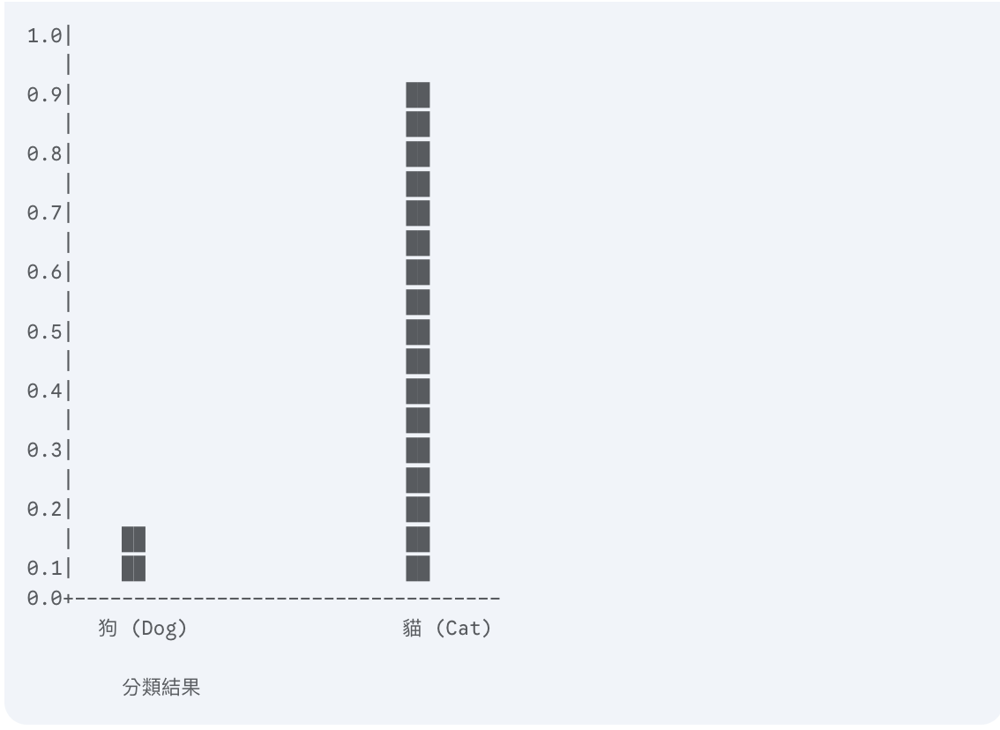
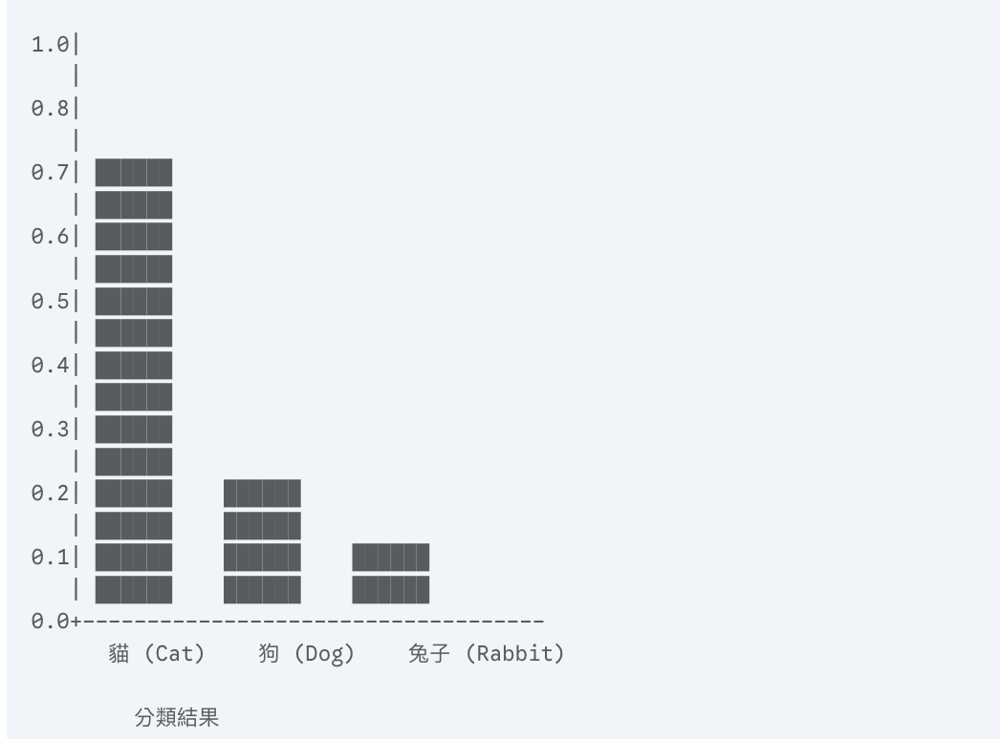
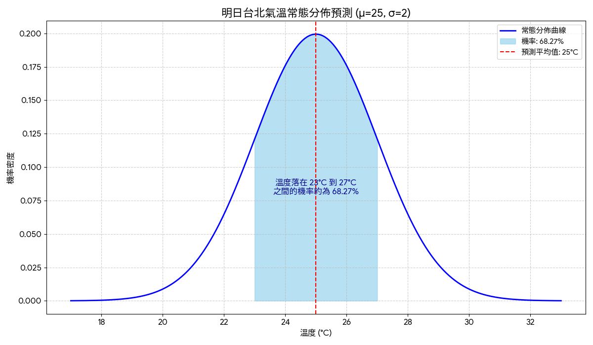
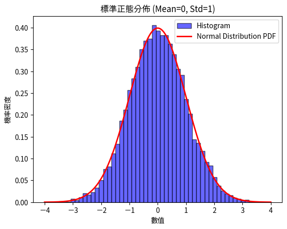
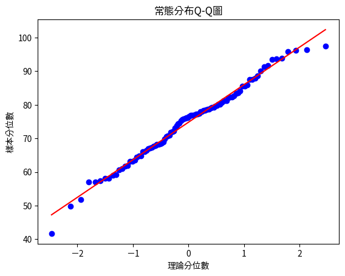

# 機率統計

- [待轉換文章1](./參考1.md)


透徹了解「機率分佈」，這是一個至關重要的基礎。因為在機器學習中，我們幾乎所有事情都圍繞著「不確定性」打轉，而機率分佈正是**描述與量化不確定性(不是百分百確定)的語言**。

## 為什麼一個搞 AI/ML 的人需要懂機率分佈？

### 問題:

目的:機率分佈不是一個純理論的數學工具，而是解決真實 ML 問題的核心。

假設我們要做一個貓狗分類器，當模型輸出『90% 是貓』時，這 90% 是什麼意思？它背後是什麼數學模型？」(伯努利分佈(Bernoulli distribution)/分類分佈(Classification distribution))


圖表：貓狗分類器對單一圖片的預測分佈圖(Bernoulli distribution)


假設我們要做一個動物分類器，模型要判斷一張圖片是「貓」、「狗」還是「兔子」三種之一。當模型輸出結果如下：

- 70% 是貓
- 20% 是狗
- 10% 是兔子

這三個數字分別代表什麼意思？它背後是什麼數學模型？

分類分佈圖表 (Categorical Distribution Chart)



補充：
- 如果只有兩個類別（例如「貓」和「狗」），這就是「伯努利分佈（Bernoulli distribution）」。
- 如果有三個以上的類別，就是「多項分佈（Multinomial distribution）」的單次試驗情況，也稱「分類分佈（Categorical distribution）」。

---

「我們要預測明天台北的氣溫，模型預測是 25°C。但我們有多大的把握？氣溫落在 23°C 到 27°C 之間的機率有多高？」(常態分佈)

常態分佈圖表(Normal distribution chart)


---


## 隨機變數（Random Variable)  

- 說明1:隨機變數是對隨機事件結果的數值描述。例如，擲骰子的結果可以用一個數值來表示（如1到6）。
	- 1點 -> 1
	- 2點 -> 2
	- 3點 -> 3
	- 4點 -> 4
	- 5點 -> 5
	- 6點 -> 6

- 說明2:是一個將隨機實驗結果對應到數值的函數

```python
import numpy as np

# 模擬擲骰子 10 次，每次結果為 1~6 的整數
dice_rolls = np.random.randint(1, 7, size=10)
print("擲骰子的結果（隨機變數 X）:", dice_rolls)
```

## 離散隨機變數(Discrete Random Variable) 
離散隨機變數就是「可以一個一個數出來」的隨機變數。也就是說，它的所有可能結果不是有限個，就是雖然很多但還是可以一個一個列出來。舉例來說，擲骰子的點數只有 1、2、3、4、5、6 這六種，這就是離散隨機變數。

**主要特徵**
- 有限或可數無窮個: 例如擲骰子的結果（1,2,3,4,5,6）、投硬幣的結果（正面、反面）、或某段時間內電話接聽次數（0,1,2,…）
- 每個值有對應機率: 可以明確寫出每個可能值的機率，稱為「機率分佈」
- 機率總和為1

**常見例子**

| 例子 | 可能的取值 |
|:--|:--|
| 擲骰子 | 1, 2, 3, 4, 5, 6 |
| 投硬幣（只看正反面） | 0（反面）、1（正面） |
| 投籃命中次數 | 0, 1, 2, …, n |

**總結**  
離散隨機變數就是「可以一一列出所有可能值」的隨機變數，每個值都有明確的機率

```python
import numpy as np

# 模擬投擲硬幣 10 次，0 表示反面，1 表示正面
# 什麼是二項式亂數？
# 二項式亂數是指根據「二項分布」產生的隨機數。二項分布描述的是：在固定次數 n 的獨立試驗中，每次試驗成功的機率為 p，最終成功的次數會呈現什麼樣的分布。
# 例如：拋 10 次硬幣（n=10），每次出現正面的機率是 0.5（p=0.5），那麼「出現正面的次數」就是一個二項式亂數。
# 在 numpy 中，可以用 np.random.binomial 來產生這種亂數。
coin_flips = np.random.binomial(n=1, p=0.5, size=10)
# n 代表「每一次試驗中重複進行的次數」。
# 在這裡 n=1，表示每次只拋一次硬幣（即每次試驗只有一次成功或失敗的機會）。
# 如果 n=3，則代表每次試驗會連續拋3次硬幣，並記錄其中正面的次數。
# p=0.5：每次成功（例如拋到正面）的機率是 0.5。
# size=10：總共重複這個試驗 10 次，得到 10 個結果。
print("投擲硬幣的結果（離散隨機變數 Y）:", coin_flips)
# 這段程式碼會產生一個長度為 10 的陣列，表示投擲硬幣 10 次的結果。
# 陣列中的每個元素是 0 或 1，分別表示反面或正面。
# 例如，如果結果是 [0, 1, 0, 1, 0, 1, 0, 1, 0, 1]，表示投擲硬幣 10 次，其中有 5 次是正面，5 次是反面。
---
### 這個範例的離散隨機變數是什麼值？

在這個範例中，離散隨機變數 \( Y \) 代表「每一次投擲硬幣的結果」，其可能的取值為：
- 0（表示反面）
- 1（表示正面）

也就是說，對於每一次投擲，\( Y \) 只能是 0 或 1 其中之一。這就是一個典型的離散隨機變數，因為它的所有可能值可以一一列舉出來。

**總結：**
- 離散隨機變數 \( Y \) 的可能值：0、1
- 每個值分別代表一次投擲硬幣的結果（反面或正面）

---
	

```


## 連續隨機變數

連續隨機變數（Continuous Random Variable）是指「取值為某一區間內的實數，且這些數值是不可數無限多個」的隨機變數。也就是說，連續隨機變數的可能值無法一一列舉，而是「遍布」在某個或整個實數區間內

**主要特徵**  
- **不可數無限多個取值**: 不可數無限多個取值：例如身高、體重、溫度、時間、薪資等，這些數值通常介於某個區間內，且無法一一列出

> 身高理論上可以量測到極小單位，例如 170 公分、170.1 公分、170.01 公分、170.001 公分…可以無限細分下去。

- **單一值的機率為零**:
對於連續隨機變數，任一點的機率為0，機率只存在於某個區間內

> 連續型隨機變數的機率是以「機率密度函數（PDF）」曲線下某區間的面積來表示。單一值（如身高=170.0公分）對應的「區間」寬度為0，因此面積（即機率）為0

- **機率以區間面積計算**:
- 機率以區間面積計算：連續隨機變數的機率是以「機率密度函數（PDF）」曲線下某區間的面積來表示

> 因為連續型隨機變數的取值是不可數無限多個，且機率是以區間面積來定義，所以單一值的機率為0

**常見例子**

| 例子 | 可能取值區間 |
|:--|:--|
| 身高 | 例如 100~220 cm |
| 體重 | 例如 30~150 kg |
| 溫度 | 例如 0~40 ℃ |
| 時間 | 例如 0~∞ 秒 |

```python
import numpy as np

# 連續隨機變數的範例說明與模擬

# 連續隨機變數的特點：
# - 可以取某個區間內的任意實數值，無法一一列舉
# - 例如「身高」這個變數，理論上可以是 170.0、170.01、170.001...，甚至 170.0000001 公分
# - 在統計上，這類變數通常用常態分佈（Normal Distribution）來建模

# 以下用 numpy 模擬 10 筆身高資料（單位：公分），假設全體平均身高為 170 公分，標準差為 10 公分
import numpy as np

# 這裡的 loc=170 表示常態分佈的「平均數」（μ），scale=10 表示「標準差」（σ），size=10 表示要產生 10 筆資料
# 標準差（σ）代表資料分布的離散程度，數值越大，資料分布越分散。以本例來說，平均數是170，標準差是10，表示大多數資料會落在170左右，但也有可能出現比170大或小很多的值。
# 例如，產生的資料中可能會有190（比平均數大2個標準差），這是因為常態分佈的特性，數值有機會落在平均數的兩倍標準差之外。
# 換句話說，標準差決定了資料「擴散」的範圍，並不是所有值都會很接近平均數。
heights = np.random.normal(loc=170, scale=10, size=10)
print("模擬身高資料（連續隨機變數 Z）：", heights)

# 說明：
# heights 這個陣列中的每一個值，都是從一個「連續」的常態分佈隨機抽取出來的
# 這代表每個人的身高理論上都可以是 170.0、170.01、169.999...等無窮多個可能值
# 這就是連續隨機變數的特性：在某個區間內有無限多個可能值，且每個精確值的機率為 0
```

## 離散隨機變數的概率分佈
**概率質量分佈(PMF)**

- **特性**:
	- 非負性
	- 總和為1

- **例子**:

假設擲一顆公平骰子，X代表出現的點數，則 PMF 如下：

| x | P(X=x) |
|:--|:--|
| 1 | 1/6 |
| 2 | 1/6 |
| 3 | 1/6 |
| 4 | 1/6 |
| 5 | 1/6 |
| 6 | 1/6 |

[**範例說明PMF**](./PMF概率質量分佈.ipynb)


## 連續隨機變數的概率分佈
**概率密度分佈(PDF)**  
概率密度函數（Probability Density Function, PDF） 是用來描述連續型隨機變數在某個取值點附近「出現可能性」的函數。PDF 本身不是機率，而是用來計算某個區間內機率的「密度」

**[範例說明PDF](./PDF概率密度分佈.ipynb)** 

----

## 2. 常見機率分佈

### 2.1 常態分佈（Normal Distribution）- 連續分佈

**numpy建立理論常態分佈**

```python
import numpy as np

# 生成 5 個符合均值 0、標準差 1 的正態分佈數值
normal_data = np.random.normal(loc=0, scale=1, size=5)
print(normal_data)
```

**高斯分佈(Gaussian distribution),常態分佈（normal distribution)**




➜ 高斯分佈（Gaussian distribution），也稱為常態分佈（normal distribution），是一種連續概率分佈，常用於描述自然界中許多現象的數據分佈。它的特徵是數據分佈呈現鐘形曲線（bell-shaped curve），具有以下關鍵特性：

1. **對稱性**：曲線以平均值（mean, μ）為中心，左右對稱。
2. **集中性**：大多數數據點分佈在平均值附近，隨著數據值偏離平均值，出現的概率逐漸減少。
3. **參數**：由兩個參數決定：
	- 平均值（μ）：表示數據的中心位置。
	- 標準差（σ）: ：表示數據的分散程度，標準差越大，曲線越扁平。?

> [!IMPORTANT]
> 高斯分佈之所以重要，是因為許多自然現象（如身高、考試成績、測量誤差等）的數據分佈近似符合高斯分佈，這使得它在統計學和機器學習中廣泛應用。

**➜機器學習常說「特徵符合高斯分佈」**  

在機器學習中，特別是 GaussianNB（高斯單純貝氏模型），假設每個特徵的數據分佈符合高斯分佈，意味著：

- 該特徵的數值是連續的（例如身高、溫度）。
- 這些數值的分佈形狀近似鐘形曲線，大多數值集中在平均值附近，極端值（很小或很大）的出現概率較低。
- GaussianNB 使用高斯分佈的概率密度函數來估計每個特徵在不同類別下的概率，從而進行分類。

如果特徵的數據分佈偏離高斯分佈（例如呈現偏態或多峰分佈），GaussianNB 的表現可能會受到影響，因為它的假設不再完全成立。

**➜實際的例子**  

假設您正在研究學生的身高數據，來預測他們是否適合參加籃球隊：

- **特徵**：身高（連續數據，單位：厘米）。  
- **數據分佈**：假設身高數據符合高斯分佈，平均值 μ = 170 cm，標準差 σ = 10 cm。  
- **分佈特性**：  
	- 大多數學生身高集中在 160 cm 到 180 cm 之間（約 68% 的數據在 μ ± σ 範圍內）。  
	- 極端值（例如 140 cm 或 200 cm）的學生很少出現。  
	- 鐘形曲線：如果畫出身高分佈的直方圖，它會呈現一個對稱的鐘形曲線，中心在 170 cm。  

- **視學化理解**

1. 鐘形曲線：如果畫出身高分佈的直方圖，它會呈現一個對稱的鐘形曲線，中心在 170 cm。
2. 說明曲線下的面積表示概率，例如
	- 約 68% 的數據落在 μ ± σ 範圍內。
	- 約 95% 的數據落在 μ ± 2σ 範圍內。
3. 實際例子（如身高、考試成績）對照，強調「大多數數據集中在中間，極端值少見」。

**➜實作範例**

[**正態(常態)分佈實作ipynb檔**](./正態分佈.ipynb)

[**使用Q-Q圖(Quantile-Quantile Plot)是否為常態分佈-ipynb檔**](./正態分佈1.ipynb)


### 2.2. 均勻分佈（Uniform Distribution）- 連續分佈

均勻分佈是一種概率分佈，其中隨機變數在指定區間內的每個值具有相等的出現概率。

**講解情境：公車等待時間**  
**場景**：假設一輛公車每隔10分鐘到站一次，且到站時間在一天內是隨機的。你在任意時刻到達公交站，等待時間𝑋,（單位：分鐘）是一個隨機變數。

[**均勻分佈實作ipynb檔**](./均勻分佈.ipynb)

```other
uniform_data = np.random.uniform(low=0, high=10, size=5)
print(uniform_data)
```

### 2.3 指數分佈(Exponential) - 連續分佈

### 2.4  二項分佈（Binomial Distribution） - 離散分佈

[**2項分佈實作ipynb檔**](./二項分佈.ipynb)

```other
# 進行 10 次獨立拋硬幣試驗，成功機率為 0.5
binomial_data = np.random.binomial(n=10, p=0.5, size=5)
print(binomial_data)
```

### 2.5 泊松分佈(Poisson) - 離散分佈

### 2.6 伯努利分佈(Bernoulli) - 離散分佈

----

## 3. [Quantile-Quantile Plot](./Q-Q圖)（簡稱 Q-Q 圖）

是一種圖形工具，用於檢查數據的分佈是否符合某個特定的理論分佈，或者比較兩個數據集的分佈是否相似。



---


## 4. 基本統計計算

**使用 numpy 計算常見統計量**：

```other
data = [12, 15, 20, 25, 30]

# 平均數
print("平均數:", np.mean(data))

# 中位數
print("中位數:", np.median(data))

# 標準差
print("標準差:", np.std(data))

# 變異數
print("變異數:", np.var(data))
```

----

**4. 機率密度函數與累積分佈函數**

使用 scipy.stats 計算機率分佈相關函數。

**(1) 計算某數值在標準正態分佈下的機率**

```other
from scipy.stats import norm

x = 1.0  # 目標數值
pdf_value = norm.pdf(x, loc=0, scale=1)  # 機率密度函數
cdf_value = norm.cdf(x, loc=0, scale=1)  # 累積分佈函數

print("PDF:", pdf_value)
print("CDF:", cdf_value)
```


**(2) 計算某數值在二項分佈下的機率**

```other
from scipy.stats import binom

n, p, k = 10, 0.5, 3  # 10 次試驗, 成功機率 0.5, 觀察 3 次成功
prob = binom.pmf(k, n, p)
print(f"成功 {k} 次的機率: {prob}")
```


