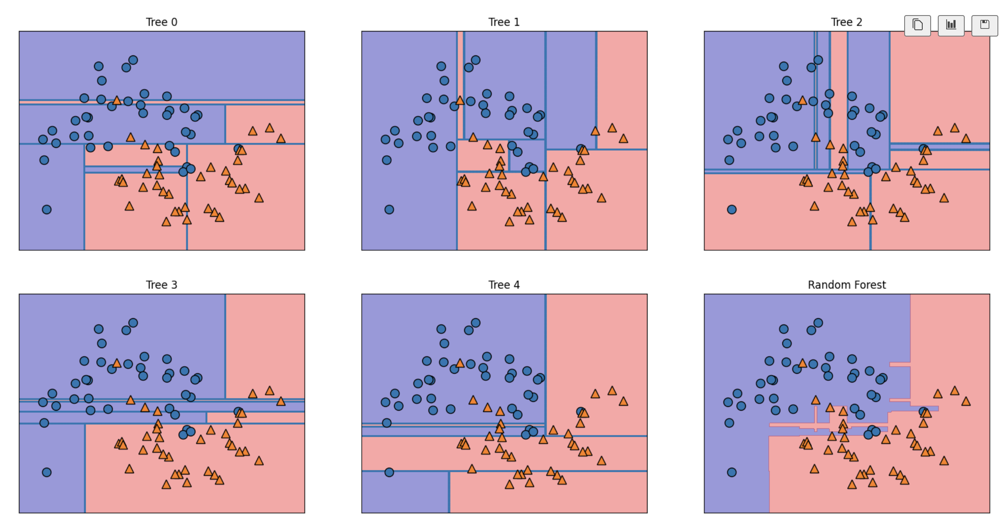
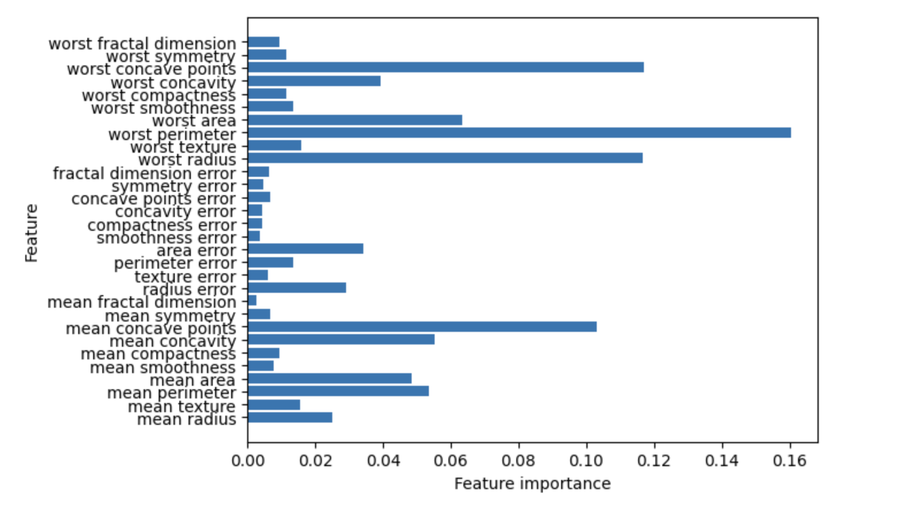

## Ensembles of Decision Trees（決策樹集成模型）

Ensembles of Decision Trees是一種將多種機器學習模型結合起來以創建更強大模型的方法。

簡單來說，就是**「集合很多棵決策樹」**來做更強大的預測，目標是比單一樹還要準確、穩定

**➜常見的三種主要方法是：**

1. **Bagging（Bootstrap Aggregating）**
	- **代表模型:Random Forest**
	- **原理:**
		- 從原資料集中，隨機有放回地抽樣出多個子資料集。
		- 每個子資料集訓練一棵決策樹。
		- 最後預測時，**投票（分類問題）或平均（迴歸問題）**結果。
	- **優點**: 減少過擬合（overfitting），提升穩定性
	- **特別點:** Random Forest還會在每個節點隨機選取特徵，而不是用全部特徵找最佳分割。

2. **Boosting（提升法）**
	- **代表模型: AdaBoost、Gradient Boosting、XGBoost、LightGBM、CatBoost**
	- **原理:**
		- 一棵一棵**順序訓練樹**，每次訓練時，**加強前一次錯誤的地方**。
		- 例如：前一棵樹錯誤分類的樣本，下一棵樹會被給更高的權重。
	- **優點:** 能打造非常強大的模型。
	- **缺點:** 容易過擬合，如果不控制好。

3. **Stacking（堆疊法）**
	- **代表模型:** 自訂式（通常結合不同類型的模型）
	- **原理:**
		- 用**不同演算法**（不一定都是決策樹！）訓練多個模型（比如一個用Random Forest，一個用XGBoost）。
		- 把這些模型的預測結果**當成新特徵**，再訓練一個**最終模型**做最後預測。
	- **優點: 可以融合不同模型的優點**
	- **缺點:** 比較複雜，容易出現資料洩漏問題（需要小心分層交叉驗證）。


## 隨機森林 Random Forests

決策樹的一個主要缺點是它們傾向於過度擬合訓練資料。隨機森林是解決這個問題的方法。隨機森林本質上是決策樹的集合，其中每棵樹都與其他樹略有不同。隨機森林背後的想法是，每棵樹可能在預測方面做得相對較好，但可能會在部分數據上過度擬合。如果我們建立許多樹，它們都運作良好並且以不同的方式過度擬合，我們可以透過平均它們的結果來減少過度擬合的量。可以用嚴格的數學方法來證明過度擬合的減少，同時保留樹的預測能力。

為了實現這個策略，我們需要建立許多決策樹。每棵樹都應該能夠很好地預測目標，並且也應該與其他樹木有所不同。隨機森林因在樹的建造過程中註入隨機性以確保每棵樹都不同而得名。 隨機森林中的樹隨機化有兩種方式：選擇用於建樹的`資料點`和選擇每次`分割測試中的特徵`。

### 建立隨機森林

要建立隨機森林模型，您需要決定要建立的樹的數量 (Random Forest Regressor vs Random Forest Classifier 的 n_estimators 參數)。假設我們想種 10 棵樹。這些樹將完全獨立地構建，並且演算法將對每棵樹做出不同的隨機選擇，以確保樹之間的差異。為了建構一棵樹，我們首先從數據中取得所謂的引導樣本。也就是說，從我們的 n_samples 個資料點中，我們重複地隨機抽取一個樣本（意味著可以多次挑選相同的樣本），n_samples 次。這將建立一個與原始資料集一樣大的資料集，但其中的一些資料點會缺失（大約三分之一），有些資料點會重複。為了說明，假設我們要建立清單 ['a', 'b','c', 'd'] 的引導樣本。可能的引導樣本是 ['b', 'd', 'd', 'c']。另一個可能的樣本是 ['d', 'a', 'd', 'a']。

接下來，基於這個新建立的資料集來建立決策樹。然而，我們針對決策樹所描述的演算法稍有修改。該演算法不是為每個節點尋找最佳測試，而是在每個節點中隨機選擇特徵的子集，並尋找涉及其中一個特徵的最佳測試。所選特徵的數量由 max_features 參數控制。在每個節點中分別重複選擇特徵子集，以便樹中的每個節點可以使用不同的特徵子集做出決策。自舉抽樣導致隨機森林中的每個決策樹都建立在略有不同的資料集上。由於每個節點中的特徵選擇，每棵樹中的每個分割都會對不同的特徵子集進行操作。這兩種機制共同確保隨機森林中的所有樹木都是不同的。

此過程中的一個關鍵參數是max_features。如果我們將 max_features 設為 n_features，則表示每次分割都可以查看資料集中的所有特徵，並且在特徵選擇中不會注入任何隨機性（但是，由於引導而產生的隨機性仍然存在）。如果我們將 max_features 設為 1，則表示分割根本無法選擇要測試的特徵，而只能在不同的閾值上搜尋隨機選擇的特徵。因此，較高的 max_features 意味著隨機森林中的樹木將非常相似，並且它們將能夠使用最獨特的特徵輕鬆地擬合資料。較低的 max_features 意味著隨機森林中的樹木將會非常不同，每棵樹可能需要非常深才能很好地適應資料。

為了使用隨機森林進行預測，演算法首先對森林中的每棵樹進行預測。對於迴歸，我們可以平均這些結果來得到最終結果預言。對於分類，採用「軟投票(soft voting)」策略。這意味著每個演算法都會做出「軟」預測，為每個可能的輸出標籤提供一個機率。對所有樹預測的機率取平均值，並預測機率最高的類別。

### 分析Random Forests
- 5棵樹
- two_moons資料集

[分析Random_Forests實作](./分析Random_Forests.ipynb)




### 在乳癌資料集上應用由 100 棵樹組成的隨機森林：

[100棵樹組成的隨機森林](./100棵樹組成的隨機森林.ipynb)

```python
from sklearn.datasets import load_breast_cancer
from sklearn.model_selection import train_test_split
from sklearn.ensemble import RandomForestClassifier

canser = load_breast_cancer()

X_train, X_test, y_train, y_test = train_test_split(canser.data, canser.target, random_state=0)
forest = RandomForestClassifier(n_estimators=100, random_state=0)
forest.fit(X_train, y_train)

print("Accuracy on training set:{:.3f}".format(forest.score(X_train, y_train)))
print("Accuracy on test set:{:.3f}".format(forest.score(X_test, y_test)))

#===output===
Accuracy on training set:1.000
Accuracy on test set:0.972
```

隨機森林為我們提供了 97% 的準確率，比線性模型或單一決策樹更好，而且無需調整任何參數。我們可以調整 max_features 設置，或像對單一決策樹那樣應用預修剪(pre-pruning)。然而，隨機森林的預設參數通常已經運行得相當好。

與決策樹類似，隨機森林提供特徵重要性，它是透過聚合森林中樹的特徵重要性來計算的。通常，隨機森林提供的特徵重要性比單棵樹提供的特徵重要性更可靠。

```python
import numpy as np
import matplotlib.pyplot as plt

n_features = cancer.data.shape[1]
plt.barh(range(n_features), forest.feature_importances_, align='center')
plt.yticks(np.arange(n_features), cancer.feature_names)
plt.xlabel("Feature importance")
plt.ylabel("Feature")
plt.show()
```





### 隨機森林 Random Forests實作

- [隨機森林 Random Forests實作1](./random_forests1.ipynb)

## 梯度提升分類器(GradientBoostingClassifier)