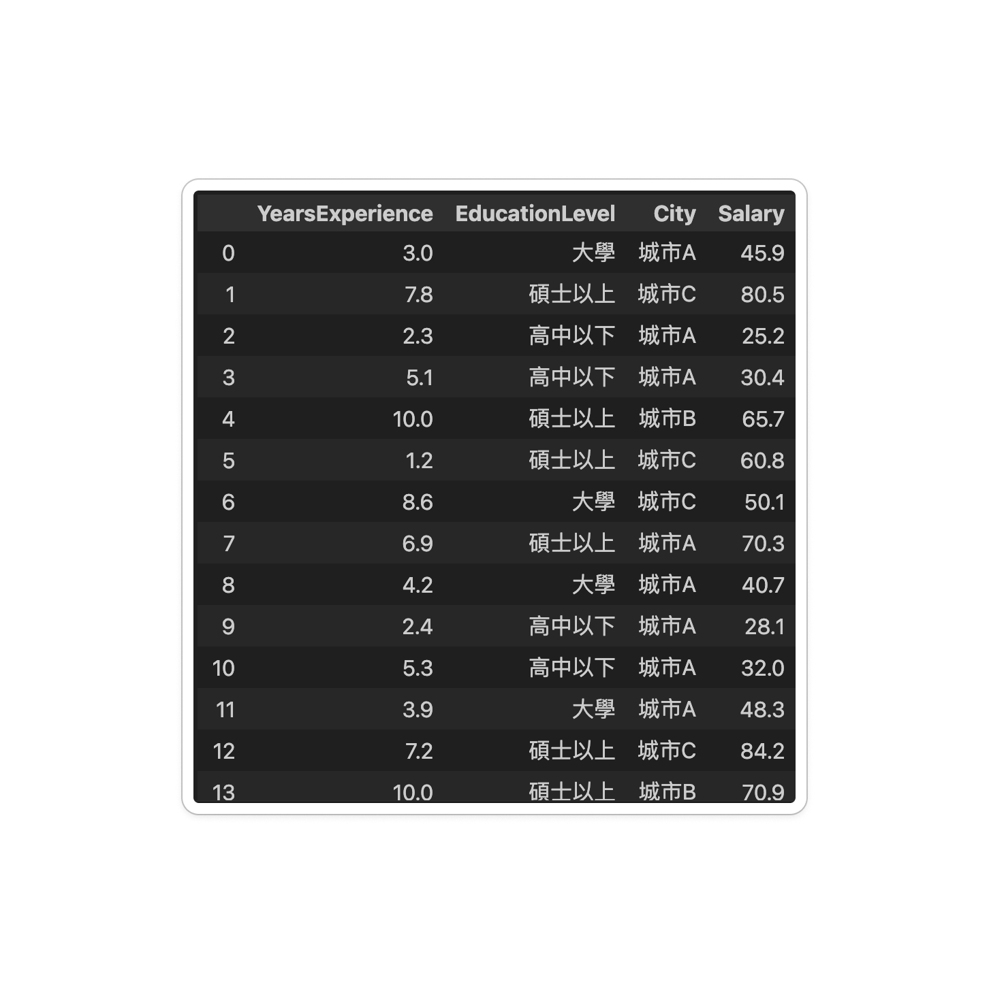
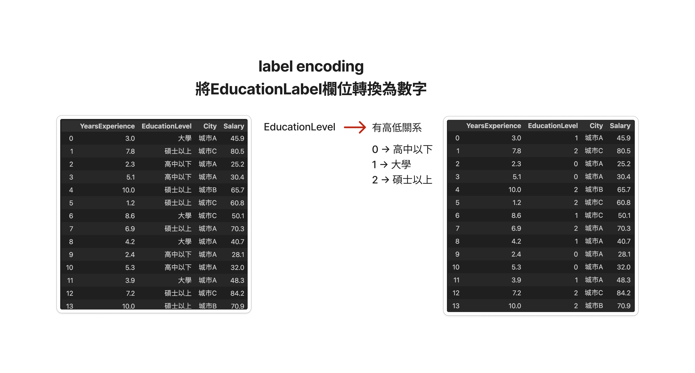
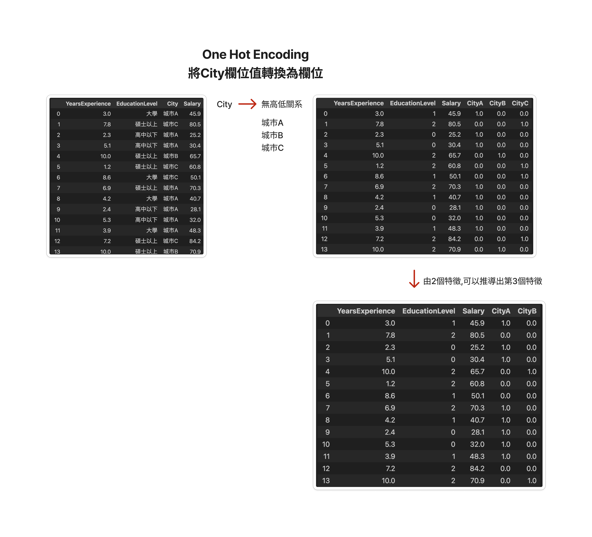
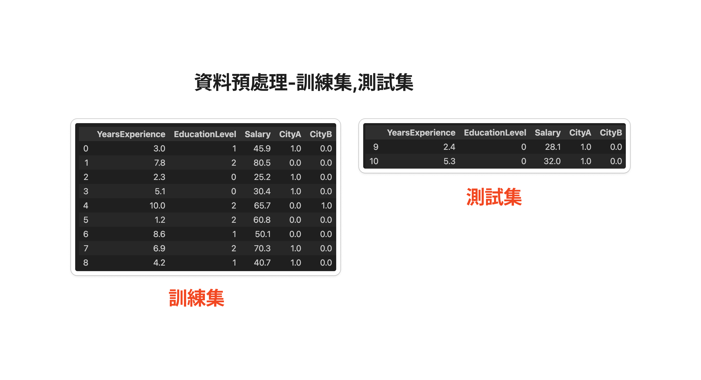
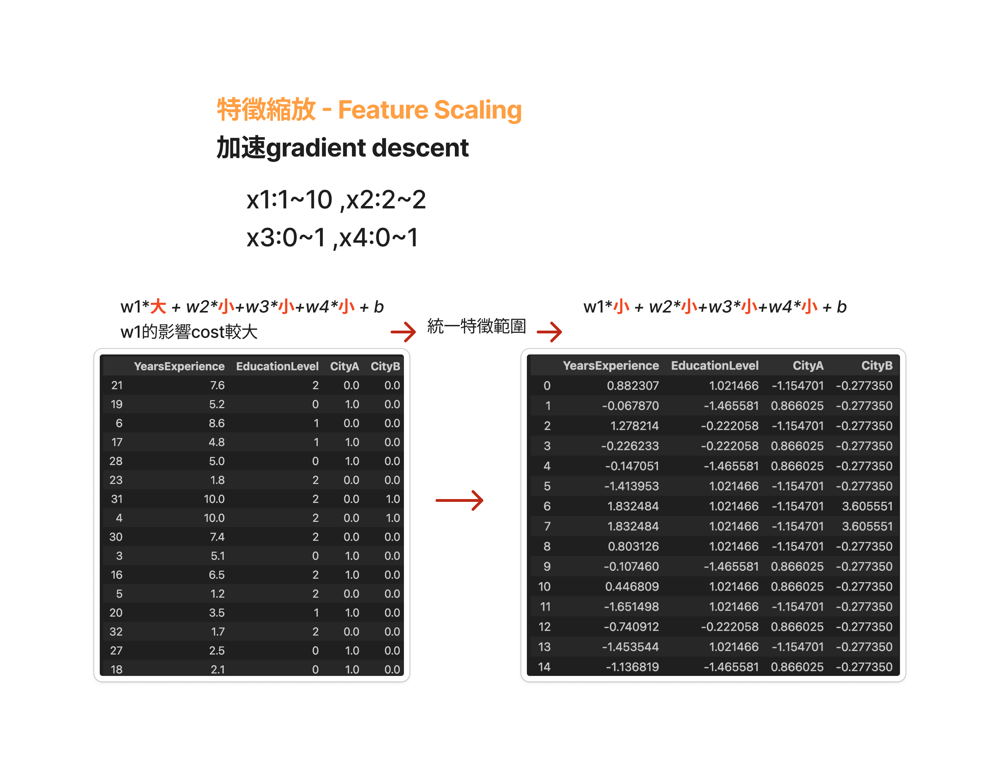
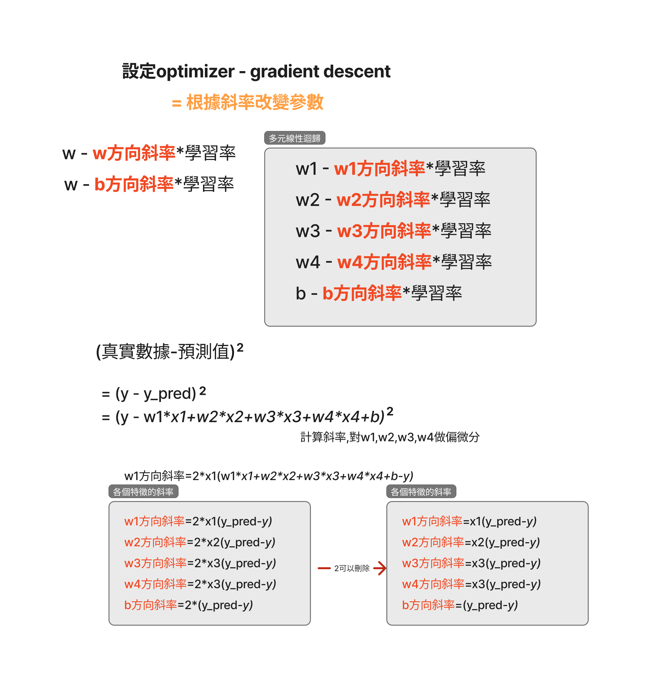

# 多元線性迴歸(Multiple Linear degression)

> [!TIP]
> [Jam簡報檔目錄](./說明jam)  
> [手動gradient的實作](./multiple_linear_regression1.ipynb)  
> [自動scikit-learn模型的實作] (./multiple_linear_regression2.ipynb)

## 讀取資料

```python
import pandas as pd

url = "Salary_Data2.csv"
data = pd.read_csv(url)
data
```



## Label Encoding
- 將文字轉為數值
- 有高低的欄位(EducationLevel)
- 高中以下 -> 0
- 大學 -> 1
- 碩士以上 -> 2


```python
educationLabel_encoding = data['EducationLevel'].map({'高中以下':0,'大學':1,'碩士以上':2})

data['EducationLevel'] = educationLabel_encoding
```



## One Hot Encoding
- 將文字轉為數值
- 沒有高低的欄位(City)
- 將城市A,城市B,城市C的值轉換為欄位
- 刪除City,CityC

```pyhton
from sklearn.preprocessing import OneHotEncoder

onehot_encoder = OneHotEncoder(categories=[['城市A', '城市B', '城市C']], handle_unknown='ignore') #如果出現新的城市，handle_unknown='ignore' 至關重要，以避免錯誤

#轉換過程必需是2維的資料
#由serirec轉換為DataFrame
city_encoded = onehot_encoder.fit_transform(data[['City']],)

# city_encoded是一個稀疏矩陣,轉換為nd_array
# 增加資料至data內
data[['CityA','CityB','CityC']] = city_encoded.toarray()

#刪除欄位
data = data.drop(['City','CityC'],axis=1)

```



## 拆分為訓練集,測試集
- **測試集主要目的:評估模型的準確度**

```python
#分割數據集成為訓練集和測試集
from sklearn.model_selection import train_test_split

#random_state的目的是不要亂數分割,以利範例後面的講解,正常不需要加入
x_train, x_test, y_train, y_test = train_test_split(x, y, test_size=0.2,random_state=76) #測試集佔20%,會return 個元素的tuple,

len(x), len(x_train), len(x_test)

```



## 特微縮放(Feature Scaling)

**加速gradient descent**

```python
#將訓練資料和測試資料轉換為nd_array

x_train = x_train.to_numpy()
x_test = x_test.to_numpy()
```

```python
#特徵縮放
from sklearn.preprocessing import StandardScaler

scaler = StandardScaler()
scaler.fit(x_train)
x_train = scaler.transform(x_train)
x_test = scaler.transform(x_test)
x_train, x_test
```




## 手動實作-[參考實作檔](./multiple_linear_regression1.ipynb)
- cost function
- gradient descent




