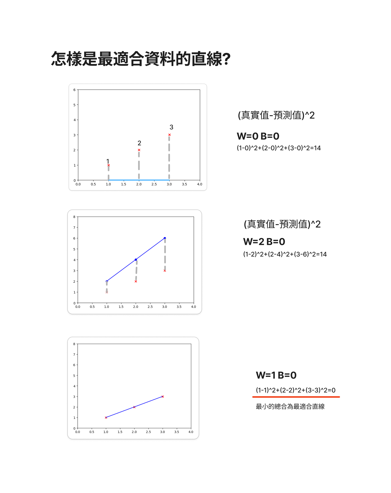

# 簡單線性回歸(Simple Linear Regression)
- 請使用`說明jam資料夾內檔案做說明`
- [手動實作筆記本檔案](./simple_linear_regression.ipynb)

```python
!pip install wget
```

```python
import pandas as pd

url = "https://github.com/roberthsu2003/machine_learning/raw/refs/heads/main/source_data/Salary_Data.csv"
data = pd.read_csv(url)
data
# y = w*x + b
x = data["YearsExperience"]
y = data["Salary"]

```

```python

import wget

wget.download("https://github.com/roberthsu2003/machine_learning/raw/refs/heads/main/source_data/ChineseFont.ttf")
```

```python
import matplotlib.pyplot as plt
import matplotlib as mpl
from matplotlib.font_manager import fontManager

fontManager.addfont("ChineseFont.ttf")
mpl.rc('font', family="ChineseFont")

plt.scatter(x, y, marker="x", color="red")
plt.title("年資-薪水")
plt.xlabel("年資")
plt.ylabel("月薪(千)")
plt.show()
```

```python
def plot_pred(w, b):
  y_pred = x*w + b
  plt.plot(x, y_pred, color="blue", label="預測線")
  plt.scatter(x, y, marker="x", color="red", label="真實數據")
  plt.title("年資-薪水")
  plt.xlabel("年資")
  plt.ylabel("月薪(千)")
  plt.xlim([0, 12])
  plt.ylim([-60, 140])
  plt.legend()
  plt.show()

plot_pred(-5, -30)
```

```python
from ipywidgets import interact

interact(plot_pred, w=(-100, 100, 1), b=(-100, 100, 1))
```

## 尋找最適合的w和b


## 怎樣是最適合資料的直線?



## [利用cost function(成本函數)找出最適合的w和b](./cost_function.md)


