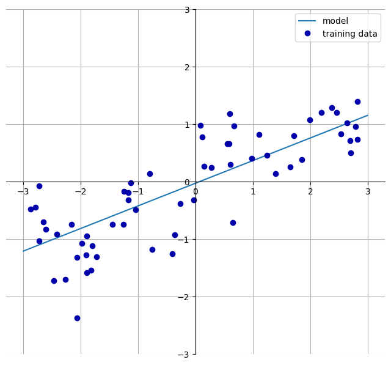
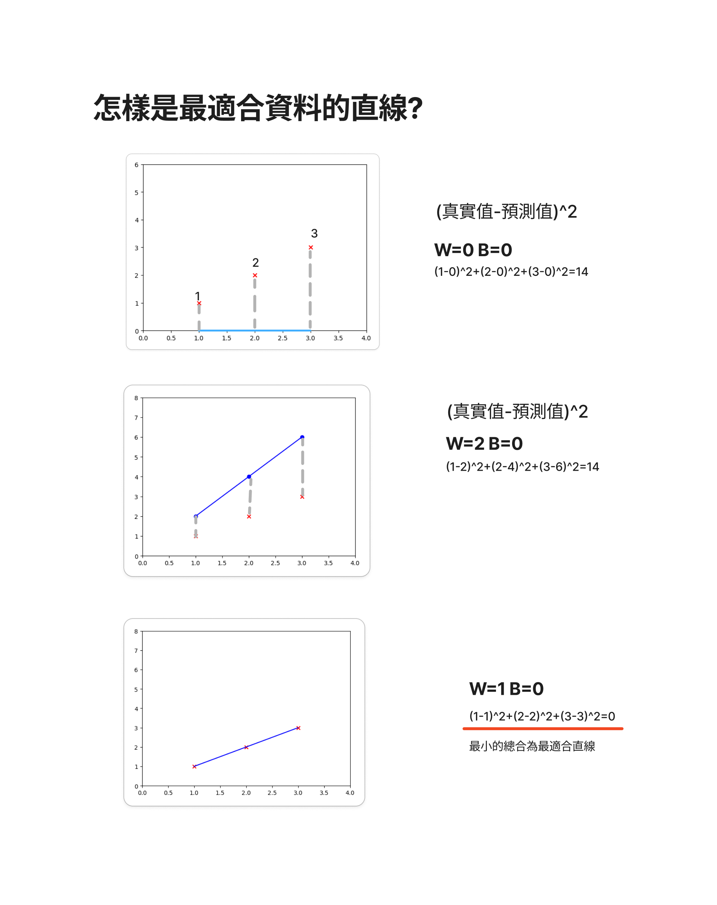
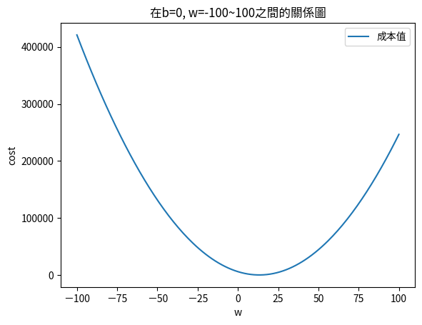
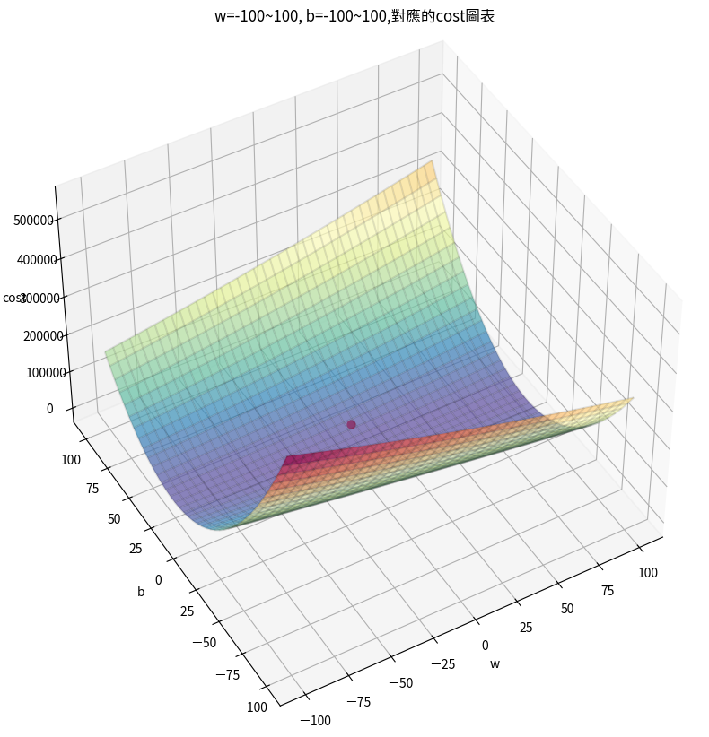

# 簡單線性迴歸(Linear Regression)

## 學習重點:
- 從簡單的線性關係開始，讓學生理解線性迴歸的基本概念。
- 解釋迴歸係數和截距的意義，以及它們如何影響預測結果。
- 嘗試修改數據，觀察模型的變化。
- 介紹其他評估指標，例如均方誤差（MSE）和 R 平方值，來評估模型的性能。
- 嘗試使用真實世界的數據集，例如房價數據集，來進行線性迴歸分析。
- 線性回歸的假設，例如線性關係，資料常態分佈等等

## [了解線性迴歸公式-互動繪圖](./線性迴歸公式繪圖.ipynb)

> [!NOTE]
> 使用公式實作,可以學習較多基本觀念

## 範例實作-直接使用公式(y=Xw+b)
- [**簡單線性迴歸_手動**](./簡單線性迴歸_手動.md)
- [cost_function實作](./cost_function.ipynb)  
- [gradient_descent實作](./gradient_descent.ipynb)

---

## scikit-learn套件


### 線性迴歸說明
線性模型是一類在實踐中廣泛使用的模型，在過去的幾十年中得到了廣泛的研究，其根源可以追溯到一百多年前年。

**➜線性回歸模型(Linear models for regression)**

只有單一特徵的資料集的公式

```
ŷ = w[0] * x[0] + b
```

你可能還記得高中數學中關於直線方程式的內容。這裡，w[0] 是斜率，b 是 y 軸偏移。對於更多的特徵，w 包含每個特徵軸的斜率。另外，您也可以將預測反應看成是輸入特徵的加權總和，其權重（可以是負值）由 w 的項目提出。

對於迴歸，線性模型的一般預測公式如下：

```
ŷ = w[0] * x[0] + w[1] * x[1] + ... + w[p] * x[p] + b
```

這裡，x[0] 到 x[p] 表示單一資料點的特徵（本例中特徵個數為 p），w 和 b 是模型學習到的參數，ŷ 是模型所做的預測。

嘗試學習一維wave資料集上的參數 w[0] 和 b 可能會導致以下結果:

```python
import mglearn
mglearn.plots.plot_linear_regression_wave()
```




[➜解釋上圖實作範例說明-(也可以了解斜率和偏移值)](./simple_linear_regression.ipynb)

> [!IMPORTANT]
> 這個範例可以了解`線性迴歸公式`和`斜率`和`偏移值`

僅查看一維資料會產生有些偏頗的視角(不準呀)! 對於具有`許多特徵`的資料集，線性模型可能非常強大。特別是，如果您的`特徵多於訓練資料點`，任何目標 y 都可以完美地（在訓練集上）建模為線性函數。

有許多不同的線性迴歸模型,這些模型之間的差異在於如何從訓練資料中學習模型參數w和b，以及如何控制模型複雜度。現在我們來看看最受歡迎的迴歸線性模型。


### 線性迴歸(Linear regression)（又稱普通最小平方法-ordinary least squars）

線性迴歸，或稱最小平方法（OLS），是最簡單、最經典的線性迴歸方法。線性迴歸找到參數 w 和 b，以最小化訓練集上的預測和真實迴歸目標 y 之間的均方誤差。均方誤差是預測值與真實值之間的平方差之和。線性迴歸沒有參數，這是一個好處，但它也無法控制模型的複雜度。

> [!IMPORTANT]
> 更深入了解請參考下方連結(包含有參數的線性迴歸)
> [**線性迴歸更多的說明**](./mglearn說明.ipynb)


### ➜找出最適合資料的直線  
- 資料集使用Salary_Data.csv->年資,薪資
- 使用cost function 成本函數(不是最有效率的方式)
- 公式(真實值-預測值)^2



**➜ 在b=0, w=-100\~100,和cost之間的關係圖**



**➜ 在b=-100\~100,w=-100\~100,和cost之間的關係圖**



[➜利用cost function取出最適合的直線-實作](./cost_function.ipynb)

### [➜薪資_年資_sklearn-ipynb實作](./sklearn_薪資_年資.ipynb)

### [➜薪資_年資_評估指標的說明-ipynb實作](./model_evaluation_薪資_年資.ipynb)

### 範例實作
**房屋面積和價格的數據**

- [**簡單線性迴歸_模型**](./sklearn實作1.ipynb)

**年資,薪水**

- [**簡單線性迴歸_模型**](./sklearn實_薪資_年資.ipynb)
