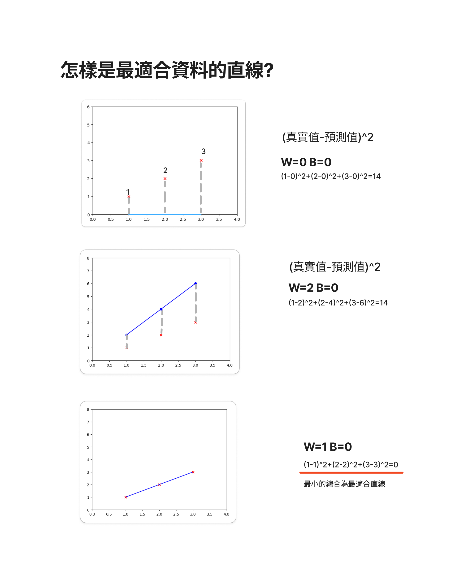
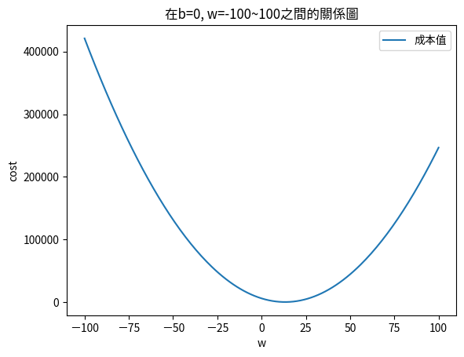
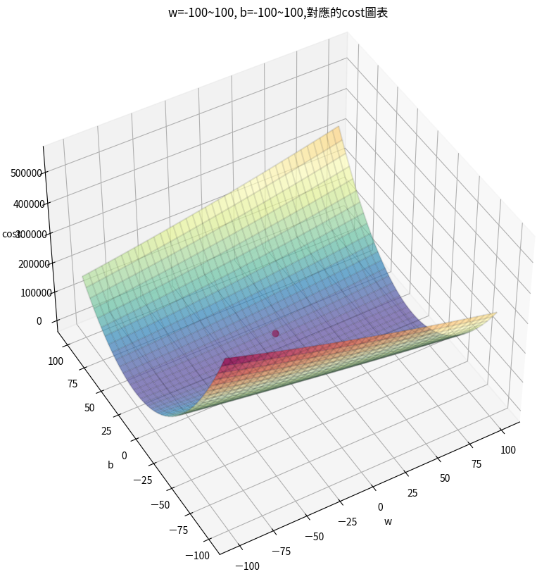
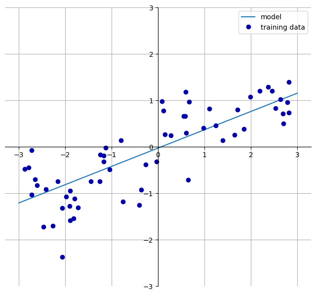

# 簡單線性迴歸 (Linear Regression)

本教學旨在引導學習者從最基礎的幾何概念開始，逐步理解線性迴歸的數學原理與程式實作，並學會使用主流的機器學習套件 Scikit-Learn 進行實際的預測與評估。

## 🎯 學習重點
- **基礎理論**：從幾何與公式出發，理解線性迴歸的數學表達式與其核心參數（斜率與截距）。
- **底層實作**：動手撰寫損失函數 (Cost Function) 與梯度下降 (Gradient Descent)，透徹掌握模型的優化過程。
- **套件應用**：學會使用 Scikit-Learn 套件快速建立線性迴歸模型、進行預測並調整參數。
- **模型評估**：介紹均方誤差 (MSE) 與決定係數 ($R^2$) 等評估指標，來衡量預測結果的品質。
- **實務應用**：使用真實世界的數據（如薪資與年資、房屋面積與價格）進行模型實作與分析。
- **基本假設**：理解線性迴歸背後的假設（如線性關係、資料常態性分佈等）。

---

## 📐 核心概念：理解線性迴歸公式 ($y = wx + b$)

線性迴歸的核心是透過一個簡單的線性方程式來建立輸入特徵與輸出預測之間的關係：

$$y = wx + b$$

- **$x$**：輸入特徵（自變數）
- **$y$**：預測結果（應變數）
- **$w$ (Weight)**：權重，代表直線的**斜率 (Slope)**，決定直線的傾斜程度。
- **$b$ (Bias)**：偏差，代表直線的**截距 (Intercept)**，決定直線在 y 軸上的起點。

### 學習目標
1. **數值生成**：了解如何給定一組 $x$ 值，透過公式 $y = wx + b$ 計算出對應的 $y$ 值。
2. **幾何意義**：理解在二維空間中，將這些 $(x, y)$ 點連接起來會形成一條直線。

🔗 **[實作範例：線性迴歸公式繪圖](./線性迴歸公式繪圖.ipynb)**

> [!NOTE]
> 透過手動帶入公式與繪圖，可以幫助學生直觀地理解斜率與截距對直線形狀的影響。

---

## ⚖️ 學習路徑選擇

本課程設計了兩種不同的學習路徑，您可以根據學習目標進行選擇：

* **[路徑一：手動公式實作（循序漸進理解底層）](#path-1)**
  適合想掌握演算法底層邏輯、為深度學習奠定扎實數學基礎的學習者。
* **[路徑二：套件應用實作（直接使用 scikit-learn）](#path-2)**
  適合想快速上手、著重於機器學習套件應用與模型評估的學習者。

---

## <a id="path-1"></a>🛠️ 路徑一：手動公式實作（循序漸進理解底層）

在此路徑中，我們將不依賴任何機器學習套件，而是透過數學公式手動實現線性迴歸的核心優化算法。

### 1. 尋找最適合資料的直線
當我們有一群真實資料點時，我們需要找到一條最能代表這群資料趨勢的直線。

- **資料集說明**：使用 [Salary_Data.csv](./Salary_Data.csv)（包含年資與薪資）。
- **核心挑戰**：如何衡量一條直線的「好壞」？

### 2. 損失函數與成本函數 (Cost Function)
為了衡量預測值與真實值之間的落差，我們使用**均方誤差 (MSE)** 作為成本函數：
$$\text{Cost} = \frac{1}{N} \sum_{i=1}^{N} (y_i - \hat{y}_i)^2$$
透過計算所有資料點「預測值」與「真實值」的平方差平均，我們可以得到一個用來代表預測誤差的數值。



#### 📊 視覺化參數與誤差的關係
為了找出誤差最小的 $w$ 與 $b$，我們可以將它們與成本的關係繪製出來：
- **當固定 $b=0$，調整 $w$** 時，斜率與誤差呈二次曲線關係：
  
  
  
- **當同時調整 $b$ 與 $w$** 時，會形成一個 3D 的碗狀曲面。我們的目標是找到這個曲面的最低點（即 Cost 最小處）：
  
  

🔗 **[手動實作：利用成本函數找出最適合的直線](./cost_function.ipynb)**

### 3. 參數自動優化：梯度下降法 (Gradient Descent)
手動去猜測或暴力搜尋 $w$ 與 $b$ 不是有效率的方法。我們利用梯度下降法，沿著誤差曲面的斜率向下走，自動更新參數直至收斂。

🔗 **[手動實作：梯度下降法演算法](./gradient_descent.ipynb)**
🔗 **[詳細手動實作教學步驟說明](./簡單線性迴歸_手動.md)**

---

## <a id="path-2"></a>📦 路徑二：套件應用實作（直接使用 scikit-learn）

在實際專案中，我們通常直接調用成熟的機器學習套件如 **scikit-learn**，以提高開發效率。

### 1. 線性迴歸與普通最小平方法 (OLS)
在 scikit-learn 中，`LinearRegression` 類別使用的是**普通最小平方法 (Ordinary Least Squares, OLS)**。
- **基本原理**：此方法同樣是以最小化均方誤差為目標來求解參數 $w$ 與 $b$。
- **公式延伸（多特徵情況）**：
  若資料集有多個特徵（例如預測房價時，有面積、房間數、地段等多個自變數），預測公式會擴展為：
  $$\hat{y} = w_0 x_0 + w_1 x_1 + \dots + w_p x_p + b$$
  其中 $p$ 為特徵個數。

#### 📊 一維資料的擬合範例
以下是使用 `mglearn` 套件在一維波形 (wave) 資料集上擬合的結果：

```python
import mglearn
mglearn.plots.plot_linear_regression_wave()
```


🔗 **[實作範例：一維 wave 資料集擬合與參數解讀](./simple_linear_regression.ipynb)**

> [!IMPORTANT]
> 這個範例可以讓您了解如何在實際資料中提取出模型的 `斜率 (coef_)` 與 `偏移值/截距 (intercept_)`。

### 2. 實作案例：薪資與年資預測 (單特徵)
使用 scikit-learn 讀取薪資資料，並進行模型擬合與結果預測。

🔗 **[實作範例：薪資與年資預測 (scikit-learn)](./sklearn_薪資_年資.ipynb)**

### 3. 實作案例：房屋面積與價格預測 (單特徵)
使用真實的房屋數據，體驗單特徵線性迴歸的模型訓練。

🔗 **[實作範例：房屋面積與價格預測](./sklearn實作1.ipynb)**

### 4. 模型評估指標說明 (Evaluation Metrics)
在預測完畢後，我們必須使用客觀的指標來評估模型表現：
- **均方誤差 (MSE)**：評估預測值與真實值間的平均誤差平方。
- **決定係數 ($R^2$ Score)**：說明模型能解釋資料變異的比例，數值越接近 1 代表擬合越好。

🔗 **[實作範例：評估指標實作與說明](./model_evaluation_薪資_年資.ipynb)**

---

## 📚 補充學習資源
- 💡 **[深入了解線性迴歸變形（如 Ridge, Lasso 等有參數的線性迴歸）](./mglearn說明.ipynb)**：當特徵數量大於資料點時，如何控制模型複雜度以防過擬合。
