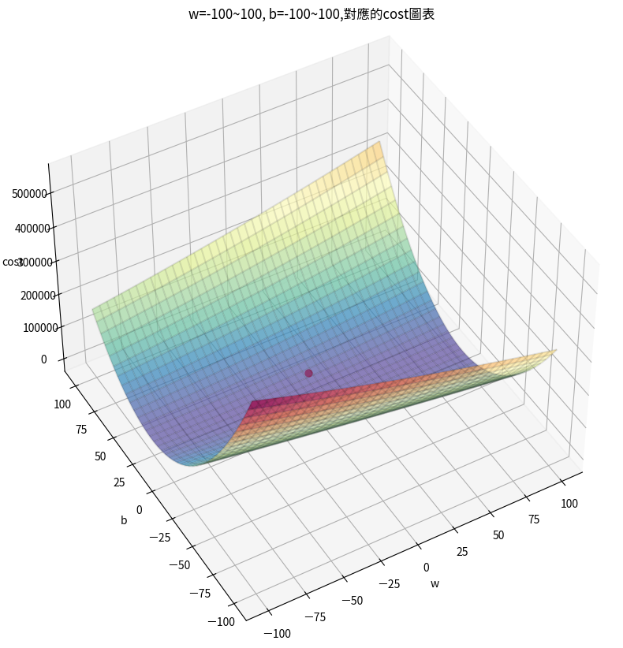

# Cost Function 成本函數

> [!IMPORTANT]
> [cost_function的ipynb實作](./cost_function.ipynb)
> 使用此種方法不是最有效率的方式

## 依據公式(真實值-預測值)^2
### 在b=0, w=-100\~100,和cost之間的關係圖

### 在b=-100\~100,w=-100\~100,和cost之間的關係圖

## 最有效率的方式找出最佳的w和b?
### 答案是:gradient descent梯度下降

> [!IMPORTANT]
> [梯度下降說明](./gradient_descent.md)