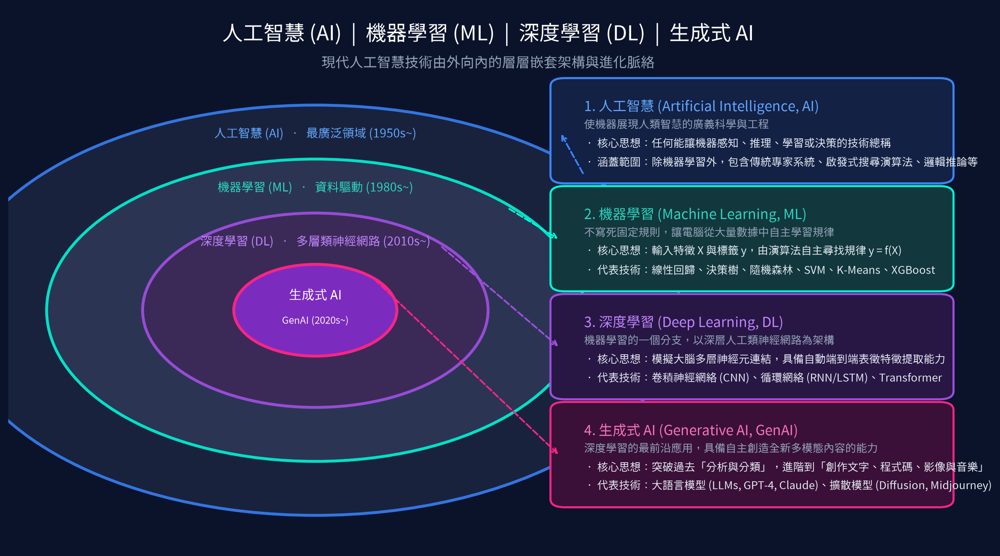

# 📊 何謂 AI、機器學習與深度學習？

本單元深入解析**人工智慧（AI）**、**機器學習（ML）**、**深度學習（DL）**以及前沿**生成式 AI（GenAI）**的核心概念與其相互包含的層級架構，並提供全新的高質感教學簡報與向量 PDF 供下載學習。

---

## 🎯 核心觀念：層層包覆的同心圓架構

人工智慧、機器學習、深度學習與生成式 AI 並非互相對立的平行技術，而是**層層包覆、由外向內的演進同心圓**：

---

## 💡 四大核心層級深入解析

| 層級 | 領域名稱 | 出現時期 | 核心定義與思想 | 經典代表技術 |
| :---: | :--- | :---: | :--- | :--- |
| **最外層** | **人工智慧 (AI)** *Artificial Intelligence* | 1950 年代~ | **最廣義的科學範疇**：任何能讓機器展現人類智慧行為、進行感知、理解或決策的技術總稱。 | 專家系統 (Rule-based)、A* 搜尋演算法、棋類邏輯樹 |
| **中層** | **機器學習 (ML)** *Machine Learning* | 1980 年代~ | **資料驅動的核心方法**：不直接寫死硬編碼規則，而是給予電腦大量數據，由演算法自主從中「學習」映射規律。 | 線性回歸、決策樹、隨機森林、支援向量機 (SVM)、XGBoost |
| **內層** | **深度學習 (DL)** *Deep Learning* | 2010 年代~ | **機器學習的超強分支**：以深層人工類神經網路為基礎，具備從原始數據端到端「自動提取抽象特徵」的強大能力。 | 卷積神經網絡 (CNN)、循環網絡 (RNN/LSTM)、Transformer |
| **核心前沿** | **生成式 AI (GenAI)** *Generative AI* | 2020 年代~ | **深度學習的最前沿應用**：打破過往單純的「分析與分類」，進階到能夠「自主創造全新多模態內容」。 | 大語言模型 (GPT-4, Claude)、擴散模型 (Diffusion, Midjourney, Stable Diffusion) |

---

## 📥 課程講義與簡報檔案下載

* 🌐 **[線上閱讀與下載教材（Light Mode 網頁）](https://roberthsu2003.github.io/machine_learning/)**
  （GitHub Pages 啟用並部署後可使用；[網頁原始檔](../docs/index.html)）

本目錄已全面重新設計高解析度 16:9 投影片，包含視覺化圖解、生動生活實例與現代科技暗黑風排版：

* 👉 **[📥 點此下載高畫質 PDF 講義簡報 (機器學習簡報.pdf)](./機器學習簡報.pdf)**  
  *(推薦首選：16:9 大師級視覺設計、向量高畫質、手機與平板隨開即讀)*
* 👉 **[📥 點此下載 PowerPoint 投影片 (機器學習簡報.pptx)](./機器學習簡報.pptx)**  
  *(適用於 Windows / Mac 的 PowerPoint 課堂全螢幕放映)*

---

### 📑 投影片精華架構目錄 (共 15 頁)
1. **封面**：徐國堂 Python 實作應用班 —— 機器學習導論與核心實務
2. **什麼是人工智慧 (AI)?**：起源、核心定義與弱 AI vs AGI
3. **人工智慧的終極目標**：視覺感知、語音語言、邏輯推理、自主行動
4. **什麼是機器學習 (ML)?**：傳統寫死邏輯 vs 資料驅動學習範式變革
5. **機器學習的核心本質**：大量歷史數據 ➔ 演算法學習 ➔ 提煉規律 ➔ 預測未來
6. **什麼是深度學習 (DL)?**：大腦類神經網絡啟發、大數據與 GPU 算力爆發
7. **深度學習的核心特長**：傳統人工手動特徵工程 vs 深度學習端到端自動表徵
8. **核心架構同心圓**：AI ➔ ML ➔ DL ➔ 生成式 AI 全景圖譜
9. **機器如何從資料中找出規則？**：數學理論（線代/微積分）+ 程式實踐（Python/Scikit-Learn）
10. **過渡頁**：機器如何學習？如何預測？
11. **機器如何學習？**：貓狗影像分類實例（真實標籤 vs 預測機率，反向傳播誤差修正）
12. **找出規則**：單特徵房價預測（坪數 = 特徵 Feature X，成交價 = 標籤 Label y）
13. **多元特徵預測**：現實世界的多維特徵矩陣（坪數、地段、房數、屋齡 ➔ 總價）
14. **機器如何預測？**：模型落地推論（Inference）流水線
15. **實戰開發環境建置**：Google Colaboratory 雲端 GPU + GitHub 專案管理
