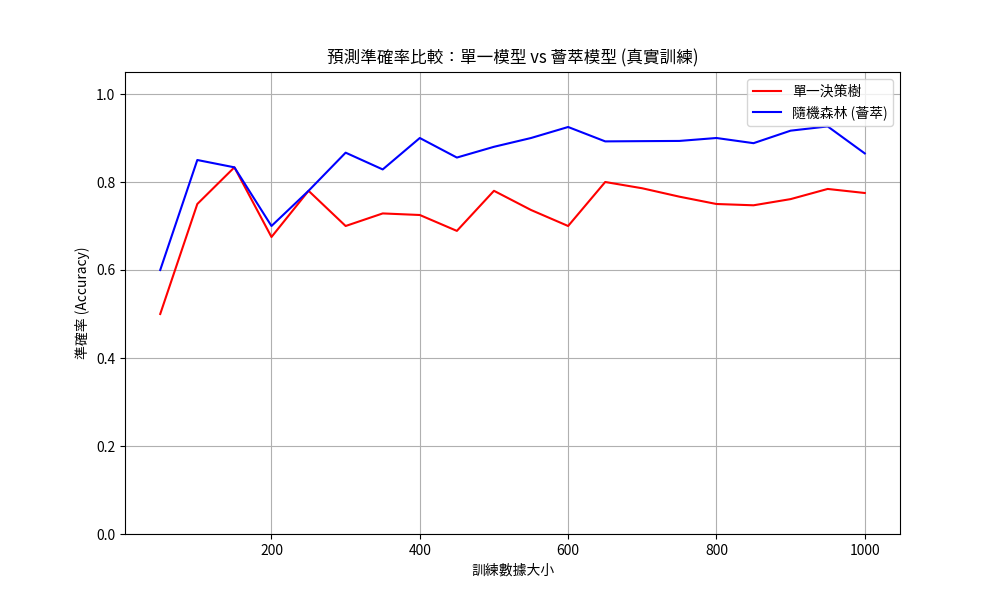
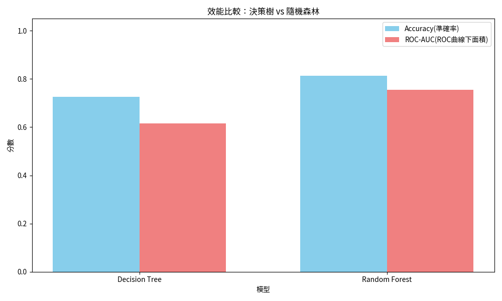

# 薈萃式學習-集成學習(Ensemble Learning)

薈萃式學習（集成學習）是一種機器學習方法，通過結合多個基礎模型（稱為弱學習器或基學習器）的預測結果來提高整體模型的性能。這些基礎模型可以是決策樹、線性模型、神經網絡等，通過特定的組合策略（如投票、平均或加權）生成最終預測。薈萃式學習的核心思想是**「集體智慧」**，即多個模型的協同工作通常比單一模型更穩健且準確。

### 常見的薈萃式學習方法包括：
- **Bagging（Bootstrap Aggregating）**：如隨機森林（Random Forest），通過對數據進行有放回採樣訓練多個模型，並平均或投票得出結果。

> [!TIP]
> [**Bagging（Bootstrap Aggregating)**的細節說明](./Bagging(Bootstrap_Aggregating)說明.md)

- **Boosting**：如AdaBoost、Gradient Boosting和XGBoost，通過迭代地調整樣本權重或梯度來訓練模型，逐步提升性能。

- **Stacking**：將多個不同類型的模型預測結果作為輸入，訓練一個元模型（meta-model）進行最終預測。

### 薈萃式學習的優點:

1. **提高預測準確性:** 通過結合多個模型的預測，減少單一模型的錯誤，提升整體性能。
2. **降低過擬合風險:** Bagging方法（如隨機森林）通過隨機採樣和特征選擇，減少模型對訓練數據的過度依賴。

3. **增強模型穩定性:** 薈萃式學習對數據中的噪音和異常值不敏感，能在不同數據分佈下保持穩定。

4. **靈活性:** 可結合不同類型的基礎模型，適應多種問題和數據類型。

5. **特征重要性評估:** 如隨機森林和Gradient Boosting能提供特征重要性分數，幫助理解數據中的關鍵變量。

### 範例:直觀理解薈萃式學習的優勢

- 預測模型(regression)

> [!IMPORTANT]
> - 比較單一決策樹與隨機森林（一種薈萃式學習方法）  
> - 不同數據集大小下的預測誤差。  
> - 使用Matplotlib生成一張圖表  
> - [直觀理解薈萃式學習的優勢_regression-ipynb範例](./emsemble_直觀理解薈萃式學習的優勢.ipynb)

### 範例:

- 分類模型(classification)

> [!IMPORTANT]
> - 隨機森林的分類範例
> - 何應用薈萃式學習解決簡單的二元分類問題。
> - 該範例生成一個包含1000個樣本和20個特征的模擬數據集。
> - 使用隨機森林（100棵決策樹）進行二元分類。
> - 輸出模型在測試集上的準確率，展示薈萃式學習的應用。
> - 隨機森林的簡單實現，並解釋其內部如何通過多棵決策樹的投票提高預測性能。
> - [直觀理解薈萃式學習的優勢_classification-ipynb範例](./ensemble_直觀理解薈萃式學習的優勢1.ipynb)

### 實際案例

金融風險評估-使用UCI Credit Card Default Dataset進行違約風險預測：
	
在金融風險評估領域，薈萃式學習（例如隨機森林、Gradient Boosting）是解決客戶違約預測、信用評分及詐欺偵測等任務的強效工具。這些方法藉由整合多個基礎學習器（弱學習器）的預測，不僅能更精準地應對複雜的金融數據，同時也顯著提升了模型在面對數據噪音和樣本不平衡情況時的穩健性。

公開數據集來源

以下是兩個適合金融風險評估的公開數據集，這些數據集可在網路上免費取得：

1. UCI Credit Card Default Dataset：
	- 來源: UCI Machine Learning Repository（https://archive.ics.uci.edu/dataset/350/default+of+credit+card+clients）

	- 內容: 該數據集包含台灣某銀行的信用卡客戶數據（2005年4月至9月），包括23個特征（如信用額度、性別、教育程度、還款記錄等）以及是否違約的標籤（二元分類：違約/未違約）。

	- 樣本數：30,000筆記錄，適合用於違約風險預測。

	- 適用性：模擬真實的信用卡違約風險評估場景。

以下是一個使用Python和Scikit-learn實現的範例，展示如何使用隨機森林（一種ensemble學習方法）對信用卡違約風險進行預測，並比較其與單一決策樹的性能。該範例包括數據下載、預處理、模型訓練和圖表生成，以幫助學生理解薈萃式學習的優勢。

> [!IMPORTANT]
> 金融風險評估
> [ensemble_金融風險評估-ipynb範例](./ensemble_金融風險評估.ipynb)

---

### 擴展練習

- 鼓勵學生嘗試調整隨機森林的參數（如樹的數量n_estimators或最大深度max_depth），觀察對性能的影響；或使用Gradient Boosting（如XGBoost）進行比較。

- 醫療診斷:

	- 場景：醫療機構使用隨機森林預測患者是否患有某種疾病（如糖尿病）。
	- 應用：利用患者的醫療記錄（如血糖水平、BMI、家族病史），隨機森林通過多棵決策樹的投票，生成更可靠的診斷結果，並提供特征重要性分數，幫助醫生了解關鍵風險因素。
	- 優勢：隨機森林對噪音數據的魯棒性使其適合處理醫療數據中的缺失值或異常值。

---

## 實作:

[**集成學習 VotingClassifier model實作**](./sklearn實作1.ipynb)
